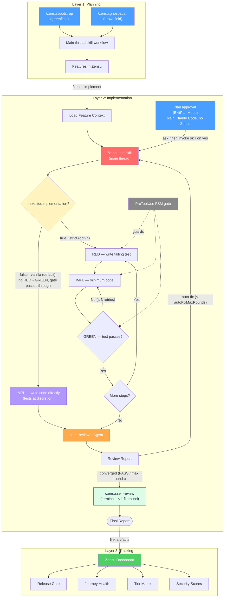
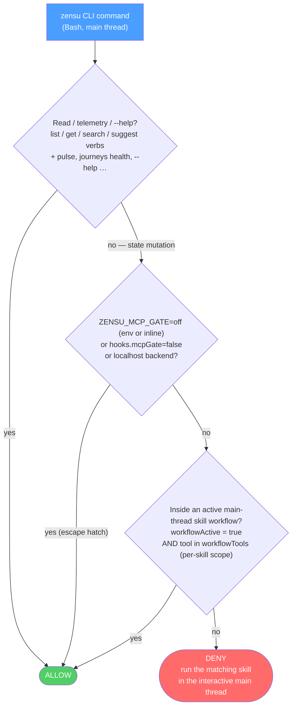

<p align="center">
  <a href="https://zensu.dev"></a>
</p>

# Zensu Plugin for Claude Code

[](LICENSE)
[](CHANGELOG.md)

Zensu is a Product Lifecycle Manager that treats features as first-class citizens. This plugin covers the **entire development lifecycle** inside Claude Code — from product planning through disciplined implementation to release readiness.

## The Three Layers

```
Planning              →  Implementation  →  Tracking
main-thread skills       /zensu:tdd         Zensu Dashboard
/zensu:bootstrap         code-reviewer      (Web UI)
/zensu:ghost-scan        auto-fix loop
/zensu:implement         (main thread)
```

**Layer 1 — Planning (WHAT is being built?):** Bootstrap a greenfield product from a vision document (`/zensu:bootstrap`), or scan an existing codebase to discover and import undocumented features (`/zensu:ghost-scan`) — or, for a brownfield repo that *also* ships a forward plan doc, run the **hybrid**: ghost-scan what is built, then add the plan's not-yet-built items as `planned` features. All end with features tracked in Zensu with security profiles, user journeys, and pricing tiers. Each discovered feature is seated at a **v1 build-out baseline** (a revision); features grow from there through deeper revisions (stages) and subfeatures (parts).

**Layer 2 — Implementation (HOW is it built securely?):** `/zensu:tdd` runs in the main thread in vanilla implementation mode by default, with strict RED→IMPL→GREEN FSM-gated TDD available via `hooks.tddImplementation:true`. Both modes keep the evidence audits and read-only review chain: five parallel specialist aspects → optional judge (default on) → consume-mode code-reviewer → auto-fix loop → self-review.

**Layer 3 — Tracking (HOW is progress tracked?):** Web dashboard for POs and stakeholders — security scores, tier matrix, journey health, coverage trends. No terminal required.

## Agent & Workflow Overview

The Implementation layer shows both modes: **vanilla** (`hooks.tddImplementation`
default `false`) skips the RED→GREEN ceremony and lets the edit gate pass
through; set it `true` for the strict gate. The review chain and evidence audits
run in both.



## CLI Write-Gate

The `zensu` CLI is **read-free, write-gated**. Any state-mutating command (creating or
updating features, security classifications, tiers, journeys, revisions, …) run directly
on the main thread is **denied by default** — it must run inside a skill that declared its
work, so "freelance" writes cannot bypass the dedup, user-journey, baseline-revision and
security-review conventions the skills enforce. Reads and telemetry are always allowed.

The gate is a PreToolUse(Bash) hook (`pre-bash-zensu-gate.sh`): it parses `zensu <noun> <verb>`
out of the Bash command, resolves each to its canonical tool
name via `hooks/lib/zensu-cli-map.sh`, and classifies it with the same `hooks/lib/zensu-mcp-tools.sh`
source of truth. It is a **convention-nudge, not a hard boundary** — once the CLI's OAuth token
is cached on disk an agent could `curl` the backend directly; the gate enforces the workflow
conventions, not a security control (the same role, and the same `ZENSU_MCP_GATE=off` escape, as
the MCP write-gate it replaced).



A skill opens a **scoped** window with
`zensu-log.sh --workflow-begin --tools "<exact tool set>"`: the bypass then allows **only**
that skill's declared tools — so `/zensu:implement` cannot forge a `set_security_classification`
it never declared — and `--workflow-end` closes it again. The `--tools` list stays tool-name-keyed;
the gate maps each CLI command back to its canonical tool name to check membership. `ZENSU_MCP_GATE=off`
disables the gate for a deliberate one-off — honored both as a session env and as an **inline prefix**
(`ZENSU_MCP_GATE=off zensu …`). The gate is scoped to its threat model (a low-context agent writing to the
*real tracked product*), so it also never fires on reads or `--help`/`-h`, or on a write whose target backend
(`--api-url` flag / `ZENSU_API_URL` env) is **localhost** — a throwaway dev/test DB where the conventions are
meaningless. A structure test (`tests/structure/test-skill-workflow-markers.sh`)
fails the build if any skill runs a mutation command without the `--workflow-begin` /
`--workflow-end` markers, so a new skill cannot silently regress the contract.

## Source-Write Gate

A second PreToolUse(Bash) hook (`pre-bash-source-write-gate.sh`) protects **source files** from
raw shell writes that bypass the Edit/Write tools. The Edit/Write gate (`pre-edit-tdd-reminder.sh`)
only ever sees `Edit|Write|MultiEdit`; an agent can route around it with `printf >> file.rs`,
`cat > file.rs <<EOF`, `sed -i`, `tee`, or `dd of=` — and, worse, `cd` into a sibling/main checkout
and clobber **another session's working tree**.

The gate denies a write through one of those channels to a source-extension file when either:

- **(A) Clobber** — the target already **exists and is git-tracked** inside the project (a raw
  shell overwrite of real tracked source), or
- **(B) Escape** — the resolved path lands **outside the session root** (`CLAUDE_PROJECT_DIR`, else
  the command's cwd) — a sibling or main checkout. Relative targets resolve against a cwd that
  **tracks `cd` across the command**, so `cd ../main && printf … >> src/x.rs` is caught. (B) fires
  even for a new file, since writing fresh source into another checkout is the breach.

Never denied: creating a **new** file inside the project, gitignored/untracked files, non-source
extensions, and temp roots (`$TMPDIR`, `/tmp`, `/private/tmp`, `/var/folders`; override the set with
`ZENSU_BSWGATE_TEMP_DIRS`). `mv`/`cp` are out of scope. Like the CLI gate this is a
**convention-nudge, not a hard boundary** — bypass a deliberate one-off with an inline
`ZENSU_BASH_WRITE_GATE=off` (or `ZENSU_MCP_GATE=off`) prefix, or disable it via `hooks.bashWriteGate:false`.
`tests/structure/test-bash-source-write-gate.sh` pins the behavior.

## Secret Scan

A third PreToolUse gate (`pre-write-secret-scan.sh`) inspects **what** is about to be written,
complementing the source-write gate's **which files**: Write `content`, Edit `new_string`,
MultiEdit `edits[].new_string`, NotebookEdit `new_source`, and — whenever the shared parser
(`detectChannels`) reports a write channel (redirect, `tee`, `sed -i`, `dd of=`, heredoc) —
the Bash command text. Payloads are matched against the curated rule set in
`hooks/lib/secret-patterns.js` (AWS, GitHub `gh[pousr]_`/`github_pat_`, Slack, Stripe
`sk_live_`/`rk_live_`, private-key PEM headers incl. PKCS#8, plus a Shannon-entropy assignment
heuristic — deliberately no naive key/password catch-all); decision logic lives in
`hooks/lib/secret-scan-decide.js`. Never denied: **file-tool** targets under a `test(s)/`, `__tests__/`,
`spec(s)/`, `testdata/`, `evals/` or `fixtures/` segment and `*.example.*` files (the path exemption does not apply to
the Bash channel — its targets are not resolved; use the marker or escape hatch there), lines
carrying the `zensu-secret-allow` marker, obvious placeholders (`EXAMPLE`, `YOUR_...`,
`{{...}}`, `${...}`), and Bash commands with an inline `ZENSU_SECRET_SCAN=off` prefix. Parser
errors **fail open** with a stderr note. Bypass with `ZENSU_SECRET_SCAN=off` (env, or inline
for Bash); disable via `hooks.secretScan:false`.
`tests/structure/test-secret-scan-gate.sh` pins the behavior.

## Claude Code Workflows (subagent safety)

The review chain is enforced by a Stop hook (`stop-chain-enforcer.sh`) on the **top-level
interactive thread** — the one that owns the TDD state, receives the `Stop` event, and can
spawn `zensu:code-reviewer`. Under a **Claude Code Workflow** (the `Workflow` tool /
`agent()` orchestration) many short-lived agents run concurrently, and naively that breaks
two ways: each spawned worker fires its own `Stop` (the enforcer would block it and order a
reviewer spawn it cannot do → deadlock), and concurrent agents could cross-resolve to each
other's session state.

Both are handled by Session Control v1:

- **Spawned agents never block on `Stop`.** The enforcer reads the hook-input `agent_id`
  (present only inside a spawned subagent) and no-ops for Task/Agent reviewers **and**
  Workflow workers. Only the genuine interactive thread enforces. `ZENSU_FORCE_MAIN=1`
  may re-enable the Stop backstop for debugging, but it cannot bypass the reviewer
  capability boundary.
- **One immutable parent context.** `SessionStart` binds the exact plugin installation,
  project, version, content-addressed source revision (equal to the runtime digest), and runtime digest to a domain-separated session
  hash under `CLAUDE_PLUGIN_DATA/session-control/v1`. `SubagentStart` reads that
  parent record to inject context, but Claude Code does not support blocking a child
  from this event. The first all-tool `PreToolUse` hook therefore revalidates the
  inherited session id, plugin root, plugin-data directory, project root, context
  path, and current runtime digest before every tool call and denies missing or
  contradictory context. The three exact built-in reviewer names receive
  `reviewer-readonly-v1`; `zensu-plm` and every other unknown or custom
  subagent receive neutral `host-profile-v1`. Only the top-level interactive
  thread receives `main-v1`; there is no transcript scan,
  PPID key, newest-file selection, or fallback identity.

**Security boundary.** Session Control protects host-tool and subagent workflow
decisions against cross-session confusion, protected-path access, and concurrent
CAS races. Before a neutral file tool runs, the gate resolves every existing
path component (including symbolic links), but Claude Code does not provide an
OS broker that atomically binds that check to the later tool operation. The
project-local state is therefore not a cryptographic authority against
user-authorized build/test commands, external processes, or other same-UID
processes that can mutate the worktree between check and use. Run untrusted
project code inside an OS sandbox/container with a separate UID and restricted
mounts; do not treat `host-profile-v1` as a host sandbox.

> Naming note: this is unrelated to the MCP-gate `--workflow-begin` / `workflowActive`
> markers above — those scope per-skill MCP mutation tools, not Claude Code Workflows.

Nightly and release validation installs the exact clean Git SHA through an
ephemeral local marketplace backed by a private detached-HEAD clone, using the
pinned Claude Plugin CLI and an isolated user cache. It launches Claude without
`--plugin-dir` and proves that normal and reviewer subagents inherit this
immutable context. The production marketplace remains pinned to the release
tag throughout this checkout-specific validation.
See [Session Control release gate](docs/session-control-release-gate.md).

**Getting a guaranteed review for a Workflow-triggered run.** Because the worker `Stop`
no-ops, run the review **once over the aggregate diff** — either in-script (recommended) or
deferred:

```js
// Orchestrator-driven: after all implementation agents have joined, run ONE
// review pass over the combined diff — 5 read-only aspects → merge → judge
// (when hooks.reviewJudge is enabled, the default) → reviewer.
const ASPECTS = ['conventions', 'bugs', 'architecture', 'tests', 'security']
const changed = /* `git diff --name-only HEAD`, comma-joined */
const aspects = await parallel(ASPECTS.map(a => () =>
  agent(`Perspective: ${a}. Files changed: [${changed}]`, { agentType: 'zensu:review-aspect' })))
let merged = /* dedupe + sort the five findings lists in-script */
const judge = await agent(`Judge pass. Files changed: [${changed}]\n${merged}`, { agentType: 'zensu:review-judge' })
merged = /* apply JUDGE-* deltas; Panel-FP: verdicts stay visible and mark the referenced finding [Panel-FP-neutralized — do not fix] */
await agent(`PRE-MERGED FINDINGS (fan-out)\n${merged}`, { agentType: 'zensu:code-reviewer' })
```

If you cannot review in-script, a worker records a project-scoped marker
(`zensu-log.sh --pending-review --files "<changed>"`); the **next interactive `Stop`** in
that project adopts it and runs the full chain once, then clears it. The orchestrator clears
it itself with `zensu-log.sh --pending-review-done` when it reviewed in-script. Review is
per-implementation over the aggregate diff — **never per spawned worker**.

## Installation

The minimum supported Claude Code version is **2.1.211**. Session Control's
live, nightly, and release evaluations deliberately pin **exactly 2.1.211** so
host behavior is reproducible; newer Claude Code releases remain supported but
are revalidated before the evaluation pin advances.

```bash
claude plugin marketplace add MKITConsulting/zensu-claude-code
claude plugin install zensu --scope project
```

The marketplace entry uses Claude Code's GitHub source object and pins the
plugin to the immutable tag matching its manifest version (`v<plugin version>`).
A release commit landing on `main` is therefore not itself an activation: the
new version becomes resolvable only after the publish workflow validates that
exact main SHA, uploads its evidence, and creates the referenced tag. The normal
install and update commands stay unchanged for end users.

## Updating

Already installed an earlier version? Pull the latest release:

```bash
claude plugin marketplace update zensu   # refresh the catalog to the latest release
claude plugin update zensu@zensu         # pull the new version into the installed plugin
```

Restart the session (`/exit` and reopen) so the new hooks, agents, and skills load — the plugin reloads only at SessionStart.

Session Control is intentionally fresh-session-only. The former
`~/.zensu/plugin-root` locator is neither read, migrated, nor rewritten during
install or update; it is inert and may be deleted. Updating installs the new
plugin copy, and the next fresh session binds that exact installed root in its
private immutable context. An already-running pre-update session is not
rebound to the new copy.

## Authentication

### OAuth Browser Login (Recommended)

No configuration needed. When you first use a Zensu tool, Claude Code will automatically open your browser to sign in. Tokens are cached and refreshed automatically.

### API Key (CI/CD)

For headless environments where browser login isn't available, authenticate the `zensu` CLI with an API key instead of the OAuth browser flow. Set `ZENSU_API_KEY` and use the CLI's auth command:

```bash
export ZENSU_API_KEY=zsk_...
zensu auth login   # see `zensu auth --help` for the exact non-interactive / token flags
```

Verify the session with `zensu auth status`; clear it with `zensu auth logout`. Run `zensu auth --help` for where the token is cached and the headless-auth options.

To point the CLI at a self-hosted Zensu backend, see [Self-hosting](#self-hosting) below.

## What's Included

### CLI (`zensu`)

The plugin drives Zensu through the typed `zensu` CLI — install it with `curl -fsSL https://zensu.dev/install.sh | sh` and authenticate with `zensu auth login`. It provides commands for feature CRUD, security analysis, tier management, user journeys, product bootstrap, ghost scans, pulse sessions, and more (`zensu --help`). The hosted MCP server (`mcp.zensu.dev`) still exists for the Zensu web app's own AI assistant, but is no longer wired into this plugin.

### Agents (4)

| Agent | Role | How It Works |
|-------|------|--------------|
| **zensu-plm** | Read-only planning analyst | Explains and decomposes Zensu lifecycle work. It remains a neutral subagent; the matching skill performs mutations in the interactive main thread. |
| **code-reviewer** | Quality Review | Consolidates the review. Standalone: walks 5 specialist perspectives (conventions, bugs, architecture, tests, security) in a single READ-ONLY agent. In the `/zensu:tdd` chain: runs in **fan-out consume mode**, emitting the report the main thread merged from five parallel `review-aspect` agents (no re-read, no build/test). |
| **review-aspect** | Single-Perspective Review | READ-ONLY reviewer scoped to ONE perspective. The `/zensu:tdd` chain spawns five in a single parallel batch (one per perspective), then merges their findings in the main thread. Runs zero build/test commands — the suite already ran in the Phase 6 audit. |
| **review-judge** | Independent Second Pass | READ-ONLY judge spawned AFTER the five-aspect merge (gated by `hooks.reviewJudge`, default on). Re-reads the changed files fresh and covers the panel's structural blind spots: cross-cutting integration, requirement drift against the plan's stable AC-###/FR-### IDs, missed edge cases, and panel quality — a false-positive panel finding gets a `Panel-FP:` meta-verdict that the main thread neutralizes before fix routing. Emits `JUDGE-*` deltas; never repeats panel findings, never runs build/test. |

The built-in reviewer boundary uses each agent's exact
`tools: Read, Grep, Glob` allowlist. There is no shell or Git exception and no
control/agent tool. The first all-tool `PreToolUse` hook is the fail-closed
enforcement point: it revalidates the immutable Session Control context on every
tool call, recognizes Claude Code's bare `code-reviewer`, `review-aspect`, and
`review-judge` identities, then repeats the exact three-tool reviewer allowlist.

> **Implementation is no longer delegated to an agent.** Since 0.4.0 `/zensu:tdd` runs in the **main thread** — vanilla by default, with strict RED→GREEN available when configured — because the old `tdd-manager` subagent lost too much implementation context. Since 0.6.0 the review chain fans out to five parallel `review-aspect` subagents, optionally runs `review-judge`, and consolidates through one consume-mode `code-reviewer`, while preserving the round counter, auto-fix loop, and self-review terminus.

#### Custom review personas (repo-local)

Projects extend the review panel without forking the plugin: drop agent definitions at `.claude/agents/zensu-review-*.md` (standard agent frontmatter + body prompt; Claude Code registers them at session start — a file added mid-session is not yet spawnable and gets logged as `PERSONA SKIPPED — <name> (not registered)`). The frontmatter `name:` must equal the filename stem and match `zensu-review-[A-Za-z0-9_-]+` — anything else is skipped as malformed. An optional `activation:` field holds comma-separated glob patterns (items may be quoted) matched against the changed-file paths — `**` crosses directory separators on segment boundaries (`"**/domain/**"` matches `src/domain/x.ts` but not `src/subdomain/x.ts`), `*`/`?` stay within one segment, and a pattern without `/` also matches the basename. Project-agnostic examples: `"**/domain/**"` (DDD rules), `"**/*.tf"` (infrastructure), `"**/*.component.ts"` (frontend components). A persona with no `activation:` field always joins; one whose globs match nothing is skipped AND named in the run log (`PERSONA SKIPPED — <name> (no activation match)`) — never silently omitted; malformed files (bad frontmatter, name/stem mismatch, symlinks) are skipped with a log line and never abort the chain. Extra personas are capped at five per run — glob-matched personas take slots before always-join ones (relevance wins), each group lexicographic; overflow is logged as dropped. **Output contract:** a persona reports exactly like a built-in aspect — `## Aspect: <persona-name>` header with `- [SEVERITY] file:line — finding` bullets — except every finding is prefixed with the persona's uppercased `<NAME>-<n>` ID for provenance. **Trust boundary:** a persona file is a repo-controlled prompt at the same trust level as any `.claude/agents` definition or a checked-in `CLAUDE.md` — the read-only/no-build contract is carried by the spawn prompt and the persona's own `tools:` frontmatter, not by promotion to the built-in reviewer principal. Custom personas stay neutral `host-profile-v1`: the all-tool gate prevents Session Control/workflow-root access and `main-v1` impersonation, but their ordinary host tools remain governed by their own frontmatter. Audit `zensu-review-*.md` files in third-party repos before running `/zensu:tdd`. Matching is decided deterministically by `hooks/lib/persona-activation.js` (changed files on stdin, personas dir as argv; verdict lines `spawn`/`skip`/`drop`).

#### Skill overlays (additive-only)

Three skills carry an overlay anchor (`<!-- zensu:overlay <name> -->`): `tdd`, `cover`, and `pr-team-review`. A repo drops team guidance at `.zensu/overlays/<name>.md` (resolved at the git toplevel of the working checkout, worktree-aware, same anchor as templates and personas) and the skill injects it at that point. The contract is **additive-only**: an overlay may ADD conventions, extra checks, and stack particularities; it can NEVER disable, replace, weaken, or reorder the skill's mandatory phases (discipline gates, evidence audits, review chain, chain terminus) — on any conflict the skill text wins and the run surfaces one line naming the ignored overlay directive. Missing or empty file = no-op. **Trust boundary:** overlays are repo-controlled prompts at the same trust level as `.claude/agents` personas or a checked-in `CLAUDE.md` — the additive-only rule is carried by the skill instruction, not enforced by code; audit `.zensu/overlays/` in third-party repos before running. Example overlay (`.zensu/overlays/tdd.md`):

```markdown
- Team convention: every new module gets an ADR reference in its header.
- Extra check: flag any new dependency added without a lockfile update.
```

#### Templates (repo-overridable)

Three artifact skeletons ship as plugin defaults under `templates/` and resolve with the repo winning: a consumer uses `.zensu/templates/<name>.md` at the git toplevel of the working checkout (`git rev-parse --show-toplevel` — worktree-aware, same anchor as persona discovery) when it exists, else `${ZENSU_CLAUDE_PLUGIN_ROOT:?FATAL: plugin root unavailable; start a fresh Claude Code session}/templates/<name>.md`. An override REPLACES the default wholesale — it MUST keep the mandatory sections, because the Phase 5/6 audits and `/zensu:converge` anchor on them (a structure test can only pin the plugin defaults, so for overrides this is a documented contract):

| Template | Consumer | Mandatory sections |
|----------|----------|--------------------|
| `tdd-plan.md` | `/zensu:tdd` Phase 2 | `## Requirements` (ID/Covers), `## Preconditions`, `## Cross-Layer Value Flow Pairings`, Status Legend, Steps table with Status+Covers, `## Final Verification` |
| `autopilot-spec.md` | `/zensu:autopilot` Phase 0.C | numbered stable `AC-###` criteria, out-of-scope section, resolved recipe |
| `autopilot-pr-body.md` | `/zensu:autopilot` step 3 | per-AC checklist table (deprecated rows kept), `Gates bypassed during build:` audit line |

#### /zensu:tdd — How It Enforces Discipline

Unlike prompt-based TDD ("please write tests first"), the `/zensu:tdd` workflow **structurally prevents** violations via a PreToolUse FSM gate on Edit/Write/MultiEdit:

- **Phase declaration.** Before any edit, the main agent declares the current TDD phase via `bash "${ZENSU_CLAUDE_PLUGIN_ROOT:?FATAL: plugin root unavailable; start a fresh Claude Code session}/hooks/lib/zensu-log.sh" --phase <PHASE> --step <step_id>`. `ZENSU_CLAUDE_PLUGIN_ROOT` is bound to the exact plugin installation at SessionStart. Valid phases: `RED_WRITE`, `RED_RUN`, `RED_FAIL`, `IMPL`, `GREEN_RUN`, `GREEN_PASS`, `REFACTOR`.
- **Gate enforcement.** The PreToolUse hook (`pre-edit-tdd-reminder.sh`) blocks edits whose declared phase violates FSM transitions. In particular, `IMPL` requires a prior `RED_FAIL` marker for the **same step** — there is no path to production code without a failing test on record.
- **State.** Phase markers persist at `.zensu/state/tdd-phase-<scv1-session-key>.json`. Every atomic mutation increments the record revision, and each step's history remains auditable from the file.
- **Activation.** Phase 0 of the skill calls `zensu-log.sh --tdd-begin`, which sets a per-session chain-state `active` flag. Given a valid SessionStart baseline, the TDD gate (and Bash witness) enforce **only** while that flag is set; a valid inactive baseline passes through. A missing, malformed, or unreadable mandatory baseline is an integrity failure and fails closed in Session Control plus the edit/Stop guards. (Pre-0.4.0 this keyed on `CLAUDE_AGENT_TYPE=zensu:tdd-manager`.) Bypass via `ZENSU_TDD_GATE=off` for legitimate non-TDD edits explicitly authorized by the user. The strict gate described above is **opt-in**: `hooks.tddImplementation` defaults to `false`, so out of the box the workflow runs in **vanilla mode** — the gate passes through and the RED→GREEN ceremony is dropped while the evidence audits and review chain stay enforced. Set `hooks.tddImplementation:true` to enforce the strict RED→GREEN gate (see the Hook Opt-Out table).

Additional features: dependency graph for independent-step sequencing, 3-retry IMPL escalation on GREEN-fail with progressive context, completeness audit (mtime discipline + build verification), real-time progress log at `.zensu/logs/`.

**Full workflow reference:** [docs/tdd-manager-workflow.md](docs/tdd-manager-workflow.md) — Mermaid flow chart, per-step FSM state diagram, hook gate behavior table, environment variables contract, discipline patches 1-9 + B, four-channel logging.

#### Code Reviewer — 5 Sequential Specialist Perspectives

The code-reviewer agent is a single READ-ONLY agent (no `Edit` / `Write` / `Task` tools) that walks five perspectives in order:

> In the `/zensu:tdd` review chain (since 0.6.0) these five perspectives are fanned out to parallel `review-aspect` subagents and merged in the main thread; the sequential walk described here is what a direct standalone `code-reviewer` invocation does.

| Reviewer | Scope |
|----------|-------|
| conventions-checker | CLAUDE.md compliance, naming, formatting |
| bug-hunter | Logic errors, off-by-one, null checks, race conditions |
| architecture-reviewer | Layer separation, dependency direction, patterns |
| test-analyzer | Coverage gaps, assertion quality, missing scenarios |
| security-reviewer | Secrets, injection, auth checks, input validation |

Anti-hallucination rules: every finding requires file:line reference, confidence >= 80, must Read the file before reporting.

### Skills (20)

> The count is the workflow skills in this table. The read-only diagnostics skill is documented separately in **Diagnostics** below and is intentionally kept out of this table (20 skills are registered in `plugin.json`).

| Skill | Description |
|-------|-------------|
| `/zensu:bootstrap` | Bootstrap a product from a vision document — creates features, journeys, security profiles, tiers |
| `/zensu:implement` | Implement a feature end-to-end with artifact linking and revision tracking |
| `/zensu:pilot` | Interactive pipeline conductor — probes a feature's real state (backend status, release gate, git, PR review threads), renders a status card, offers the next step via AskUserQuestion, delegates to the matching sibling skill, and executes confirmed status transitions along the server FSM. Loops probe → offer → delegate until released or exit; resumable across sessions because the backend status IS the pipeline state. The guided counterpart to `/zensu:autopilot`. |
| `/zensu:cover` | Author durable, right-level tests (unit → integration → E2E) for a change — generic across stacks. Green-first coverage of existing code, report-only on surfaced bugs; reuses the `zensu:review-aspect` fan-out + `zensu:code-reviewer`. The durable-test complement to `/zensu:autopilot`'s one-shot validation (persist its ACs via `--from-acs`). |
| `/zensu:verify-feature` | Live-verify an already-built feature against the current worktree or a deployed preview. Builds a diff-grounded P0/P1/P2 matrix, drives the real UI through the pinned, integrity-locked Playwright MCP configuration, and reports DOM/data, visual, console, and network evidence. Credential-blind and report-only: it neither fixes code nor writes committed tests. The exact origin, page routes, and `declared-safe` evidence mode must already be present in the parent navigation policy; unknown dynamic ports require discovery followed by a restarted policy-configured session. Every MCP server start materializes a private npm generation from the SRI-pinned lockfile outside the plugin root; concurrent servers never share `node_modules`, while npm's normal cache avoids unnecessary downloads. See [Playwright MCP runtime integrity](docs/playwright-mcp-runtime.md). |
| `/zensu:converge` | Bidirectional flow-back audit: evaluate the current code state against the newest plan's `## Requirements` table (stable `AC-###`/`FR-###` IDs), classify gaps (`missing` / `partial` / `contradicts` / `unrequested`), split unrequested work into business rules vs implementation details, and propose plan edits with freshly allocated stable IDs — applied only after explicit user confirmation (report-only in non-interactive runs; legacy plans without a Requirements table stop cleanly). Offered at the `/zensu:tdd` chain end; `/zensu:autopilot` runs it report-only before opening the PR. |
| `/zensu:tdd` | Strict RED→IMPL→GREEN TDD in the main thread, enforced by the PreToolUse phase-gate; ends by spawning `zensu:code-reviewer` with a Stop-hook-guaranteed auto-fix chain. Invoked by plan-approval (on your confirmation), `/zensu:implement`, or directly. |
| `/zensu:docs` | Author code-grounded documentation for a tracked feature (or a whole product/component in one batch) so it honestly clears the hardened `docs_complete` release gate — one feature-specific doc per feature from the REAL linked source, published to the wiki (or a per-feature repo file) and linked via `zensu link docs`; forbids placeholder / metadata-dump stubs. Idempotent, batchable, and logs every feature skipped or failed. |
| `/zensu:wargame` | Wargame a hard mission before a cheaper executor runs it — an executable-blind battle plan (every move + expected observation, likely failure + counter-move, forks, abort conditions, verification runs, red-team pass, graded against an 8-point standard). Also handles `/goal` property-proof contracts; code/feature missions reuse the Zensu review chain to converge. |
| `/zensu:autopilot` | Take a feature from a plain-language idea to a ready, validated GitHub PR — one interactive planning gate, then an autonomous build via vanilla `/zensu:tdd`, gates, converge report, PR, one `/zensu:pr-team-review` pass, `/zensu:pr-fix-findings`, and a validate↔fix loop driven by a pluggable, credential-blind driver. Stops at a ready PR; never merges or deploys. |
| `/zensu:pr-fix-findings` | Fix every unresolved review comment on a GitHub PR end-to-end: locate the PR, pull unresolved threads, triage, implement each fix through vanilla `/zensu:tdd`, push, and resolve the threads. Built to run standalone or repeatedly until no unresolved threads remain. |
| `/zensu:plan-review` | Revalidate an implementation/design plan **before** coding: dynamically casts a tailored multi-agent reviewer team via `TeamCreate` (default 6, from a 12-persona pool), runs them in parallel as read-only validators, then consolidates one report with a GO / GO-WITH-CHANGES / REVISE / NO-GO verdict plus concrete plan amendments. Reviews the plan only — writes no code, triggers no TDD. |
| `/zensu:pr-team-review` | Multi-agent review of an **existing GitHub PR**: scouts the PR, auto-casts a tailored reviewer team from a 25-persona pool (always-on holistic core: coverage, correctness, maintainability, anti-groupthink), **always runs an explicit test-coverage evaluation that flags uncovered files and paths** (mandatory `### Test Coverage` section; `--coverage-gate` to block on uncovered production files, `--run-coverage` to run the real tool), fetches the PR into an isolated git worktree (main checkout untouched), spawns the reviewers in parallel, runs a debate (with an anti-groupthink challenge round) + synthesis pass, then publishes one consolidated GitHub review (inline comments + overall body) via `gh api` — every inline anchor is pre-validated against the PR diff (`hooks/lib/valid-diff-lines.js`) with nearest-line remap so no finding is lost to a 422. Complements `/zensu:plan-review` (which validates a plan before code exists). |
| `/zensu:security-review` | Comprehensive security review: classification, analysis, STRIDE threat model, review completion |
| `/zensu:ghost-scan` | Scan a repository with a multi-perspective agent fan-out to discover undocumented features, user journeys, and docs, and import them |
| `/zensu:pulse` | Developer journal — track coding sessions with privacy-first activity logging |
| `/zensu:reset-review-limit` | Atomically reset the current task's integrated `reviewRound` and `stopBlocks` counters and re-arm `chainDone=false`, `codeReviewDone=false`, and `selfReviewFixed=false` through exactly one revision-pinned Session Control CAS mutation. It touches only the exact validated `tdd-phase-<scv1-session-key>.json`; no file scan, deletion, or cross-worktree fallback exists. |
| `/zensu:self-review` | Terminal self-reflection stage of the review chain. After `zensu:code-reviewer` converges, re-reads this session's own changes across 7 dimensions, takes at most one fix round under the phase-gate (never re-running the reviewer), then owns the chain terminus (`--chain-done`) and renders the final report with a `## Self-Review Summary`. Hard-enforced via `codeReviewDone`/`selfReviewFixed`; gated by `hooks.selfReview`. |
| `/zensu:setup` | Interactive first-run configuration — verifies the zensu CLI + auth (offers `zensu auth login`), asks global vs project-local, then walks a curated set of high-impact plugin settings via AskUserQuestion and writes them with a jq-free deep-merge that preserves every other key. |
| `/zensu:zensu-help` | Q&A skill — explains Zensu PLM concepts and plugin internals (agents, hooks, FSM, config flags). Read-only; routes workflow requests to the appropriate action skill. |

`/zensu:verify-feature` also has an agentic Promptfoo E2E suite under
`evals/verify-feature/`. Its live runner exercises the current plugin worktree against an
isolated browser fixture and checks the unsafe-remote-URL boundary; the corresponding structure
test remains offline and deterministic for the default repository suite.

### Diagnostics — `/zensu:doctor`

A read-only health check for the install, for when something is not firing and you want to see why. `/zensu:doctor` runs `hooks/lib/zensu-doctor.sh` and prints one four-block ✅/⚠️/❌ table:

- **CLI & tooling** — zensu CLI present + authenticated, node version, `gh` present + authenticated, and the pinned, integrity-locked Playwright MCP config used by `/zensu:verify-feature` (plus the `/zensu:autopilot` browser driver). Doctor validates the declaration and lockfile offline without executing `npm`; “configured” remains a warning until loaded MCP tools prove runtime readiness.
- **Plugin integrity** — every `hooks.json` command resolves to a script on disk (and every hook script is referenced), and `plugin.json` ↔ `marketplace.json` versions agree.
- **Config** — the effective config files are valid JSON and free of the **quoted-boolean trap**: a value written as the string `"true"`/`"false"` is silently ignored by the strict `=== true` checks, so the feature stays at its default until you drop the quotes. Doctor names each offending key.
- **Session state** — the state dir is writable, every canonical `tdd-phase-<scv1-session-key>.json` is a valid CAS workflow document, and an expired `pending-review.json` is surfaced. `reviewRound` and `stopBlocks` live inside that document and are never treated as cleanup markers.

The helper never writes and always exits `0` — a red ❌ is a finding in the report, not a failed command. The skill may remove only an expired, non-symlink `pending-review.json` after explicit confirmation; it never deletes CAS workflow documents. Use `/zensu:setup` to edit config and `/zensu:reset-review-limit` for a transactional review-budget reset.

### Hooks (16)

| Hook Script | Event | Config Flag | Description |
|-------------|-------|-------------|-------------|
| `session-start-session-control.sh` | SessionStart + SubagentStart | — | SessionStart creates the immutable Session Control v1 record and exports its exact root, hashed key, record path, project root, and runtime digest via `CLAUDE_ENV_FILE`; the top-level interactive thread receives `main-v1`. SubagentStart reads the parent record and injects `reviewer-readonly-v1` for the three exact built-in reviewers or neutral `host-profile-v1` for every other child, including `zensu-plm`. Because Claude Code cannot block on SubagentStart, this hook's child-side failure is diagnostic; the first PreToolUse gate performs the mandatory fail-closed revalidation. |
| `pre-reviewer-capability-gate.sh` | PreToolUse `*` | — | First enforcement hook for every tool. Revalidates session id, installed plugin root, plugin-data store, project, record path, and live runtime digest against the immutable wrapper-exported context; any missing or mismatched field denies before capability evaluation. Exact bare built-in reviewers may invoke only `Read`/`Grep`/`Glob`; only the top-level interactive thread receives `main-v1`. All other subagents, including `zensu-plm`, remain `host-profile-v1` and cannot access Session Control/workflow-root state or impersonate main. |
| `session-start-pulse.sh` | SessionStart | `pulseSession` | Emits HEAD/branch banner and prepares pulse session context at startup |
| `session-start-banner.sh` | SessionStart | `sessionBanner` | User-facing "Zensu PLM vX active" banner + usage hints (Plan mode → ask whether to run `/zensu:tdd`, gate-enforced edits when you do, skills list). Plain stdout, shown to the user. Fires only on fresh starts (`source=startup`/`clear`), silent on `resume`/`compact`. Skipped when `sessionBanner:false`. |
| `session-start-primer.sh` | SessionStart | `sessionBanner` | Model-facing orientation: injects a short `additionalContext` primer so the agent proactively uses Plan mode and asks before running `/zensu:tdd`. Same fresh-start filter + `sessionBanner` gate as the banner. |
| `pre-edit-tdd-reminder.sh` | PreToolUse Edit/Write/MultiEdit | `ZENSU_TDD_GATE` (env) | TDD Phase Gate. Enforces RED→IMPL→GREEN FSM via `.zensu/state/tdd-phase-<sid>.json`. Active only while the session's chain-state `active` flag is set (by `zensu-log.sh --tdd-begin`); pre-0.4.0 it keyed on `CLAUDE_AGENT_TYPE=zensu:tdd-manager`. Bypass with `ZENSU_TDD_GATE=off`. Bash file mutations are intentionally **not** gated — they remain the responsibility of the `/zensu:tdd` prompt discipline + PostToolUse code-reviewer chain. |
| `pre-bash-zensu-gate.sh` | PreToolUse `Bash` | `mcpGate` (+ `ZENSU_MCP_GATE` env) | Zensu CLI write-gate. Parses `zensu <noun> <verb>` from the Bash command, resolves each via `hooks/lib/zensu-cli-map.sh`, and classifies via `hooks/lib/zensu-mcp-tools.sh`: read/telemetry commands (`zensu_is_read_tool`) pass ungated; every state-mutating command is **default-denied** unless it is declared in an active main-thread skill workflow window (opened by `zensu-log.sh --workflow-begin --tools "…"`, e.g. inside `/zensu:implement` or `/zensu:bootstrap`) or a bypass is set (`ZENSU_MCP_GATE=off` env **or inline prefix** / `mcpGate:false` config). A `zensu-plm` child is neutral and receives no mutation exemption. Reads, `--help`/`-h`, and writes whose target backend (`--api-url` flag / `ZENSU_API_URL` env) is **localhost** are never gated — the gate is scoped to writing the real tracked product, not a throwaway dev/test DB. A deny returns `permissionDecision:deny` with remediation pointing at the matching main-thread skill. A convention-nudge, not a hard boundary (once the CLI's token is on disk an agent can `curl` the API directly): forces mutations through the workflow conventions (dedup, user journeys, baseline revisions, security classification, release-readiness gates) instead of raw CLI calls. |
| `pre-bash-source-write-gate.sh` | PreToolUse `Bash` | `bashWriteGate` (+ `ZENSU_BASH_WRITE_GATE` env) | Source-write integrity gate. Inspects raw Bash writes (`>`/`>>`, `tee`, `sed -i`, `dd of=`, `cat > f <<EOF`) and **denies** a write to a source-extension file when either (A) it overwrites an **existing git-tracked** file inside the project, or (B) the resolved path **escapes the session root** (`CLAUDE_PROJECT_DIR`, else the command's cwd) into a sibling or main checkout — relative targets resolved against a cwd that tracks `cd`, so (B) catches `cd ../main && printf … >> src/x.rs` even for a new file. Never gated: new files inside the project, gitignored/untracked files, non-source extensions, and temp roots (`$TMPDIR`/`/tmp`/`/private/tmp`/`/var/folders`, overridable via `ZENSU_BSWGATE_TEMP_DIRS`); `mv`/`cp` are out of scope. Bypass a one-off with an inline `ZENSU_BASH_WRITE_GATE=off` (or `ZENSU_MCP_GATE=off`) prefix; disable with `bashWriteGate:false`. A convention-nudge that closes the Bash-write blind spot of `pre-edit-tdd-reminder.sh`, not a hard boundary. |
| `pre-write-secret-scan.sh` | PreToolUse Edit/Write/MultiEdit + NotebookEdit + `Bash` | `secretScan` (+ `ZENSU_SECRET_SCAN` env) | Secret gate. Scans the payload about to land in a file — Write `content`, Edit `new_string`, MultiEdit `edits[].new_string`, NotebookEdit `new_source`, and (for Bash) the command text whenever the shared parser (`detectChannels` in `bash-source-write-parse.js`) reports a write channel (`>`/`>>`, `tee`, `sed -i`, `dd of=`, heredoc; fd-dups like `2>&1` are not channels) — against the curated rules in `hooks/lib/secret-patterns.js` (AWS access key + secret assignment, GitHub `gh[pousr]_`/`github_pat_`, Slack `xox*`, Stripe `sk_live_`/`rk_live_`, private-key PEM headers incl. PKCS#8, Shannon-entropy assignment heuristic for quoted and unquoted values); decision logic in `hooks/lib/secret-scan-decide.js`. **Denies** with the matched rule name(s) and remediation. Never denied: **file-tool** paths under `test(s)/`/`__tests__/`/`spec(s)/`/`testdata/`/`evals/`/`fixtures/` or `*.example.*` files (path exemption does not apply to Bash — targets are not resolved there), lines carrying the `zensu-secret-allow` marker, obvious placeholders, and Bash commands with an inline `ZENSU_SECRET_SCAN=off` prefix. Parser/node errors **fail open** with a stderr note. Bypass with `ZENSU_SECRET_SCAN=off` (env; inline prefix for Bash); disable with `secretScan:false`. A convention-nudge complementing the source-write gate: that one guards *which files*, this one guards *what content*. |
| `plan-approved-delegate.sh` | PostToolUse ExitPlanMode | `autoTdd` | After the user approves a Plan-mode plan that adds executable code, directs the main agent to **ask the user** (via the `AskUserQuestion` tool) whether to run the `/zensu:tdd` skill (in-thread, no subagent), then run it on confirmation or implement the plan directly on decline. The question is skipped on fast-paths: doc-only plans, an explicit TDD preference already in the approval message (e.g. `kein tdd` / `mit tdd`), and non-interactive Auto Mode (defaults to running TDD). Skipped entirely when `autoTdd:false`. |
| `post-review-tdd-delegate.sh` | PostToolUse Agent | `autoFix` (+ `autoFixIncludeSuggestions`, `autoFixMaxRounds`, `combinedSummary`) | Auto-fix loop. After `zensu:code-reviewer` completes, atomically increments `reviewRound` in the same validated, revisioned `tdd-phase-<scv1-session-key>.json` that owns the TDD FSM, routes Critical/Important findings back to the **main thread** (or ALL severities when `autoFixIncludeSuggestions:true`), and re-spawns the reviewer. Concurrent completions serialize through the Session Control CAS lock, so increments cannot be lost. At `autoFixMaxRounds` (default 5), it marks `codeReviewDone` for `/zensu:self-review` or `chainDone` when self-review is disabled, and points to `/zensu:reset-review-limit` for a transactional re-arm. Every chain-end branch appends a `CHAIN-END SUMMARY`; disable it with `combinedSummary:false`. |
| `post-bash-witness.sh` | PostToolUse Bash | `ZENSU_TEST_WITNESS` (env) | Test-Run Witness. Records every Bash tool invocation (command, exit code, stdout tail) to `${CLAUDE_PROJECT_DIR:-.}/.zensu/logs/witness-<scv1-session-key>.log` as an independent evidence channel. Active only while that exact session key's chain-state `active` flag is set; foreign/legacy state is never adopted. The Phase 6 audit cross-checks each CHECKPOINT/AUDIT `cmd="..."` claim against the witness log. Bypass with `ZENSU_TEST_WITNESS=off`. |
| `stop-chain-enforcer.sh` | Stop | `chainEnforcer` (+ `ZENSU_CHAIN` env) | Review-chain backstop. Blocks the main agent from ending its turn while implementation is complete but the review chain has not terminated. Each nudge atomically increments the integrated `stopBlocks` field in the validated workflow document; a successful reviewer-round increment or `codeReviewDone=true` resets it. The anti-deadlock budget is `autoFixMaxRounds + 3`, with no sidecar or symlink-sensitive stop-block file. Spawned agents never block on `Stop`; a project-scoped `pending-review` marker can seed a review-only chain. Disable with `chainEnforcer:false` or `ZENSU_CHAIN=off`. |
| `user-prompt-context-nudge.sh` | UserPromptSubmit | `context.compactionNudge` (+ `context.nudgeThreshold`, `context.windowSize`) | Context-compaction nudge. On each user prompt it tail-reads the session transcript's most recent `usage` block, computes context occupancy (`input_tokens + cache_read_input_tokens + cache_creation_input_tokens` ÷ context size — when `context.windowSize` is unset the nudge stays silent at or below 200k occupancy and treats occupancy past 200k as a proven 1M window) and, once usage reaches `context.nudgeThreshold` (default `50`%), injects a model-facing `additionalContext` reminder so the **main-thread** agent proactively proposes `/compact` to the user. It never triggers compaction itself (only the user can) and never blocks the prompt — missing `node`/transcript, sub-threshold usage, or any error exits 0 silently. A per-session state file (`${CLAUDE_PROJECT_DIR:-.}/.zensu/state/context-nudge-<sid>.txt`) records the last 10%-band that fired, so the reminder repeats once per band climb (50→60→70…) instead of every prompt and re-arms after a compaction shrinks the context. All three settings live under the top-level `context` node of `.zensu/config.json` (not `hooks`); disable with `context.compactionNudge:false`. |
| `user-prompt-intent-router.sh` | UserPromptSubmit | `intentRouter` | Product-planning intent router. On each user prompt a whole-word, case-insensitive regex (`zensu`, `product`, `feature`, `roadmap`, `milestone`, `bootstrap`, `ghost scan`, `journey`, `tier`, plus inflections) screens for Zensu planning/tracking intent; on a hit it injects a model-facing `additionalContext` directive steering the interactive agent to run the greenfield/brownfield/hybrid triage — ask the three project-context questions, then invoke `/zensu:bootstrap`, `/zensu:ghost-scan`, or the hybrid sequence in the same main thread — instead of running freelance `zensu` CLI commands or delegating mutations to a child. The directive carries an explicit dismiss clause so an ordinary coding/UI/debug task that merely mentions a word like "product"/"feature"/"tier" is answered normally. Advisory steering, not a hard gate; silent on no-keyword prompts, missing `node`, or `intentRouter:false`. |
| `user-prompt-tdd-reminder.sh` | UserPromptSubmit | `tddReminder` | Per-turn TDD reminder for **direct (non-Plan-mode)** requests. The Plan-mode path (`plan-approved-delegate.sh`) only fires on plan approval, so a direct "implement X" / "fix the bug" prompt otherwise reaches no TDD trigger. On each prompt this hook injects a model-facing `additionalContext` directive — mirroring the plan-approval decision logic + fast-paths — so the agent decides whether the request is a code change and, unless a fast-path applies, **asks** (via `AskUserQuestion`) whether to run `/zensu:tdd` before its first edit. **No prompt regex** — the (multilingual) model classifies intent, so detection is language-independent. Silent when `tddReminder:false`, when the payload has no prompt, or when a TDD session is already active for the session (reusing `pre-edit-tdd-reminder.sh`'s session resolution). Advisory steering — it never blocks an edit. |

## Typical Workflows

### New Product (Planning → Implementation → Release)

```
1. /zensu:bootstrap          → Create product, features, journeys, tiers
2. /zensu:implement ZEN-1    → Load context, plan implementation
3. /zensu:tdd                → Vanilla implementation + full evidence/review by default; strict RED→GREEN when configured
4. review chain              → 5 parallel aspects → judge → consume-mode code-reviewer (Phase 6, Stop-hook guaranteed)
5. auto-fix loop             → Critical/Important findings fixed in-thread, then re-reviewed, capped at autoFixMaxRounds
6. /zensu:security-review    → OWASP, threat model, release gate check
```

### Existing Codebase

```
1. /zensu:ghost-scan         → Discover features + journeys + docs (multi-agent fan-out); seat each at a v1 build-out baseline
2. /zensu:security-review    → Assess security posture per feature
3. /zensu:tdd                → Add tests via TDD for untested features
```

### Hybrid (Existing Codebase + Forward Plan)

For a brownfield repo whose plan/vision doc also describes not-yet-built features:

```
1. /zensu:ghost-scan         → Import what is built (each feature seated at a v1 baseline)
2. (agent) create_feature    → Plan doc's not-yet-built items → planned features
3. /zensu:implement KEY-N    → Build the planned items; v1 revision at implement-time
```

No separate skill — the agent runs ghost-scan, then creates the remainder as planned features.

### Quick Feature (No Full TDD)

```
1. /zensu:implement ZEN-42   → Context-aware implementation with artifact linking
2. @code-reviewer            → Quality review
```

## Graceful Degradation

The TDD workflow and code reviewer work **without a Zensu account**. No `zensu` CLI needed for:
- `/zensu:tdd` orchestration (vanilla by default; strict RED→GREEN when configured)
- Code review (5 parallel specialist aspects → optional judge → consume-mode reviewer)
- Progress logging (`.zensu/logs/`)

When the `zensu` CLI is installed and authenticated, additional capabilities activate:
- Automatic `zensu link test` and `zensu link source` after TDD completion
- Feature status updates (`zensu features status`)
- Revision creation with implementation summary (`zensu features revision`)
- Security findings fed into `zensu security review`
- Release gate validation (`zensu security validate`)

## Configuration

### Hook Opt-Out

Zensu ships sixteen automatic hooks that fire across the development lifecycle (full enumeration in the [Hooks (16)](#hooks-16) table above). The configurable subset is listed below; `pre-edit-tdd-reminder.sh` has no on/off flag of its own — it is bypassed per call via the `ZENSU_TDD_GATE` env var and passes through for whole sessions frozen into vanilla mode by `tddImplementation` (see that row below). Any flagged hook can be disabled via `~/.zensu/config.json` without forking, editing, or uninstalling the plugin.

**Visible opt-outs (bypass ledger).** Env-var escapes stay free — no gate ever blocks on them — but they are no longer silent: while a TDD session is active (chain-state `active`), each gate records the escape it was bypassed through (`ZENSU_TDD_GATE`, `ZENSU_BASH_WRITE_GATE`, `ZENSU_MCP_GATE`, `ZENSU_SECRET_SCAN`, `ZENSU_CHAIN`, `ZENSU_TEST_WITNESS` — env or inline prefix) into the per-session state file, deduplicated per gate name and carrying gate names only (never command payloads or values; entries are validated against the closed six-gate allowlist at write and read, pre-existing junk sanitized and bounded by the closed allowlist + per-name dedup). One recording semantic for every site: the escape is recorded when it short-circuits the gate's **decision point** — the witness records once per session on the first command it would otherwise have witnessed; the zensu CLI gate records when a `zensu` invocation is actually present; `ZENSU_MCP_GATE` is also honored (and therefore also recorded) by the Bash source-write gate at its own any-Bash-command decision point, so it can appear in sessions that never ran the zensu CLI; the secret-scan gate's inline escape records only on write-channel commands while its exported env escape records on the first scanned payload of any kind; inline prefixes are reported by the command parsers themselves (quoted spellings and mixed commands included; heredoc bodies, argument mentions, and channel-less commands excluded), and a command that ends up DENIED never mints a ledger entry from the denying gate — deny wins over markers WITHIN each gate (sibling hooks on the same tool call decide independently, so a gate that individually allowed may still have recorded its own escape even when another gate denied the call; over-reporting, never under-reporting). A config-disabled gate (`hooks.<flag>:false`) has no decision point — deliberate standing configuration is not ledgered. The chain-end summary surfaces the list as `Gates bypassed during this session: …` (`/zensu:autopilot` prints the build-level union into the PR body as `Gates bypassed during build: …`), sourced via `zensu-log.sh --bypass-list` (`none` when clean; `--bypass-note <gate>` is the write verb, itself scoped to active sessions). The ledger resets at every `--tdd-begin` (which echoes any non-empty outgoing ledger as `previous-run bypasses (cleared now): …` so multi-run unions have a durable trace) and `--tdd-reset`; recording is fail-open — a ledger failure never breaks the gate.

| Flag | Hook Script | Effect when `false` (boolean flags) or value (numeric flags) |
|------|-------------|---------------------|
| `autoTdd` | `plan-approved-delegate.sh` | Skips the post-approval TDD prompt entirely — no question is asked and the main agent implements the approved plan directly |
| `tddImplementation` | `zensu-log.sh --tdd-begin` + `pre-edit-tdd-reminder.sh` + `plan-approved-delegate.sh` + `user-prompt-tdd-reminder.sh` + `post-review-tdd-delegate.sh` + `session-start-banner.sh` / `session-start-primer.sh` + `/zensu:tdd` | When `false` (the default), the `/zensu:tdd` workflow implements in **vanilla mode**: no RED→GREEN ceremony, no FSM phase markers, the PreToolUse edit gate passes through (direct edits to `.zensu/state/` stay denied while a session is active), tests are at the agent's discretion. Everything else stays enforced — plan/log/tasks, Phase 5/6 audits (build, coverage, witness evidence cross-check), the 5-aspect review fan-out → judge second pass (`review-judge`, gated by `hooks.reviewJudge`, default on) → `code-reviewer` → auto-fix loop → `/zensu:self-review`, and the Stop-hook chain guarantee. The mode is frozen per session at `--tdd-begin` (the command echoes `mode: strict` / `mode: vanilla`) into the state file's `vanilla` flag — config flips mid-session change nothing. The ask-hooks still ask before implementation, with wording adjusted to "Zensu workflow (vanilla implementation + review chain)". Note: a project-local `.zensu/config.json` checked into a repository pre-selects the mode for every clone (overlay wins per key) — the session banner and the `mode:` echo at `--tdd-begin` are the per-session signals to watch for an unexpected downgrade. Default `false` — vanilla mode is the out-of-the-box behavior; set `true` to enforce the strict RED→GREEN gate. |
| `chainEnforcer` | `stop-chain-enforcer.sh` | Disables the Stop-hook review-chain backstop. When `false`, the main agent may end its turn without completing the `zensu:code-reviewer` chain (the skill still spawns the reviewer once at Phase 6; only the hard guarantee is dropped). Replaces the retired `autoReview` flag. |
| `autoFix` | `post-review-tdd-delegate.sh` | Skips auto-routing of Critical/Important findings into the main-thread fix loop |
| `autoFixIncludeSuggestions` | `post-review-tdd-delegate.sh` | When `true`, the auto-fix hook routes ALL severities (Critical, Important, Suggestion, Minor, Nit) into the main-thread fix loop instead of only Critical+Important. Default `false` preserves legacy routing. **Requires `autoFix:true`** — if `autoFix` is `false`, the entire auto-fix hook short-circuits and this flag has no effect. |
| `autoFixMaxRounds` | `post-review-tdd-delegate.sh` | Integer loop guard (default `5`, valid range `1..99`). Caps code-reviewer → in-thread-fix cycles per task. The current count is the bounded `reviewRound` field inside the project-local, revisioned `tdd-phase-<scv1-session-key>.json`; malformed values invalidate the whole workflow document and fail closed. |
| `combinedSummary` | `post-review-tdd-delegate.sh` | When `true` (default), the chain-end directive instructs the main agent to render a narrative summary (Problem → What I built → How I built it → Open, with a one-sentence TL;DR last) at every chain end (PASS, suggestions-only, max-rounds convergence). Set `false` to restore the terse stop behavior. Contrast `autoFixIncludeSuggestions` which defaults to disabled — `combinedSummary` defaults enabled to match user preference. |
| `selfReview` | `post-review-tdd-delegate.sh` + `stop-chain-enforcer.sh` | When `false`, disables the terminal `/zensu:self-review` hand-off — the review chain terminates at `zensu:code-reviewer` convergence (`chainDone`) instead of running the self-review stage. Default `true` (since 0.5.0). |
| `pendingReviewTtlHours` | `stop-chain-enforcer.sh` | Integer freshness window (default `6`, valid range `0..8760`) for the deferred-review `pending-review` marker. When the next interactive `Stop` finds a marker whose `ts` is older than this many hours, it is treated as abandoned — cleared instead of adopted — so a stale marker (e.g. from a crashed Claude Code Workflow orchestrator that never called `--pending-review-done`) cannot hijack an unrelated later session. `0` disables the guard (markers never expire); a marker written with `logging.timestampStyle:none` carries no `ts` and is never expired (fail-safe adopt). |
| `pulseSession` | `session-start-pulse.sh` | Skips the HEAD/branch banner at session start |
| `sessionBanner` | `session-start-banner.sh` + `session-start-primer.sh` | Skips the "Zensu active" user banner AND the agent-orientation primer at fresh session starts (startup/clear) |
| `tddReminder` | `user-prompt-tdd-reminder.sh` | When `false`, suppresses the per-turn TDD reminder for direct (non-Plan-mode) implementation requests — the hook injects no `additionalContext` and the agent is never prompted to ask about `/zensu:tdd` outside the Plan-mode path. Default `true`. The reminder is advisory (never blocks an edit) and is already silent when a prompt is empty or a TDD session is active. |
| `intentRouter` | `user-prompt-intent-router.sh` | When `false`, suppresses the UserPromptSubmit product-planning intent router — keyword-bearing prompts are no longer screened and no main-thread planning-skill triage steer is injected. Default `true`. Advisory steering only; it never blocks a prompt. |
| `mcpGate` | `pre-bash-zensu-gate.sh` | When `false`, disables the Zensu CLI write-gate — state-mutating `zensu` commands are no longer default-denied on the main thread. Read/telemetry commands are always allowed regardless of this flag. Only active main-thread skill workflow windows are exempt while the gate is on; neutral subagents such as `zensu-plm` are not. For a deliberate one-off main-thread mutation use `ZENSU_MCP_GATE=off` (honored inline as a command prefix). Reads, `--help`, and writes to a localhost backend (`--api-url`/`ZENSU_API_URL`) are never gated regardless of this flag. Default `true`. |
| `bashWriteGate` | `pre-bash-source-write-gate.sh` | When `false`, disables the source-write integrity gate — raw Bash writes (`>`/`>>`, `tee`, `sed -i`, `dd of=`, heredoc) to source files are no longer inspected. While enabled (the default), it denies overwriting an existing git-tracked source file inside the project (A) or writing a source file outside the session root into a sibling/main checkout (B); new files inside the project, gitignored/untracked files, non-source extensions, and temp roots are never gated. For a deliberate one-off use an inline `ZENSU_BASH_WRITE_GATE=off` (or `ZENSU_MCP_GATE=off`) prefix; the temp-root set is overridable via `ZENSU_BSWGATE_TEMP_DIRS`. Default `true`. |
| `reviewJudge` | `/zensu:tdd` review chain (agent stage, not a hook script) | When `false`, the review chain skips the `review-judge` second pass — the consume-mode `code-reviewer` receives the five-aspect merge unchanged (the pre-judge chain behavior). While enabled (the default), ONE `zensu:review-judge` agent runs between the aspect merge and the consume-mode reviewer: it re-reads the changed files fresh, adds `JUDGE-*` findings for cross-cutting issues, requirement drift, and missed edge cases, and its `Panel-FP:` meta-verdicts neutralize false-positive panel findings before the auto-fix loop routes them. Default `true`. |
| `secretScan` | `pre-write-secret-scan.sh` | When `false`, disables the secret gate — Write/Edit/MultiEdit/NotebookEdit payloads and Bash raw-write command text are no longer matched against `hooks/lib/secret-patterns.js`. While enabled (the default), a payload matching a curated rule (provider tokens, PEM headers incl. PKCS#8, high-entropy assignment) is denied with the rule name and remediation; file-tool `test(s)/`/`__tests__/`/`spec(s)/`/`testdata/`/`evals/`/`fixtures/`/`*.example.*` paths, `zensu-secret-allow` lines, and placeholders are never gated, and parser errors fail open. For a deliberate one-off use `ZENSU_SECRET_SCAN=off` (env, or inline prefix on a Bash command). Default `true`. |
| `context.compactionNudge` | `user-prompt-context-nudge.sh` | When `false`, suppresses the UserPromptSubmit context-compaction nudge entirely — the hook reads no transcript and never proposes `/compact`. Default `true`. Lives under the top-level `context` node (not `hooks`). |
| `context.nudgeThreshold` | `user-prompt-context-nudge.sh` | Integer percent (default `50`, valid range `1..99`) of context-window occupancy at or above which the nudge fires. Out-of-range or non-integer values fall back to `50`. **Requires `context.compactionNudge:true`.** |
| `context.windowSize` | `user-prompt-context-nudge.sh` | Optional integer token budget used as the 100% denominator when computing occupancy (valid range `1000..100000000`). **Unset by default** — since hooks aren't handed the real window size, the nudge then stays silent at or below 200k occupancy (a near-full 200k session is handled by Claude Code's own auto-compaction) and treats occupancy past 200k as a proven 1M window. Set it explicitly to the model's true window (e.g. `1000000` for a 1M model — or a sub-200k value to opt into earlier nudges) for accurate percentages on any window. **Requires `context.compactionNudge:true`.** |

**Resolution rules:**

- File missing -> all hooks active (default, backward compatible)
- Key missing -> hook active
- Only an explicit boolean `false` disables a hook
- Override the config path via the `ZENSU_CONFIG` environment variable

> Flag names are **case-sensitive** and must be **JSON booleans**, not strings. A misspelled key or a quoted `"false"` is silently treated as enabled.

**Disable everything:**

```json
{
  "hooks": {
    "autoTdd": false,
    "chainEnforcer": false,
    "autoFix": false,
    "pulseSession": false
  }
}
```

**Selective opt-out (e.g. silence the pulse banner only):**

```json
{
  "hooks": {
    "pulseSession": false
  }
}
```

A complete reference file with all flags enabled is included as [`config.example.json`](config.example.json) at the repo root. Copy it to `~/.zensu/config.json` if you prefer an explicit baseline.

> **Auto-fix prerequisite:** `autoFix:true` is required for `autoFixIncludeSuggestions` and `autoFixMaxRounds` to have any effect. If `autoFix:false`, the entire post-review hook short-circuits and both flags are moot.

### Config Resolution Order

The plugin **deep-MERGES** the config files field by field to build the effective `config.json` — global as the base, the project-local file overlaid on top. Precedence, lowest to highest:

1. `$HOME/.zensu/config.json` (global base). Every key here applies unless a higher level overrides it.
2. `$CLAUDE_PROJECT_DIR/.zensu/config.json` (project-local overlay). Wins **per key** over the global file; keys it does not set **fall through** to the global value. Auto-discovered — `CLAUDE_PROJECT_DIR` is set by Claude Code for all hook subprocesses, no user setup required.
3. `$ZENSU_CONFIG` (environment override). When set, it is used **verbatim as a full override — no merge**, the explicit escape hatch for a single shell session.

A missing or malformed file is treated as `{}`, and any key absent from the merged result falls back to the hook's built-in default. So a downstream project can commit a project-local `.zensu/config.json` that sets only a few keys (e.g. enabling `autoFixIncludeSuggestions:true`) and the developer's other global settings still apply.

> If your project commits a `.zensu/config.json` and a developer also has `~/.zensu/config.json`, the two are **merged field by field** — the project-local file wins per key, and keys it omits keep the developer's global value. Use `ZENSU_CONFIG=/path/to/other.json` to bypass the merge entirely for one session.

### Log Timestamp Style

The `/zensu:tdd` workflow writes a session log under `.zensu/logs/YYYY-MM-DD-HHMM_tdd-<slug>.log` with one line per RED/IMPL/GREEN phase. The wall-clock prefix on each line can be reformatted or suppressed via `~/.zensu/config.json`:

| Style | Inline format | Example |
|---|---|---|
| `wall` (default) | `[HH:MM:SS]` | `[14:23:45] step1 RED test_isOdd — FAIL` |
| `relative` | `[+HH:MM:SS]` from session start (< 24h); `[+Dd HH:MM:SS]` for deltas ≥ 24h | `[+00:01:23] step1 RED test_isOdd — FAIL` / `[+1d 03:45:12] step42 GREEN test_persist — PASS` |
| `none` | no prefix | `step1 RED test_isOdd — FAIL` |

Filenames retain the `YYYY-MM-DD-HHMM` session timestamp for uniqueness across multiple sessions on the same day; only the inline log-entry prefixes are affected.

Example (relative timestamps):

```json
{
  "logging": {
    "timestampStyle": "relative"
  }
}
```

Invalid values, missing keys, malformed JSON, or a missing `node` binary all fall back to `wall`.

### Environment Variables

| Variable | Default | Description |
|----------|---------|-------------|
| `ZENSU_API_KEY` | — | API key for headless/CI-CD auth — consumed by the `zensu` CLI's auth (see [Authentication](#authentication)); not needed when using OAuth browser login |
| `ZENSU_API_URL` | `https://api.zensu.dev` | Points the `zensu` CLI at a self-hosted Zensu backend (overridden per-invocation by the `--api-url` global flag). See [Self-hosting](#self-hosting). |
| `ZENSU_TDD_GATE` | — | Set to `off` to disable the TDD Phase Gate for legitimate non-TDD edits during a main-thread `/zensu:tdd` session. Any other value (or unset) leaves the gate active while the session's chain-state `active` flag is set. |
| `ZENSU_TEST_WITNESS` | — | Set to `off` to disable the test-run witness hook (`post-bash-witness.sh`) for the current session. Any other value (or unset) leaves the witness active while the exact Session Control key's chain-state `active` flag is set. Per-Bash-call recording lives at `${CLAUDE_PROJECT_DIR:-.}/.zensu/logs/witness-<scv1-session-key>.log`. |
| `ZENSU_CHAIN` | — | Set to `off` to disable the Stop-hook review-chain backstop (`stop-chain-enforcer.sh`) so the main agent may end its turn without completing the `zensu:code-reviewer` chain. Equivalent to `hooks.chainEnforcer:false` but scoped to the shell. |
| `ZENSU_FORCE_MAIN` | — | Debug-only Stop-hook override. It cannot change the trusted host `agent_type` or bypass `reviewer-readonly-v1`. |
| `CLAUDE_AGENT_TYPE` | — | Legacy introspection variable only. Security decisions use the trusted top-level `agent_type` from each hook payload, never this environment variable. |
| `CLAUDE_PLUGIN_ROOT` | — | Set by Claude Code for each plugin hook subprocess. Every hook self-resolves from it because matching SessionStart hooks run concurrently. No user setup required. |
| `ZENSU_CLAUDE_PLUGIN_ROOT` | — | Exact executed plugin root exported by `session-start-session-control.sh` through `CLAUDE_ENV_FILE` and bound to the immutable session record. Missing/invalid values fail closed; no shared home-directory pointer is consulted. |
| `ZENSU_SESSION_KEY` | — | Domain-separated `scv1_…` session key exported by Session Control v1. The raw host session id is never persisted. |
| `ZENSU_SESSION_CONTEXT` | — | Absolute path to the immutable Session Control v1 record under `CLAUDE_PLUGIN_DATA`. |
| `ZENSU_RUNTIME_DIGEST` | — | SHA-256 digest covering the manifest plus every runtime hook, library, agent, and skill file bound at SessionStart. |
| `ZENSU_PROJECT_ROOT` | — | Canonical project/worktree root bound at SessionStart and reused by all state helpers. |

## Data & Privacy

When using this plugin, certain data is transmitted by the `zensu` CLI to the Zensu backend API.

**What data is transmitted:**
- Product names, feature titles, and descriptions
- Security classifications and OWASP tags
- File paths (not file contents), git SHAs, and branch names
- Vision documents (may contain product strategy and roadmap details)
- Pulse session metadata: tool names, durations, feature IDs, file paths

**Where it goes:**
- Default: `https://api.zensu.dev` (all data transmitted via HTTPS)
- Self-hosted Zensu deployments — see [Self-hosting](#self-hosting) below

**What is NOT transmitted:**
- Source code content
- File contents (only paths)
- Error messages (unless `freetext_logging` is explicitly enabled for Pulse)

**Data retention:**
- Pulse sessions: 90 days by default (configurable)

### Self-hosting

The `zensu` CLI talks to the SaaS default backend (`https://api.zensu.dev`). To point it at your own Zensu deployment, set the API URL — via the `--api-url` global flag, the `ZENSU_API_URL` environment variable, or the CLI's stored host (`zensu auth login` against your deployment):

```bash
export ZENSU_API_URL=https://api.example.internal
# or per-invocation:
zensu --api-url https://api.example.internal features list --product <id>
```

See `zensu --help` / `zensu auth --help` for the precedence between the flag, the env var, and the stored host. The hosted MCP server (`mcp.zensu.dev`) — used by the Zensu web app's own AI assistant — is no longer wired into this plugin. The plugin `.mcp.json` contains only the local Playwright driver used for live verification; it has no Zensu API or hosted-MCP endpoint to redirect.

**Regulated environments:**
If you operate under GDPR, CCPA, or similar data protection regulations, review the data transmission above and consider using a self-hosted instance to maintain full control over your data.

## Platform Support

Hooks use `bash -c` and require a POSIX-compatible shell. Supported platforms:
- macOS
- Linux

Windows users need WSL or Git Bash. Native `cmd.exe` and PowerShell are not supported for hooks.

## Troubleshooting

| Problem | Solution |
|---------|----------|
| `zensu` CLI not found | Install the CLI (`curl -fsSL https://zensu.dev/install.sh \| sh`) and ensure it is on `PATH` — the session banner warns when it is missing |
| Backend unreachable / `zensu` command errors | Verify network connectivity to `https://api.zensu.dev` (or your self-hosted `ZENSU_API_URL` — see [Self-hosting](#self-hosting)), and that `zensu auth status` shows a logged-in session |
| Invalid API key | Verify `ZENSU_API_KEY` format (`zsk_...`) and re-run `zensu auth login` — see [API Key (CI/CD)](#api-key-cicd) |
| Hook errors on Windows | Use WSL or Git Bash (see [Platform Support](#platform-support)) |
| Planning agent cannot mutate Zensu state | Expected: every child, including `zensu-plm`, is neutral `host-profile-v1`. Return to the top-level interactive thread and invoke the matching `/zensu:bootstrap`, `/zensu:ghost-scan`, `/zensu:implement`, or `/zensu:security-review` skill there. If even the interactive thread is neutral, run `/zensu:doctor` and compare the installed Claude Code version with the pinned supported version; a host/runtime mismatch requires updating or restoring the supported host, then starting a fresh session. |
| OAuth login not opening | Check your default browser settings |
| TDD phase gate blocking a legitimate edit | Set `ZENSU_TDD_GATE=off` for that edit only, or declare the correct phase via `bash "${ZENSU_CLAUDE_PLUGIN_ROOT:?FATAL: plugin root unavailable; start a fresh Claude Code session}/hooks/lib/zensu-log.sh" --phase <PHASE> --step <step_id>` first |
| `ZENSU_CLAUDE_PLUGIN_ROOT` missing in an agent Bash command | Start a fresh Claude Code session so the plugin's SessionStart exporter can bind the exact installed root; do not recover from a shared `~/.zensu` pointer |

## Contributing

See [CONTRIBUTING.md](CONTRIBUTING.md) for guidelines on reporting bugs, suggesting features, and submitting pull requests.

## Security

See [SECURITY.md](SECURITY.md) for our responsible disclosure policy.

## License

**Functional Source License, Version 1.1, Apache 2.0 Future License** ([FSL-1.1-Apache-2.0](LICENSE)).

The FSL is a source-available license designed for SaaS projects. In short:

- **You can use it for any Permitted Purpose** — internal use, modifications, forks, commercial projects, professional services for clients, education, research.
- **You cannot use it for a Competing Use** — i.e. you may not offer a commercial product or service that substitutes for the Zensu plugin or the Zensu SaaS, or provides substantially similar functionality, while this restriction is in effect.
- **Auto-conversion to Apache 2.0** — each release converts to the Apache License 2.0 on the second anniversary of its public availability. After that date, that release is unrestricted OSS.

The full text and the canonical FAQ live at [fsl.software](https://fsl.software/). For commercial-use questions outside the Permitted Purpose, contact [contact@zensu.dev](mailto:contact@zensu.dev).
