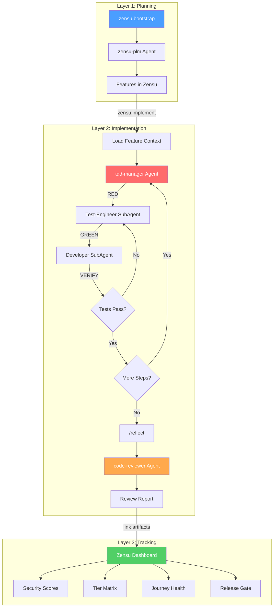

# Zensu Plugin for Claude Code

[](LICENSE)
[](CHANGELOG.md)

Zensu is a Product Lifecycle Manager that treats features as first-class citizens. This plugin covers the **entire development lifecycle** inside Claude Code — from product planning through disciplined implementation to release readiness.

## The Three Layers

```
Planning        →  Implementation  →  Tracking
zensu-plm          tdd-manager        Zensu Dashboard
/zensu:bootstrap   code-reviewer      (Web UI)
/zensu:implement   /reflect
```

**Layer 1 — Planning (WAS wird gebaut?):** Bootstrap products from vision documents, decompose into features with security profiles, define user journeys and pricing tiers.

**Layer 2 — Implementation (WIE wird es sicher gebaut?):** Strict TDD with SubAgent role separation (test-engineer cannot write production code), followed by 5+1 parallel code reviewers.

**Layer 3 — Tracking (WO steht es?):** Web dashboard for POs and stakeholders — security scores, tier matrix, journey health, coverage trends. No terminal required.

## Agent & Workflow Overview



## Installation

```bash
claude plugin install zensu --scope project
```

## Authentication

### OAuth Browser Login (Recommended)

No configuration needed. When you first use a Zensu tool, Claude Code will automatically open your browser to sign in. Tokens are cached and refreshed automatically.

### API Key (CI/CD)

For headless environments where browser login isn't available:

```bash
export ZENSU_API_KEY=zsk_...
```

Optionally set `ZENSU_MCP_URL` to override the default MCP server URL (`https://mcp.zensu.dev`).

## What's Included

### MCP Server (49 Tools)

Auto-configured connection to the Zensu MCP server providing tools for feature CRUD, security analysis, tier management, user journeys, product bootstrap, ghost scans, pulse sessions, and more.

### Agents (3)

| Agent | Role | How It Works |
|-------|------|--------------|
| **zensu-plm** | Product Lifecycle Manager | Orchestrates all Zensu workflows — feature tracking, security reviews, release readiness, bootstrap, ghost scans |
| **tdd-manager** | TDD Orchestrator | Strict RED→GREEN TDD via SubAgent role separation. Test-Engineer writes failing test, Developer implements, Test-Engineer verifies. Parallel BE/FE streams. |
| **code-reviewer** | Quality Review | Spawns 5+1 parallel specialist SubAgents: conventions, bugs, architecture, tests, security, blind reviewer |

#### TDD Manager — How It Enforces Discipline

Unlike prompt-based TDD ("please write tests first"), the TDD manager **structurally prevents** violations:

- **Test-Engineer SubAgent**: Can only write tests and run test commands. Cannot create production files.
- **Developer SubAgent**: Can only write production code. Cannot run tests or modify test files.
- **Verifier SubAgent**: Runs the test suite and reports pass/fail. Cannot modify anything.

This role separation is enforced by giving each SubAgent a different prompt with explicit constraints — not by asking a single agent to self-regulate.

Additional features: dependency graph for parallel execution, 3-retry escalation with progressive context, completeness audit, real-time progress log (`.zensu/logs/`).

#### Code Reviewer — 5+1 Parallel Specialists

| Reviewer | Scope |
|----------|-------|
| conventions-checker | CLAUDE.md compliance, naming, formatting |
| bug-hunter | Logic errors, off-by-one, null checks, race conditions |
| architecture-reviewer | Layer separation, dependency direction, patterns |
| test-analyzer | Coverage gaps, assertion quality, missing scenarios |
| security-reviewer | Secrets, injection, auth checks, input validation |
| blind-reviewer | Gets ONLY the diff, zero context — catches what others miss |

Anti-hallucination rules: every finding requires file:line reference, confidence >= 80, must Read the file before reporting.

### Skills (5)

| Skill | Description |
|-------|-------------|
| `/zensu:bootstrap` | Bootstrap a product from a vision document — creates features, journeys, security profiles, tiers |
| `/zensu:implement` | Implement a feature end-to-end with artifact linking and revision tracking |
| `/zensu:security-review` | Comprehensive security review: classification, analysis, STRIDE threat model, review completion |
| `/zensu:ghost-scan` | Scan a repository to discover undocumented features and import them |
| `/zensu:pulse` | Developer journal — track coding sessions with privacy-first activity logging |

### Hooks (3)

| Hook | Event | Description |
|------|-------|-------------|
| Auto Pulse | SessionStart | Prepares pulse session context at startup |
| Auto Reflect | SubagentStop (tdd-manager) | Triggers `/reflect` in main context after TDD completion |
| Review Handoff | SubagentStop (code-reviewer) | Presents review report and prompts for next steps |

## Typical Workflows

### New Product (Planning → Implementation → Release)

```
1. /zensu:bootstrap          → Create product, features, journeys, tiers
2. /zensu:implement ZEN-001  → Load context, plan implementation
3. @tdd-manager              → Strict TDD (RED→GREEN per step)
4. /reflect                  → Self-review in full context (auto-triggered)
5. @code-reviewer            → 5+1 parallel specialist review
6. /zensu:security-review    → OWASP, threat model, release gate check
```

### Existing Codebase

```
1. /zensu:ghost-scan         → Discover undocumented features from code
2. /zensu:security-review    → Assess security posture per feature
3. @tdd-manager              → Add tests via TDD for untested features
```

### Quick Feature (No Full TDD)

```
1. /zensu:implement ZEN-042  → Context-aware implementation with artifact linking
2. @code-reviewer            → Quality review
```

## Graceful Degradation

The TDD manager and code reviewer work **without a Zensu account**. No MCP connection needed for:
- TDD orchestration (RED→GREEN cycles)
- Code review (5+1 specialists)
- Progress logging (`.zensu/logs/`)

When Zensu MCP **is** connected, additional capabilities activate:
- Automatic `link_test` and `link_source_files` after TDD completion
- Feature status updates (`in_progress` → `testing`)
- Revision creation with implementation summary
- Security findings fed into `complete_security_review`
- Release gate validation (`validate_feature_security`)

## Configuration

### Hook Opt-Out

Zensu ships four automatic hooks that fire across the development lifecycle. Any single hook can be disabled via `~/.zensu/config.json` without forking, editing, or uninstalling the plugin.

| Flag | Hook Script | Effect when `false` |
|------|-------------|---------------------|
| `autoTdd` | `plan-approved-delegate.sh` | Skips auto-spawn of `zensu:tdd-manager` after Plan approval |
| `autoReview` | `post-tdd-review-delegate.sh` | Skips auto-spawn of `zensu:code-reviewer` after tdd-manager completes |
| `autoFix` | `post-review-tdd-delegate.sh` | Skips auto-routing of Critical/Important findings back to tdd-manager |
| `pulseSession` | `session-start-pulse.sh` | Skips the HEAD/branch banner at session start |

**Resolution rules:**

- File missing -> all hooks active (default, backward compatible)
- Key missing -> hook active
- Only an explicit boolean `false` disables a hook
- Override the config path via the `ZENSU_CONFIG` environment variable

> Flag names are **case-sensitive** and must be **JSON booleans**, not strings. A misspelled key or a quoted `"false"` is silently treated as enabled.

**Disable everything:**

```json
{
  "hooks": {
    "autoTdd": false,
    "autoReview": false,
    "autoFix": false,
    "pulseSession": false
  }
}
```

**Selective opt-out (e.g. silence the pulse banner only):**

```json
{
  "hooks": {
    "pulseSession": false
  }
}
```

A complete reference file with all flags enabled is included as [`config.example.json`](config.example.json) at the repo root. Copy it to `~/.zensu/config.json` if you prefer an explicit baseline.

### Environment Variables

| Variable | Default | Description |
|----------|---------|-------------|
| `ZENSU_MCP_URL` | `https://mcp.zensu.dev` | MCP server base URL |
| `ZENSU_API_KEY` | — | API key for CI/CD (optional if using OAuth) |

### Default Agent

Installing this plugin sets `zensu-plm` as the default agent for the project scope via `settings.json`. The agent automatically delegates Zensu-related tasks (feature tracking, security reviews, product lifecycle workflows).

To override or disable:
- Edit `settings.json` in the plugin root to change the default agent
- Remove the `"agent"` key from `settings.json` to restore the Claude Code default

## Data & Privacy

When using this plugin, certain data is transmitted to the Zensu MCP server.

**What data is transmitted:**
- Product names, feature titles, and descriptions
- Security classifications and OWASP tags
- File paths (not file contents), git SHAs, and branch names
- Vision documents (may contain product strategy and roadmap details)
- Pulse session metadata: tool names, durations, feature IDs, file paths

**Where it goes:**
- Default: `https://mcp.zensu.dev` (all data transmitted via HTTPS)
- Override with `ZENSU_MCP_URL` to point to a self-hosted instance

**What is NOT transmitted:**
- Source code content
- File contents (only paths)
- Error messages (unless `freetext_logging` is explicitly enabled for Pulse)

**Data retention:**
- Pulse sessions: 90 days by default (configurable)

**Self-hosting:**
Set `ZENSU_MCP_URL` to your own instance to keep all data on your infrastructure.

**Regulated environments:**
If you operate under GDPR, CCPA, or similar data protection regulations, review the data transmission above and consider using a self-hosted instance to maintain full control over your data.

## Platform Support

Hooks use `bash -c` and require a POSIX-compatible shell. Supported platforms:
- macOS
- Linux

Windows users need WSL or Git Bash. Native `cmd.exe` and PowerShell are not supported for hooks.

## Troubleshooting

| Problem | Solution |
|---------|----------|
| MCP server unreachable | Check `ZENSU_MCP_URL` value and network connectivity |
| Invalid API key | Verify `ZENSU_API_KEY` format (`zsk_...`) |
| Hook errors on Windows | Use WSL or Git Bash (see [Platform Support](#platform-support)) |
| Agent triggers on non-Zensu tasks | Override the default agent (see [Default Agent](#default-agent)) |
| OAuth login not opening | Check your default browser settings |
| TDD manager not spawning SubAgents | Ensure `CLAUDE_CODE_EXPERIMENTAL_AGENT_TEAMS` is not blocking |

## Contributing

See [CONTRIBUTING.md](CONTRIBUTING.md) for guidelines on reporting bugs, suggesting features, and submitting pull requests.

## Security

See [SECURITY.md](SECURITY.md) for our responsible disclosure policy.

## License

MIT
