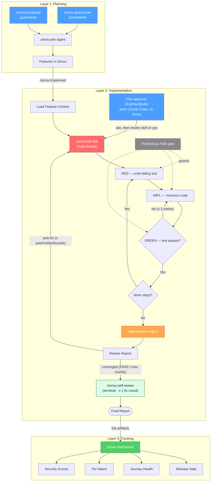

<p align="center">
  <a href="https://zensu.dev"></a>
</p>

# Zensu Plugin for Claude Code

[](LICENSE)
[](CHANGELOG.md)

Zensu is a Product Lifecycle Manager that treats features as first-class citizens. This plugin covers the **entire development lifecycle** inside Claude Code — from product planning through disciplined implementation to release readiness.

## The Three Layers

```
Planning              →  Implementation  →  Tracking
zensu-plm                /zensu:tdd         Zensu Dashboard
/zensu:bootstrap         code-reviewer      (Web UI)
/zensu:ghost-scan        auto-fix loop
/zensu:implement         (main thread)
```

**Layer 1 — Planning (WHAT is being built?):** Bootstrap a greenfield product from a vision document (`/zensu:bootstrap`), or scan an existing codebase to discover and import undocumented features (`/zensu:ghost-scan`) — or, for a brownfield repo that *also* ships a forward plan doc, run the **hybrid**: ghost-scan what is built, then add the plan's not-yet-built items as `planned` features. All end with features tracked in Zensu with security profiles, user journeys, and pricing tiers. Each discovered feature is seated at a **v1 build-out baseline** (a revision); features grow from there through deeper revisions (stages) and subfeatures (parts).

**Layer 2 — Implementation (HOW is it built securely?):** Strict TDD (Test-Driven Development — write a failing test first, then the minimum implementation to make it pass, then refactor) enforced by a PreToolUse FSM (Finite State Machine — a discipline tracker with a small set of allowed states and transitions) gate (`pre-edit-tdd-reminder.sh`) that blocks edits outside the declared RED→IMPL→GREEN phase. Followed by 5 sequential specialist code-review perspectives.

**Layer 3 — Tracking (HOW is progress tracked?):** Web dashboard for POs and stakeholders — security scores, tier matrix, journey health, coverage trends. No terminal required.

## Agent & Workflow Overview



## Installation

```bash
claude plugin marketplace add MKITConsulting/zensu-claude-code
claude plugin install zensu --scope project
```

## Authentication

### OAuth Browser Login (Recommended)

No configuration needed. When you first use a Zensu tool, Claude Code will automatically open your browser to sign in. Tokens are cached and refreshed automatically.

### API Key (CI/CD)

For headless environments where browser login isn't available, authenticate with an API key. Exporting the key alone is **not** enough — the bundled `.mcp.json` carries no `Authorization` header (the absence of one is exactly what lets interactive users get the OAuth flow above), so nothing forwards the key. Register a user-scope MCP entry that sends it:

```bash
export ZENSU_API_KEY=zsk_...
claude mcp add zensu --transport http --url https://mcp.zensu.dev/mcp \
  --header "Authorization: Bearer ${ZENSU_API_KEY}" --scope user
```

The user-scope entry takes precedence over the plugin's project-scope `.mcp.json` and survives plugin upgrades. With double quotes the shell expands `${ZENSU_API_KEY}` at add time, baking the key into `~/.claude.json` — fine for an ephemeral CI runner. On a persistent machine, single-quote the header (`'Authorization: Bearer ${ZENSU_API_KEY}'`) to store the placeholder instead and let Claude Code expand it from the environment at startup. Remove with `claude mcp remove zensu --scope user`.

To point Claude Code at a self-hosted Zensu MCP server, see [Self-hosting](#self-hosting) below.

## What's Included

### MCP Server (60 Tools)

Auto-configured connection to the Zensu MCP server providing tools for feature CRUD, security analysis, tier management, user journeys, product bootstrap, ghost scans, pulse sessions, and more.

### Agents (3)

| Agent | Role | How It Works |
|-------|------|--------------|
| **zensu-plm** | Product Lifecycle Manager | Orchestrates all Zensu workflows — feature tracking, security reviews, release readiness, bootstrap, ghost scans |
| **code-reviewer** | Quality Review | Consolidates the review. Standalone: walks 5 specialist perspectives (conventions, bugs, architecture, tests, security) in a single READ-ONLY agent. In the `/zensu:tdd` chain: runs in **fan-out consume mode**, emitting the report the main thread merged from five parallel `review-aspect` agents (no re-read, no build/test). |
| **review-aspect** | Single-Perspective Review | READ-ONLY reviewer scoped to ONE perspective. The `/zensu:tdd` chain spawns five in a single parallel batch (one per perspective), then merges their findings in the main thread. Runs zero build/test commands — the suite already ran in the Phase 6 audit. |

> **TDD is no longer an agent.** Since 0.4.0 the strict RED→GREEN TDD workflow runs in the **main thread** via the `/zensu:tdd` skill (see Skills below) — the old `tdd-manager` subagent lost too much implementation context. Since 0.6.0 the review chain fans out to five parallel `review-aspect` subagents and consolidates through a single `code-reviewer` spawn, so the existing hook chain (round counter, auto-fix loop, self-review) is unchanged.

#### /zensu:tdd — How It Enforces Discipline

Unlike prompt-based TDD ("please write tests first"), the `/zensu:tdd` workflow **structurally prevents** violations via a PreToolUse FSM gate on Edit/Write/MultiEdit:

- **Phase declaration.** Before any edit, the main agent declares the current TDD phase via `bash $CLAUDE_PLUGIN_ROOT/hooks/lib/zensu-log.sh --phase <PHASE> --step <step_id>`. Valid phases: `RED_WRITE`, `RED_RUN`, `RED_FAIL`, `IMPL`, `GREEN_RUN`, `GREEN_PASS`, `REFACTOR`.
- **Gate enforcement.** The PreToolUse hook (`pre-edit-tdd-reminder.sh`) blocks edits whose declared phase violates FSM transitions. In particular, `IMPL` requires a prior `RED_FAIL` marker for the **same step** — there is no path to production code without a failing test on record.
- **State.** Phase markers persist at `.zensu/state/tdd-phase-<session>.json`. Each step's history is auditable from the file.
- **Activation.** Phase 0 of the skill calls `zensu-log.sh --tdd-begin`, which sets a per-session chain-state `active` flag. The gate (and the Bash witness) enforce **only** while that flag is set; sessions with no active TDD chain-state — other main-thread work, other subagents, plain CLI — are never gated. (Pre-0.4.0 this keyed on `CLAUDE_AGENT_TYPE=zensu:tdd-manager`.) Bypass via `ZENSU_TDD_GATE=off` for legitimate non-TDD edits explicitly authorized by the user.

Additional features: dependency graph for independent-step sequencing, 3-retry IMPL escalation on GREEN-fail with progressive context, completeness audit (mtime discipline + build verification), real-time progress log at `.zensu/logs/`.

**Full workflow reference:** [docs/tdd-manager-workflow.md](docs/tdd-manager-workflow.md) — Mermaid flow chart, per-step FSM state diagram, hook gate behavior table, environment variables contract, discipline patches 1-9, three-channel logging.

#### Code Reviewer — 5 Sequential Specialist Perspectives

The code-reviewer agent is a single READ-ONLY agent (no `Edit` / `Write` / `Task` tools) that walks five perspectives in order:

> In the `/zensu:tdd` review chain (since 0.6.0) these five perspectives are fanned out to parallel `review-aspect` subagents and merged in the main thread; the sequential walk described here is what a direct standalone `code-reviewer` invocation does.

| Reviewer | Scope |
|----------|-------|
| conventions-checker | CLAUDE.md compliance, naming, formatting |
| bug-hunter | Logic errors, off-by-one, null checks, race conditions |
| architecture-reviewer | Layer separation, dependency direction, patterns |
| test-analyzer | Coverage gaps, assertion quality, missing scenarios |
| security-reviewer | Secrets, injection, auth checks, input validation |

Anti-hallucination rules: every finding requires file:line reference, confidence >= 80, must Read the file before reporting.

### Skills (10)

| Skill | Description |
|-------|-------------|
| `/zensu:bootstrap` | Bootstrap a product from a vision document — creates features, journeys, security profiles, tiers |
| `/zensu:implement` | Implement a feature end-to-end with artifact linking and revision tracking |
| `/zensu:tdd` | Strict RED→IMPL→GREEN TDD in the main thread, enforced by the PreToolUse phase-gate; ends by spawning `zensu:code-reviewer` with a Stop-hook-guaranteed auto-fix chain. Invoked by plan-approval (on your confirmation), `/zensu:implement`, or directly. |
| `/zensu:plan-review` | Revalidate an implementation/design plan **before** coding: dynamically casts a tailored multi-agent reviewer team via `TeamCreate` (default 6, from a 12-persona pool), runs them in parallel as read-only validators, then consolidates one report with a GO / GO-WITH-CHANGES / REVISE / NO-GO verdict plus concrete plan amendments. Reviews the plan only — writes no code, triggers no TDD. |
| `/zensu:security-review` | Comprehensive security review: classification, analysis, STRIDE threat model, review completion |
| `/zensu:ghost-scan` | Scan a repository with a multi-perspective agent fan-out to discover undocumented features, user journeys, and docs, and import them |
| `/zensu:pulse` | Developer journal — track coding sessions with privacy-first activity logging |
| `/zensu:reset-review-limit` | Reset the auto-fix loop round counter so the chain can resume past `autoFixMaxRounds` within the same session. Deletes `${CLAUDE_PLUGIN_DATA_OVERRIDE:-${CLAUDE_PROJECT_DIR:-.}/.zensu/state}/rounds-*.json` and re-arms the Stop-hook chain (clears `chainDone` + `*.stopblocks`); idempotent and symlink-safe. |
| `/zensu:self-review` | Terminal self-reflection stage of the review chain. After `zensu:code-reviewer` converges, re-reads this session's own changes across 7 dimensions, takes at most one fix round under the phase-gate (never re-running the reviewer), then owns the chain terminus (`--chain-done`) and renders the final report with a `## Self-Review Summary`. Hard-enforced via `codeReviewDone`/`selfReviewFixed`; gated by `hooks.selfReview`. |
| `/zensu:zensu-help` | Q&A skill — explains Zensu PLM concepts and plugin internals (agents, hooks, FSM, config flags). Read-only; routes workflow requests to the appropriate action skill. |

### Hooks (10)

| Hook Script | Event | Config Flag | Description |
|-------------|-------|-------------|-------------|
| `session-start-pulse.sh` | SessionStart | `pulseSession` | Emits HEAD/branch banner and prepares pulse session context at startup |
| `session-start-capture-sid.sh` | SessionStart | — | Captures the claude-code `session_id` from SessionStart stdin and persists it to `${CLAUDE_PROJECT_DIR:-.}/.zensu/state/session-id-<PPID>_<proc_hash>.txt` so later PreToolUse/PostToolUse hooks that receive a payload without `session_id` can recover the real id via a 3-tier lookup (stdin → SessionStart cache → `claude_<PPID>_<proc_hash>` deterministic fallback). Prevents cross-session collision on a literal `unknown` bucket. Process-fingerprint key (`PPID + cksum of ps -o lstart=`) survives OS PID reuse. Skips silently when `session_id` absent, `node` missing, or cache dir unwritable. |
| `session-start-banner.sh` | SessionStart | `sessionBanner` | User-facing "Zensu PLM vX active" banner + usage hints (Plan mode → ask whether to run `/zensu:tdd`, gate-enforced edits when you do, skills list). Plain stdout, shown to the user. Fires only on fresh starts (`source=startup`/`clear`), silent on `resume`/`compact`. Skipped when `sessionBanner:false`. |
| `session-start-primer.sh` | SessionStart | `sessionBanner` | Model-facing orientation: injects a short `additionalContext` primer so the agent proactively uses Plan mode and asks before running `/zensu:tdd`. Same fresh-start filter + `sessionBanner` gate as the banner. |
| `pre-edit-tdd-reminder.sh` | PreToolUse Edit/Write/MultiEdit | `ZENSU_TDD_GATE` (env) | TDD Phase Gate. Enforces RED→IMPL→GREEN FSM via `.zensu/state/tdd-phase-<sid>.json`. Active only while the session's chain-state `active` flag is set (by `zensu-log.sh --tdd-begin`); pre-0.4.0 it keyed on `CLAUDE_AGENT_TYPE=zensu:tdd-manager`. Bypass with `ZENSU_TDD_GATE=off`. Bash file mutations are intentionally **not** gated — they remain the responsibility of the `/zensu:tdd` prompt discipline + PostToolUse code-reviewer chain. |
| `plan-approved-delegate.sh` | PostToolUse ExitPlanMode | `autoTdd` | After the user approves a Plan-mode plan that adds executable code, directs the main agent to **ask the user** (via the `AskUserQuestion` tool) whether to run the `/zensu:tdd` skill (in-thread, no subagent), then run it on confirmation or implement the plan directly on decline. The question is skipped on fast-paths: doc-only plans, an explicit TDD preference already in the approval message (e.g. `kein tdd` / `mit tdd`), and non-interactive Auto Mode (defaults to running TDD). Skipped entirely when `autoTdd:false`. |
| `post-review-tdd-delegate.sh` | PostToolUse Agent | `autoFix` (+ `autoFixIncludeSuggestions`, `autoFixMaxRounds`, `combinedSummary`) | Auto-fix loop. After `zensu:code-reviewer` completes, routes Critical/Important findings back to the **main thread** to be fixed in-thread under the phase-gate (or ALL severities when `autoFixIncludeSuggestions:true`), then the main agent re-spawns the reviewer. Round counter persisted at `${CLAUDE_PLUGIN_DATA_OVERRIDE:-${CLAUDE_PROJECT_DIR:-.}/.zensu/state}/rounds-<session_id>.json` (project-local default since 0.3.23 — claude-code's auto-set `CLAUDE_PLUGIN_DATA` is intentionally IGNORED so the round budget resets per worktree); on reaching `autoFixMaxRounds` (default 5) it converges — with `hooks.selfReview` enabled (the 0.5.0 default) it marks `codeReviewDone` and hands off to the terminal `/zensu:self-review` stage, which owns `--chain-done`; otherwise it sets `chainDone` directly — and emits a convergence directive instead of routing again — pointing the user at `/zensu:reset-review-limit` to grant another budget without ending the session. At every chain-end branch (PASS, suggestions-only, max-rounds convergence) it appends a `CHAIN-END SUMMARY` directive (Implementation / Review / Auto-fix History). Disable summary with `combinedSummary:false`. |
| `post-bash-witness.sh` | PostToolUse Bash | `ZENSU_TEST_WITNESS` (env) | Test-Run Witness. Records every Bash tool invocation (command, exit code, stdout tail) to `${CLAUDE_PROJECT_DIR:-.}/.zensu/logs/witness-<session>.log` as an independent evidence channel. Active only while the session's chain-state `active` flag is set. The Phase 6 audit cross-checks each CHECKPOINT/AUDIT `cmd="..."` claim against the witness log to detect hallucinated test runs. Bypass with `ZENSU_TEST_WITNESS=off`. |
| `stop-chain-enforcer.sh` | Stop | `chainEnforcer` (+ `ZENSU_CHAIN` env) | Review-chain backstop. Blocks the main agent from ending its turn while a TDD session has finished implementation (`implComplete`) but the review chain has not terminated (`chainDone`) — forcing the `zensu:code-reviewer` spawn after implementation and after each in-thread fix round (this replaces the deleted `post-tdd-review-delegate.sh` Agent-completion trigger; since 0.5.0, once `codeReviewDone` is set with `hooks.selfReview` enabled it instead forces the terminal `/zensu:self-review` Skill until `chainDone`). Activation scoped to chain-state `active`; anti-deadlock stop-block budget = `autoFixMaxRounds + 3`. Disable with `chainEnforcer:false` or `ZENSU_CHAIN=off`. |
| `user-prompt-context-nudge.sh` | UserPromptSubmit | `context.compactionNudge` (+ `context.nudgeThreshold`, `context.windowSize`) | Context-compaction nudge. On each user prompt it tail-reads the session transcript's most recent `usage` block, computes context occupancy (`input_tokens + cache_read_input_tokens + cache_creation_input_tokens` ÷ context size — when `context.windowSize` is unset the nudge stays silent at or below 200k occupancy and treats occupancy past 200k as a proven 1M window) and, once usage reaches `context.nudgeThreshold` (default `50`%), injects a model-facing `additionalContext` reminder so the **main-thread** agent proactively proposes `/compact` to the user. It never triggers compaction itself (only the user can) and never blocks the prompt — missing `node`/transcript, sub-threshold usage, or any error exits 0 silently. A per-session state file (`${CLAUDE_PROJECT_DIR:-.}/.zensu/state/context-nudge-<sid>.txt`) records the last 10%-band that fired, so the reminder repeats once per band climb (50→60→70…) instead of every prompt and re-arms after a compaction shrinks the context. All three settings live under the top-level `context` node of `.zensu/config.json` (not `hooks`); disable with `context.compactionNudge:false`. |

## Typical Workflows

### New Product (Planning → Implementation → Release)

```
1. /zensu:bootstrap          → Create product, features, journeys, tiers
2. /zensu:implement ZEN-001  → Load context, plan implementation
3. /zensu:tdd                → Strict TDD in the main thread (RED→GREEN per step)
4. @code-reviewer            → 5-perspective sequential review (spawned by /zensu:tdd Phase 6, Stop-hook guaranteed)
5. auto-fix loop             → Critical/Important findings fixed in-thread, then re-reviewed, capped at autoFixMaxRounds
6. /zensu:security-review    → OWASP, threat model, release gate check
```

### Existing Codebase

```
1. /zensu:ghost-scan         → Discover features + journeys + docs (multi-agent fan-out); seat each at a v1 build-out baseline
2. /zensu:security-review    → Assess security posture per feature
3. /zensu:tdd                → Add tests via TDD for untested features
```

### Hybrid (Existing Codebase + Forward Plan)

For a brownfield repo whose plan/vision doc also describes not-yet-built features:

```
1. /zensu:ghost-scan         → Import what is built (each feature seated at a v1 baseline)
2. (agent) create_feature    → Plan doc's not-yet-built items → planned features
3. /zensu:implement ZEN-xxx  → Build the planned items; v1 revision at implement-time
```

No separate skill — the agent runs ghost-scan, then creates the remainder as planned features.

### Quick Feature (No Full TDD)

```
1. /zensu:implement ZEN-042  → Context-aware implementation with artifact linking
2. @code-reviewer            → Quality review
```

## Graceful Degradation

The TDD manager and code reviewer work **without a Zensu account**. No MCP connection needed for:
- TDD orchestration (RED→GREEN cycles)
- Code review (5 sequential specialist perspectives)
- Progress logging (`.zensu/logs/`)

When Zensu MCP **is** connected, additional capabilities activate:
- Automatic `link_test` and `link_source_files` after TDD completion
- Feature status updates (`in_progress` → `testing`)
- Revision creation with implementation summary
- Security findings fed into `complete_security_review`
- Release gate validation (`validate_feature_security`)

## Configuration

### Hook Opt-Out

Zensu ships ten automatic hooks that fire across the development lifecycle (full enumeration in the [Hooks (10)](#hooks-10) table above). The configurable subset is listed below; `session-start-capture-sid.sh` (session-id cache) and `pre-edit-tdd-reminder.sh` (gated via the `ZENSU_TDD_GATE` env var rather than a config flag) are unconditional infrastructure. Any flagged hook can be disabled via `~/.zensu/config.json` without forking, editing, or uninstalling the plugin.

| Flag | Hook Script | Effect when `false` (boolean flags) or value (numeric flags) |
|------|-------------|---------------------|
| `autoTdd` | `plan-approved-delegate.sh` | Skips the post-approval TDD prompt entirely — no question is asked and the main agent implements the approved plan directly |
| `chainEnforcer` | `stop-chain-enforcer.sh` | Disables the Stop-hook review-chain backstop. When `false`, the main agent may end its turn without completing the `zensu:code-reviewer` chain (the skill still spawns the reviewer once at Phase 6; only the hard guarantee is dropped). Replaces the retired `autoReview` flag. |
| `autoFix` | `post-review-tdd-delegate.sh` | Skips auto-routing of Critical/Important findings into the main-thread fix loop |
| `autoFixIncludeSuggestions` | `post-review-tdd-delegate.sh` | When `true`, the auto-fix hook routes ALL severities (Critical, Important, Suggestion, Minor, Nit) into the main-thread fix loop instead of only Critical+Important. Default `false` preserves legacy routing. **Requires `autoFix:true`** — if `autoFix` is `false`, the entire auto-fix hook short-circuits and this flag has no effect. |
| `autoFixMaxRounds` | `post-review-tdd-delegate.sh` | Integer loop guard (default `5`, valid range `1..99`). Caps the number of code-reviewer → in-thread-fix cycles per session. When the cap is reached the hook sets `chainDone` and emits a convergence directive instead of routing again. State persists per session at `${CLAUDE_PLUGIN_DATA_OVERRIDE:-${CLAUDE_PROJECT_DIR:-.}/.zensu/state}/rounds-<session_id>.json` (project-local default since 0.3.23; claude-code's auto-set `CLAUDE_PLUGIN_DATA` is intentionally IGNORED by this hook). |
| `combinedSummary` | `post-review-tdd-delegate.sh` | When `true` (default), the chain-end directive instructs the main agent to render a three-section summary (Implementation, Review, Auto-fix History) at every chain end (PASS, suggestions-only, max-rounds convergence). Set `false` to restore the terse stop behavior. Contrast `autoFixIncludeSuggestions` which defaults to disabled — `combinedSummary` defaults enabled to match user preference. |
| `selfReview` | `post-review-tdd-delegate.sh` + `stop-chain-enforcer.sh` | When `false`, disables the terminal `/zensu:self-review` hand-off — the review chain terminates at `zensu:code-reviewer` convergence (`chainDone`) instead of running the self-review stage. Default `true` (since 0.5.0). |
| `pulseSession` | `session-start-pulse.sh` | Skips the HEAD/branch banner at session start |
| `sessionBanner` | `session-start-banner.sh` + `session-start-primer.sh` | Skips the "Zensu active" user banner AND the agent-orientation primer at fresh session starts (startup/clear) |
| `context.compactionNudge` | `user-prompt-context-nudge.sh` | When `false`, suppresses the UserPromptSubmit context-compaction nudge entirely — the hook reads no transcript and never proposes `/compact`. Default `true`. Lives under the top-level `context` node (not `hooks`). |
| `context.nudgeThreshold` | `user-prompt-context-nudge.sh` | Integer percent (default `50`, valid range `1..99`) of context-window occupancy at or above which the nudge fires. Out-of-range or non-integer values fall back to `50`. **Requires `context.compactionNudge:true`.** |
| `context.windowSize` | `user-prompt-context-nudge.sh` | Optional integer token budget used as the 100% denominator when computing occupancy (valid range `1000..100000000`). **Unset by default** — since hooks aren't handed the real window size, the nudge then stays silent at or below 200k occupancy (a near-full 200k session is handled by Claude Code's own auto-compaction) and treats occupancy past 200k as a proven 1M window. Set it explicitly to the model's true window (e.g. `1000000` for a 1M model — or a sub-200k value to opt into earlier nudges) for accurate percentages on any window. **Requires `context.compactionNudge:true`.** |

**Resolution rules:**

- File missing -> all hooks active (default, backward compatible)
- Key missing -> hook active
- Only an explicit boolean `false` disables a hook
- Override the config path via the `ZENSU_CONFIG` environment variable

> Flag names are **case-sensitive** and must be **JSON booleans**, not strings. A misspelled key or a quoted `"false"` is silently treated as enabled.

**Disable everything:**

```json
{
  "hooks": {
    "autoTdd": false,
    "chainEnforcer": false,
    "autoFix": false,
    "pulseSession": false
  }
}
```

**Selective opt-out (e.g. silence the pulse banner only):**

```json
{
  "hooks": {
    "pulseSession": false
  }
}
```

A complete reference file with all flags enabled is included as [`config.example.json`](config.example.json) at the repo root. Copy it to `~/.zensu/config.json` if you prefer an explicit baseline.

> **Auto-fix prerequisite:** `autoFix:true` is required for `autoFixIncludeSuggestions` and `autoFixMaxRounds` to have any effect. If `autoFix:false`, the entire post-review hook short-circuits and both flags are moot.

### Config Resolution Order

The plugin discovers `config.json` via the following resolution order. The **first matched file** is used as-is — resolution **REPLACES**, does not **MERGE** across levels.

1. `$ZENSU_CONFIG` (environment override). Wins unconditionally when set.
2. `$CLAUDE_PROJECT_DIR/.zensu/config.json` (project-local). Used when the file exists. Auto-discovered — `CLAUDE_PROJECT_DIR` is set by Claude Code for all hook subprocesses, no user setup required.
3. `$HOME/.zensu/config.json` (global default). Used when neither of the above applies.

This lets a downstream project commit a project-local `.zensu/config.json` (e.g. enabling `autoFixIncludeSuggestions:true`) without touching the developer's global config. Likewise, a developer can override the project-local file for a single shell session via `ZENSU_CONFIG=/path/to/other.json`.

> If your project commits a `.zensu/config.json` and a developer also has `~/.zensu/config.json`, the project-local file wins — there is no field-level merge.

### Log Timestamp Style

The `/zensu:tdd` workflow writes a session log under `.zensu/logs/YYYY-MM-DD-HHMM_tdd-<slug>.log` with one line per RED/IMPL/GREEN phase. The wall-clock prefix on each line can be reformatted or suppressed via `~/.zensu/config.json`:

| Style | Inline format | Example |
|---|---|---|
| `wall` (default) | `[HH:MM:SS]` | `[14:23:45] step1 RED test_isOdd — FAIL` |
| `relative` | `[+HH:MM:SS]` from session start (< 24h); `[+Dd HH:MM:SS]` for deltas ≥ 24h | `[+00:01:23] step1 RED test_isOdd — FAIL` / `[+1d 03:45:12] step42 GREEN test_persist — PASS` |
| `none` | no prefix | `step1 RED test_isOdd — FAIL` |

Filenames retain the `YYYY-MM-DD-HHMM` session timestamp for uniqueness across multiple sessions on the same day; only the inline log-entry prefixes are affected.

Example (relative timestamps):

```json
{
  "logging": {
    "timestampStyle": "relative"
  }
}
```

Invalid values, missing keys, malformed JSON, or a missing `node` binary all fall back to `wall`.

### Environment Variables

| Variable | Default | Description |
|----------|---------|-------------|
| `ZENSU_API_KEY` | — | API key for headless/CI-CD auth — must be wired via a user-scope MCP header to take effect (see [Authentication](#authentication)); not needed when using OAuth |
| `ZENSU_TDD_GATE` | — | Set to `off` to disable the TDD Phase Gate for legitimate non-TDD edits during a main-thread `/zensu:tdd` session. Any other value (or unset) leaves the gate active while the session's chain-state `active` flag is set. |
| `ZENSU_TEST_WITNESS` | — | Set to `off` to disable the test-run witness hook (`post-bash-witness.sh`) for the current session. Any other value (or unset) leaves the witness active while the session's chain-state `active` flag is set. Per-Bash-call recording lives at `${CLAUDE_PROJECT_DIR:-.}/.zensu/logs/witness-<session>.log`. |
| `ZENSU_CHAIN` | — | Set to `off` to disable the Stop-hook review-chain backstop (`stop-chain-enforcer.sh`) so the main agent may end its turn without completing the `zensu:code-reviewer` chain. Equivalent to `hooks.chainEnforcer:false` but scoped to the shell. |
| `CLAUDE_AGENT_TYPE` | — | Set by Claude Code's harness to identify the active subagent (e.g. `zensu:code-reviewer`). Since 0.4.0 the TDD Phase Gate and witness no longer key on this — activation moved to the per-session chain-state `active` flag. Retained for subagent introspection and the eval harness. |
| `CLAUDE_PLUGIN_ROOT` | — | Set by Claude Code for hook subprocesses. Resolves to the installed plugin root and is used by `hooks.json` to reference hook scripts. No user setup required. |
| `CLAUDE_PLUGIN_DATA_OVERRIDE` | — | Opt-in override for the auto-fix rounds counter location. When set, the post-review hook (`post-review-tdd-delegate.sh`) writes per-session counters to `${CLAUDE_PLUGIN_DATA_OVERRIDE}/rounds-<session_id>.json` instead of the project-local default `${CLAUDE_PROJECT_DIR:-.}/.zensu/state/rounds-<session_id>.json`. Power-user knob for centralizing the round budget across worktrees (e.g. `$HOME/.zensu/state`); leave unset for normal per-worktree behavior. Note: claude-code's auto-set `CLAUDE_PLUGIN_DATA` is intentionally IGNORED by the rounds counter (0.3.20 used it as a fallback but the fallback was unreachable in claude-code; 0.3.23 inverts the precedence so project-local wins by default). No other Zensu hook currently reads `CLAUDE_PLUGIN_DATA` — every per-session state file (`tdd-phase-*.json`, `session-id-*.txt`, `witness-*.log`) already defaults to `${CLAUDE_PROJECT_DIR:-.}/.zensu/state/` directly. |

## Data & Privacy

When using this plugin, certain data is transmitted to the Zensu MCP server.

**What data is transmitted:**
- Product names, feature titles, and descriptions
- Security classifications and OWASP tags
- File paths (not file contents), git SHAs, and branch names
- Vision documents (may contain product strategy and roadmap details)
- Pulse session metadata: tool names, durations, feature IDs, file paths

**Where it goes:**
- Default: `https://mcp.zensu.dev` (all data transmitted via HTTPS)
- Self-hosted Zensu MCP deployments — see [Self-hosting](#self-hosting) below

**What is NOT transmitted:**
- Source code content
- File contents (only paths)
- Error messages (unless `freetext_logging` is explicitly enabled for Pulse)

**Data retention:**
- Pulse sessions: 90 days by default (configurable)

### Self-hosting

The plugin ships pointing at the SaaS default `https://mcp.zensu.dev/mcp`. To redirect Claude Code at your own Zensu MCP instance, register a user-scope MCP entry — it takes precedence over the plugin's project-scope `.mcp.json` and survives plugin upgrades:

```bash
claude mcp add zensu --transport http --url https://mcp.example.internal/mcp --scope user
```

User-scope entries persist in `~/.claude.json` and apply to every project on the machine. Remove with `claude mcp remove zensu --scope user` to fall back to the SaaS default.

Why not a `ZENSU_MCP_URL` env var? Variable expansion in `.mcp.json` only reads the shell environment at Claude Code startup — Claude Desktop's Custom Connector dialog rejects `${VAR:-default}` syntax outright, and `settings.json` `env` blocks do not reliably propagate to MCP HTTP URL expansion ([issue #1254](https://github.com/anthropics/claude-code/issues/1254)). `claude mcp add --scope user` is deterministic and portable.

**Regulated environments:**
If you operate under GDPR, CCPA, or similar data protection regulations, review the data transmission above and consider using a self-hosted instance to maintain full control over your data.

## Platform Support

Hooks use `bash -c` and require a POSIX-compatible shell. Supported platforms:
- macOS
- Linux

Windows users need WSL or Git Bash. Native `cmd.exe` and PowerShell are not supported for hooks.

## Troubleshooting

| Problem | Solution |
|---------|----------|
| MCP server unreachable | Verify network connectivity to `https://mcp.zensu.dev/mcp` (or your self-hosted URL — see [Self-hosting](#self-hosting)) |
| Invalid API key | Verify `ZENSU_API_KEY` format (`zsk_...`) and that the user-scope MCP header is registered — see [API Key (CI/CD)](#api-key-cicd) |
| Hook errors on Windows | Use WSL or Git Bash (see [Platform Support](#platform-support)) |
| Agent triggers on non-Zensu tasks | The `zensu-plm` agent's `description:` frontmatter triggers it on Zensu-related keywords. To avoid this, invoke a specific agent explicitly via `@<agent-name>` or refine your prompt. |
| OAuth login not opening | Check your default browser settings |
| TDD phase gate blocking a legitimate edit | Set `ZENSU_TDD_GATE=off` for that edit only, or declare the correct phase via `bash $CLAUDE_PLUGIN_ROOT/hooks/lib/zensu-log.sh --phase <PHASE> --step <step_id>` first |

## Contributing

See [CONTRIBUTING.md](CONTRIBUTING.md) for guidelines on reporting bugs, suggesting features, and submitting pull requests.

## Security

See [SECURITY.md](SECURITY.md) for our responsible disclosure policy.

## License

**Functional Source License, Version 1.1, Apache 2.0 Future License** ([FSL-1.1-Apache-2.0](LICENSE)).

The FSL is a source-available license designed for SaaS projects. In short:

- **You can use it for any Permitted Purpose** — internal use, modifications, forks, commercial projects, professional services for clients, education, research.
- **You cannot use it for a Competing Use** — i.e. you may not offer a commercial product or service that substitutes for the Zensu plugin or the Zensu SaaS, or provides substantially similar functionality, while this restriction is in effect.
- **Auto-conversion to Apache 2.0** — each release converts to the Apache License 2.0 on the second anniversary of its public availability. After that date, that release is unrestricted OSS.

The full text and the canonical FAQ live at [fsl.software](https://fsl.software/). For commercial-use questions outside the Permitted Purpose, contact [contact@zensu.dev](mailto:contact@zensu.dev).
