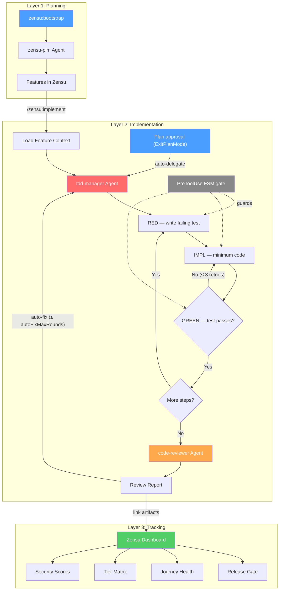

# Zensu Plugin for Claude Code

[](LICENSE)
[](CHANGELOG.md)

Zensu is a Product Lifecycle Manager that treats features as first-class citizens. This plugin covers the **entire development lifecycle** inside Claude Code — from product planning through disciplined implementation to release readiness.

## The Three Layers

```
Planning        →  Implementation  →  Tracking
zensu-plm          tdd-manager        Zensu Dashboard
/zensu:bootstrap   code-reviewer      (Web UI)
/zensu:implement   auto-fix loop
```

**Layer 1 — Planning (WHAT is being built?):** Bootstrap products from vision documents, decompose into features with security profiles, define user journeys and pricing tiers.

**Layer 2 — Implementation (HOW is it built securely?):** Strict TDD enforced by a PreToolUse FSM gate (`pre-edit-tdd-reminder.sh`) that blocks edits outside the declared RED→IMPL→GREEN phase. Followed by 5 sequential specialist code-review perspectives.

**Layer 3 — Tracking (HOW is progress tracked?):** Web dashboard for POs and stakeholders — security scores, tier matrix, journey health, coverage trends. No terminal required.

## Agent & Workflow Overview



## Installation

```bash
claude plugin install zensu --scope project
```

## Authentication

### OAuth Browser Login (Recommended)

No configuration needed. When you first use a Zensu tool, Claude Code will automatically open your browser to sign in. Tokens are cached and refreshed automatically.

### API Key (CI/CD)

For headless environments where browser login isn't available:

```bash
export ZENSU_API_KEY=zsk_...
```

Optionally set `ZENSU_MCP_URL` to override the default MCP server URL (`https://mcp.zensu.dev`).

## What's Included

### MCP Server (49 Tools)

Auto-configured connection to the Zensu MCP server providing tools for feature CRUD, security analysis, tier management, user journeys, product bootstrap, ghost scans, pulse sessions, and more.

### Agents (3)

| Agent | Role | How It Works |
|-------|------|--------------|
| **zensu-plm** | Product Lifecycle Manager | Orchestrates all Zensu workflows — feature tracking, security reviews, release readiness, bootstrap, ghost scans |
| **tdd-manager** | TDD Orchestrator | Strict RED→IMPL→GREEN TDD enforced by a PreToolUse FSM gate that blocks edits outside the declared phase. Dependency graph for independent-step sequencing, 3-retry IMPL escalation on GREEN-fail, completeness audit, real-time progress log in `.zensu/logs/`. |
| **code-reviewer** | Quality Review | Runs 5 specialist review perspectives sequentially in a single READ-ONLY agent: conventions, bugs, architecture, tests, security. |

#### TDD Manager — How It Enforces Discipline

Unlike prompt-based TDD ("please write tests first"), the TDD manager **structurally prevents** violations via a PreToolUse FSM gate on Edit/Write/MultiEdit:

- **Phase declaration.** Before any edit, the agent declares the current TDD phase via `bash $CLAUDE_PLUGIN_ROOT/hooks/lib/zensu-log.sh --phase <PHASE> --step <step_id>`. Valid phases: `RED_WRITE`, `RED_RUN`, `RED_FAIL`, `IMPL`, `GREEN_RUN`, `GREEN_PASS`, `REFACTOR`.
- **Gate enforcement.** The PreToolUse hook (`pre-edit-tdd-reminder.sh`) blocks edits whose declared phase violates FSM transitions. In particular, `IMPL` requires a prior `RED_FAIL` marker for the **same step** — there is no path to production code without a failing test on record.
- **State.** Phase markers persist at `.zensu/state/tdd-phase-<session>.json`. Each step's history is auditable from the file.
- **Scope.** The gate is active **only** when `CLAUDE_AGENT_TYPE=zensu:tdd-manager`. Main-thread edits and other subagents are never gated. Bypass via `ZENSU_TDD_GATE=off` for legitimate non-TDD edits explicitly authorized by the user.

Additional features: dependency graph for independent-step sequencing, 3-retry IMPL escalation on GREEN-fail with progressive context, completeness audit (mtime discipline + build verification), real-time progress log at `.zensu/logs/`.

#### Code Reviewer — 5 Sequential Specialist Perspectives

The code-reviewer agent is a single READ-ONLY agent (no `Edit` / `Write` / `Task` tools) that walks five perspectives in order:

| Reviewer | Scope |
|----------|-------|
| conventions-checker | CLAUDE.md compliance, naming, formatting |
| bug-hunter | Logic errors, off-by-one, null checks, race conditions |
| architecture-reviewer | Layer separation, dependency direction, patterns |
| test-analyzer | Coverage gaps, assertion quality, missing scenarios |
| security-reviewer | Secrets, injection, auth checks, input validation |

Anti-hallucination rules: every finding requires file:line reference, confidence >= 80, must Read the file before reporting.

### Skills (5)

| Skill | Description |
|-------|-------------|
| `/zensu:bootstrap` | Bootstrap a product from a vision document — creates features, journeys, security profiles, tiers |
| `/zensu:implement` | Implement a feature end-to-end with artifact linking and revision tracking |
| `/zensu:security-review` | Comprehensive security review: classification, analysis, STRIDE threat model, review completion |
| `/zensu:ghost-scan` | Scan a repository to discover undocumented features and import them |
| `/zensu:pulse` | Developer journal — track coding sessions with privacy-first activity logging |

### Hooks (5)

| Hook Script | Event | Config Flag | Description |
|-------------|-------|-------------|-------------|
| `session-start-pulse.sh` | SessionStart | `pulseSession` | Emits HEAD/branch banner and prepares pulse session context at startup |
| `pre-edit-tdd-reminder.sh` | PreToolUse Edit/Write/MultiEdit | `ZENSU_TDD_GATE` (env) | TDD Phase Gate. Enforces RED→IMPL→GREEN FSM via `.zensu/state/tdd-phase-<sid>.json`. Active only when `CLAUDE_AGENT_TYPE=zensu:tdd-manager`. Bypass with `ZENSU_TDD_GATE=off`. Bash file mutations are intentionally **not** gated — they remain the responsibility of the tdd-manager prompt discipline + PostToolUse code-reviewer chain. |
| `plan-approved-delegate.sh` | PostToolUse ExitPlanMode | `autoTdd` | Auto-spawns `@zensu:tdd-manager` in the main context after the user approves a Plan-mode plan. Skipped when `autoTdd:false`. |
| `post-tdd-review-delegate.sh` | PostToolUse Agent | `autoReview` | After `zensu:tdd-manager` completes, auto-spawns `@zensu:code-reviewer` for the 5-perspective sequential review. Filters on `subagent_type == "zensu:tdd-manager"`; other subagents bypass. Skipped when `autoReview:false`. |
| `post-review-tdd-delegate.sh` | PostToolUse Agent | `autoFix` (+ `autoFixIncludeSuggestions`, `autoFixMaxRounds`) | Auto-fix loop. After `zensu:code-reviewer` completes, routes Critical/Important findings back to `@zensu:tdd-manager` for remediation (or ALL severities when `autoFixIncludeSuggestions:true`). Round counter persisted at `${CLAUDE_PLUGIN_DATA:-$HOME/.zensu/state}/rounds-<session_id>.json`; emits a convergence directive instead of re-spawning once `autoFixMaxRounds` (default 5) is reached. |

## Typical Workflows

### New Product (Planning → Implementation → Release)

```
1. /zensu:bootstrap          → Create product, features, journeys, tiers
2. /zensu:implement ZEN-001  → Load context, plan implementation
3. @tdd-manager              → Strict TDD (RED→GREEN per step)
4. @code-reviewer            → 5-perspective sequential review (auto-spawned by post-tdd-review-delegate.sh)
5. auto-fix loop             → Critical/Important findings re-routed to @tdd-manager, capped at autoFixMaxRounds
6. /zensu:security-review    → OWASP, threat model, release gate check
```

### Existing Codebase

```
1. /zensu:ghost-scan         → Discover undocumented features from code
2. /zensu:security-review    → Assess security posture per feature
3. @tdd-manager              → Add tests via TDD for untested features
```

### Quick Feature (No Full TDD)

```
1. /zensu:implement ZEN-042  → Context-aware implementation with artifact linking
2. @code-reviewer            → Quality review
```

## Graceful Degradation

The TDD manager and code reviewer work **without a Zensu account**. No MCP connection needed for:
- TDD orchestration (RED→GREEN cycles)
- Code review (5 sequential specialist perspectives)
- Progress logging (`.zensu/logs/`)

When Zensu MCP **is** connected, additional capabilities activate:
- Automatic `link_test` and `link_source_files` after TDD completion
- Feature status updates (`in_progress` → `testing`)
- Revision creation with implementation summary
- Security findings fed into `complete_security_review`
- Release gate validation (`validate_feature_security`)

## Configuration

### Hook Opt-Out

Zensu ships four automatic hooks that fire across the development lifecycle. Any single hook can be disabled via `~/.zensu/config.json` without forking, editing, or uninstalling the plugin.

| Flag | Hook Script | Effect when `false` (boolean flags) or value (numeric flags) |
|------|-------------|---------------------|
| `autoTdd` | `plan-approved-delegate.sh` | Skips auto-spawn of `zensu:tdd-manager` after Plan approval |
| `autoReview` | `post-tdd-review-delegate.sh` | Skips auto-spawn of `zensu:code-reviewer` after tdd-manager completes |
| `autoFix` | `post-review-tdd-delegate.sh` | Skips auto-routing of Critical/Important findings back to tdd-manager |
| `autoFixIncludeSuggestions` | `post-review-tdd-delegate.sh` | When `true`, the auto-fix hook routes ALL severities (Critical, Important, Suggestion, Minor, Nit) to `zensu:tdd-manager` instead of only Critical+Important. Default `false` preserves legacy routing. **Requires `autoFix:true`** — if `autoFix` is `false`, the entire auto-fix hook short-circuits and this flag has no effect. |
| `autoFixMaxRounds` | `post-review-tdd-delegate.sh` | Integer loop guard (default `5`, valid range `1..99`). Caps the number of code-reviewer → tdd-manager cycles per session. When the cap is reached the hook emits a convergence directive instead of spawning `zensu:tdd-manager` again. State persists per session at `${CLAUDE_PLUGIN_DATA:-$HOME/.zensu/state}/rounds-<session_id>.json`. |
| `pulseSession` | `session-start-pulse.sh` | Skips the HEAD/branch banner at session start |

**Resolution rules:**

- File missing -> all hooks active (default, backward compatible)
- Key missing -> hook active
- Only an explicit boolean `false` disables a hook
- Override the config path via the `ZENSU_CONFIG` environment variable

> Flag names are **case-sensitive** and must be **JSON booleans**, not strings. A misspelled key or a quoted `"false"` is silently treated as enabled.

**Disable everything:**

```json
{
  "hooks": {
    "autoTdd": false,
    "autoReview": false,
    "autoFix": false,
    "pulseSession": false
  }
}
```

**Selective opt-out (e.g. silence the pulse banner only):**

```json
{
  "hooks": {
    "pulseSession": false
  }
}
```

A complete reference file with all flags enabled is included as [`config.example.json`](config.example.json) at the repo root. Copy it to `~/.zensu/config.json` if you prefer an explicit baseline.

> **Auto-fix prerequisite:** `autoFix:true` is required for `autoFixIncludeSuggestions` and `autoFixMaxRounds` to have any effect. If `autoFix:false`, the entire post-review hook short-circuits and both flags are moot.

### Config Resolution Order

The plugin discovers `config.json` via the following resolution order. The **first matched file** is used as-is — resolution **REPLACES**, does not **MERGE** across levels.

1. `$ZENSU_CONFIG` (environment override). Wins unconditionally when set.
2. `$CLAUDE_PROJECT_DIR/.zensu/config.json` (project-local). Used when the file exists. Auto-discovered — `CLAUDE_PROJECT_DIR` is set by Claude Code for all hook subprocesses, no user setup required.
3. `$HOME/.zensu/config.json` (global default). Used when neither of the above applies.

This lets a downstream project commit a project-local `.zensu/config.json` (e.g. enabling `autoFixIncludeSuggestions:true`) without touching the developer's global config. Likewise, a developer can override the project-local file for a single shell session via `ZENSU_CONFIG=/path/to/other.json`.

> If your project commits a `.zensu/config.json` and a developer also has `~/.zensu/config.json`, the project-local file wins — there is no field-level merge.

### Log Timestamp Style

The `zensu:tdd-manager` subagent writes a session log under `.zensu/logs/YYYY-MM-DD-HHMM_tdd-<slug>.log` with one line per RED/IMPL/GREEN phase. The wall-clock prefix on each line can be reformatted or suppressed via `~/.zensu/config.json`:

| Style | Inline format | Example |
|---|---|---|
| `wall` (default) | `[HH:MM:SS]` | `[14:23:45] step1 RED test_isOdd — FAIL` |
| `relative` | `[+HH:MM:SS]` from session start (< 24h); `[+Dd HH:MM:SS]` for deltas ≥ 24h | `[+00:01:23] step1 RED test_isOdd — FAIL` / `[+1d 03:45:12] step42 GREEN test_persist — PASS` |
| `none` | no prefix | `step1 RED test_isOdd — FAIL` |

Filenames retain the `YYYY-MM-DD-HHMM` session timestamp for uniqueness across multiple sessions on the same day; only the inline log-entry prefixes are affected.

Example (relative timestamps):

```json
{
  "logging": {
    "timestampStyle": "relative"
  }
}
```

Invalid values, missing keys, malformed JSON, or a missing `node` binary all fall back to `wall`.

### Environment Variables

| Variable | Default | Description |
|----------|---------|-------------|
| `ZENSU_MCP_URL` | `https://mcp.zensu.dev` | MCP server base URL |
| `ZENSU_API_KEY` | — | API key for CI/CD (optional if using OAuth) |
| `ZENSU_TDD_GATE` | — | Set to `off` to disable the TDD Phase Gate for legitimate non-TDD edits inside a `zensu:tdd-manager` subagent context. Any other value (or unset) leaves the gate active per `CLAUDE_AGENT_TYPE` resolution. |
| `CLAUDE_AGENT_TYPE` | — | Set by Claude Code's harness to identify the active subagent (e.g. `zensu:tdd-manager`). The TDD Phase Gate is active **only** when this is exactly `zensu:tdd-manager`; empty or any other value disables the gate (main-thread edits and other subagents are never gated). |
| `CLAUDE_PLUGIN_ROOT` | — | Set by Claude Code for hook subprocesses. Resolves to the installed plugin root and is used by `hooks.json` to reference hook scripts. No user setup required. |
| `CLAUDE_PLUGIN_DATA` | `$HOME/.zensu/state` | Set by Claude Code; the auto-fix loop persists per-session round counters at `${CLAUDE_PLUGIN_DATA}/rounds-<session_id>.json`. Falls back to `$HOME/.zensu/state` when unset. |

## Data & Privacy

When using this plugin, certain data is transmitted to the Zensu MCP server.

**What data is transmitted:**
- Product names, feature titles, and descriptions
- Security classifications and OWASP tags
- File paths (not file contents), git SHAs, and branch names
- Vision documents (may contain product strategy and roadmap details)
- Pulse session metadata: tool names, durations, feature IDs, file paths

**Where it goes:**
- Default: `https://mcp.zensu.dev` (all data transmitted via HTTPS)
- Override with `ZENSU_MCP_URL` to point to a self-hosted instance

**What is NOT transmitted:**
- Source code content
- File contents (only paths)
- Error messages (unless `freetext_logging` is explicitly enabled for Pulse)

**Data retention:**
- Pulse sessions: 90 days by default (configurable)

**Self-hosting:**
Set `ZENSU_MCP_URL` to your own instance to keep all data on your infrastructure.

**Regulated environments:**
If you operate under GDPR, CCPA, or similar data protection regulations, review the data transmission above and consider using a self-hosted instance to maintain full control over your data.

## Platform Support

Hooks use `bash -c` and require a POSIX-compatible shell. Supported platforms:
- macOS
- Linux

Windows users need WSL or Git Bash. Native `cmd.exe` and PowerShell are not supported for hooks.

## Troubleshooting

| Problem | Solution |
|---------|----------|
| MCP server unreachable | Check `ZENSU_MCP_URL` value and network connectivity |
| Invalid API key | Verify `ZENSU_API_KEY` format (`zsk_...`) |
| Hook errors on Windows | Use WSL or Git Bash (see [Platform Support](#platform-support)) |
| Agent triggers on non-Zensu tasks | The `zensu-plm` agent's `description:` frontmatter triggers it on Zensu-related keywords. To avoid this, invoke a specific agent explicitly via `@<agent-name>` or refine your prompt. |
| OAuth login not opening | Check your default browser settings |
| TDD phase gate blocking a legitimate edit | Set `ZENSU_TDD_GATE=off` for that edit only, or declare the correct phase via `bash $CLAUDE_PLUGIN_ROOT/hooks/lib/zensu-log.sh --phase <PHASE> --step <step_id>` first |

## Contributing

See [CONTRIBUTING.md](CONTRIBUTING.md) for guidelines on reporting bugs, suggesting features, and submitting pull requests.

## Security

See [SECURITY.md](SECURITY.md) for our responsible disclosure policy.

## License

**Functional Source License, Version 1.1, Apache 2.0 Future License** ([FSL-1.1-Apache-2.0](LICENSE)).

The FSL is a source-available license designed for SaaS projects. In short:

- **You can use it for any Permitted Purpose** — internal use, modifications, forks, commercial projects, professional services for clients, education, research.
- **You cannot use it for a Competing Use** — i.e. you may not offer a commercial product or service that substitutes for the Zensu plugin or the Zensu SaaS, or provides substantially similar functionality, while this restriction is in effect.
- **Auto-conversion to Apache 2.0** — each release converts to the Apache License 2.0 on the second anniversary of its public availability. After that date, that release is unrestricted OSS.

The full text and the canonical FAQ live at [fsl.software](https://fsl.software/). For commercial-use questions outside the Permitted Purpose, contact [contact@zensu.dev](mailto:contact@zensu.dev).
