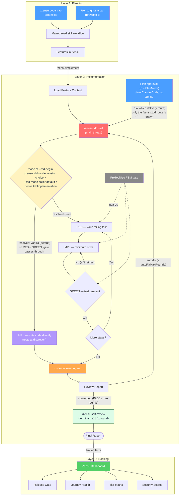

# Architecture

How the three layers fit together, what the review chain does, and the one
rule underneath all of it. Start at the [README](../README.md) if you just
want to install and run it.

## The Three Layers

```
Planning              →  Implementation  →  Tracking
main-thread skills       /zensu:tdd         Zensu Dashboard
/zensu:bootstrap         code-reviewer      (Web UI)
/zensu:ghost-scan        auto-fix loop
/zensu:implement         (main thread)
```

**Layer 1 — Planning (WHAT is being built?):** Bootstrap a greenfield product from a vision document (`/zensu:bootstrap`), or scan an existing codebase to discover and import undocumented features (`/zensu:ghost-scan`) — or, for a brownfield repo that *also* ships a forward plan doc, run the **hybrid**: ghost-scan what is built, then add the plan's not-yet-built items as `planned` features. All end with features tracked in Zensu with security profiles, user journeys, and pricing tiers. Each discovered feature is seated at a **v1 build-out baseline** (a revision); features grow from there through deeper revisions (stages) and subfeatures (parts).

**Layer 2 — Implementation (HOW is it built securely?):** `/zensu:tdd` runs in the main thread in vanilla implementation mode by default. Opt-in strict TDD (Test-Driven Development — write a failing test first, then the minimum implementation to make it pass, then refactor) is available via `hooks.tddImplementation:true` and enforced by the PreToolUse RED→IMPL→GREEN FSM gate (`pre-edit-tdd-reminder.sh`); `/zensu:tdd-mode` switches the same discipline for one session without touching config, and a skill can request it per run (`/zensu:pr-fix-findings` asks for strict). Both modes keep the evidence audits and guaranteed read-only review chain: five parallel specialist aspects → optional judge (default on) → consume-mode code-reviewer → auto-fix loop → self-review.

**Layer 3 — Tracking (HOW is progress tracked?):** Web dashboard for POs and stakeholders — security scores, tier matrix, journey health, coverage trends. No terminal required.

## Agent & Workflow Overview

The Implementation layer shows both modes: **vanilla** skips the RED→GREEN
ceremony and lets the edit gate pass through; **strict** enforces it. The mode is
resolved once at `--tdd-begin` from the ladder in the decision node below —
`hooks.tddImplementation` (default `false`) is rank 3 of it, and both a
`/zensu:tdd-mode` session choice and a calling skill's own `--tdd-mode strict`
default outrank the flag. The review chain and evidence audits run in both.



## Evidence Discipline

One rule runs underneath every other mechanism in this plugin: **an agent may state only what it has actually observed.** A plausible sentence nobody checked is the most expensive defect the plugin can produce, because every later stage — the review chain, the Phase 6 audits, the PR body, the user's decision — treats it as established fact and builds on it.

[`docs/evidence-discipline.md`](evidence-discipline.md) is the single source of truth: no unobserved assertion; cite the observation behind every claim; mark what could not be verified as unverified instead of smoothing it over; settle assumptions with a check before acting and surface the ones you cannot; never invent a path, symbol, identifier, command, flag, API shape, version, or citation; never restate a build/test/coverage result this session did not produce. It lives under `docs/` on purpose — that directory is inside the Session Control runtime digest, so the declared source of truth is tamper-evident within a session exactly like the carriers that quote it. That holds only while the executing plugin root *is* the recorded one: the digest measures the recorded root, the hook reads from the executing one, and `servesRecordedRuntime` deliberately lets a compatible sibling install serve a record it did not mint (see [Runtime Lineage](../CLAUDE.md)), so a mid-session upgrade injects bytes no in-session digest measured. The build-time pins in `tests/structure/test-evidence-discipline.sh` are what bind the text across that case.

It reaches every process through three deliberately redundant carriers, because each one alone has a hole:

| Carrier | Reaches | Hole it covers |
|---------|---------|----------------|
| `hooks/session-start-evidence-discipline.sh` | the main thread on every `SessionStart` (including `resume`/`compact`) and every subagent on `SubagentStart` | free-form work that never invokes a skill, and context lost to a compaction |
| `agents/*.md` | every spawned agent | a child whose hook context is advisory or absent |
| `skills/*/SKILL.md` | every invoked workflow | a session that started before the plugin was installed or updated |

The hook reads the block out of the canonical file at run time rather than carrying its own copy, so it cannot drift from the `agents/*.md` and `skills/*/SKILL.md` prompt carriers when the rule is reworded. (The carrier population is pinned as `EXPECTED_AGENTS` + `EXPECTED_SKILLS` in `tests/structure/test-evidence-discipline.sh`; it is deliberately not restated as a literal here, because a numeral goes stale on every new skill and nothing fails closed on it.)

It is the only **advisory** hook without a config flag — `hooks.sessionBanner:false`, or disabling every other hook, does not silence it. Other hooks carry no flag either (`session-start-session-control.sh`, `pre-reviewer-capability-gate.sh`, `pre-write-plugin-data-guard.sh`, `session-start-autopilot-resume.sh`, `post-artifact-redact.sh`, the two `review-evidence-subagent-*` hooks), but those are enforcement or evidence-plumbing hooks that must not be disableable at all; what makes this one unusual is that every other *advisory, context-injecting* hook is flagged. It is also fail-silent: an unknown event, a malformed payload, a missing `node`, or a rule file that is absent, symlinked, swapped between the pre-check and the open, oversized in FILE or in BLOCK, short-read, or malformed exits `0` with no output. The one branch that is not silent is a mismatched inherited `CLAUDE_PLUGIN_ROOT`, which refuses with exit `2` on stderr; every other path lets an always-on hook through rather than blocking a prompt or a spawn. The two size bounds are separate: a file far under the file ceiling can still carry one over-long block, and that is refused too.

**The block names no file, on purpose.** A `reviewer-readonly-v1` subagent resolves tool paths against the *project* root, not the plugin root, so a `docs/evidence-discipline.md` pointer inside the block could only ever resolve into the repository under review — letting a hostile repo plant that path and have its own text ingested as the authoritative rule. The two leased `evidence-worker-v1` agents would additionally burn a bounded turn on a read their lease denies. So the block declares itself complete and forbids any workspace file claiming to be the rule from overriding it; agents act on the block, humans and the hook read the file.

`tests/structure/test-evidence-discipline.sh` keeps the three carriers honest: the condensed block is extracted from between the canonical file's markers and must appear **verbatim** in every agent and every skill, so a newly added surface that omits it fails the suite instead of shipping without the rule. Anti-vacuity is pinned too — extraction hard-aborts rather than degrading to an empty pattern, the carrier predicate is exercised against missing, paraphrased and unterminated fixtures, and the content assertions run against the hook's *emitted* context rather than its source text.

One reviewer is not a plugin file and so cannot be a carrier: a **repo-custom review persona** (`.claude/agents/zensu-review-*.md`) is authored by the repository under review. `/zensu:pr-team-review` and `/zensu:plan-review` are covered by construction — they spawn a custom seat *as* one of the confined plugin workers, which carries the block like any agent. `/zensu:tdd` is the one path that spawns a custom persona under its own `subagent_type`, so its fan-out prepends the canonical block to that spawn prompt, read from the canonical file at run time rather than duplicated. The suite pins all of it, including the premise: if either other skill ever starts spawning custom seats under their own type, that path loses its carrier the same silent way, and the check fails.

The prose is the floor, not the ceiling. Where the discipline can be enforced by machinery it already is — the [witness cross-check](configuration.md#hooks-25) matches every claimed `cmd="…"` against an independent record of what actually ran, REVIEW PACKET v1 makes reviewers reject an evidence-less spawn rather than review from imagination, `/zensu:verify-feature` reports `PARTIAL` instead of inferring an outcome, and `/zensu:wargame` marks an unsettled assumption `RECON NEEDED` with the check that settles it. When extending the plugin, prefer a check that fails closed over a sentence asking the model to be careful.

That cross-check is `hooks/lib/zensu-evidence-crosscheck.js`, and it is code for a reason worth stating precisely. It used to be a prose recipe — "for each `cmd="X"` claim, run `grep -F -q 'cmd="X"'` against the witness log", plus a hand-executed tail scan. The recipe is not known to be wrong on its own: the witness JSON-encodes each recorded command, and that escaping happens to defeat the obvious attack where the `printf` that *wrote* a claim ends up corroborating it. What failed, in a real session on this repository, was the execution — the procedure was carried out by hand, every claim came back `verified`, and that verdict reached a human before anyone noticed nothing had actually been established. A check that must be re-derived and re-run by hand has no failure mode anyone can test and no exit code any gate can consume.

Moving it into a library fixes that and adds what the prose never had: a witness entry that is itself a log write cannot corroborate anything, matching is equality rather than containment, the format is decoded rather than pattern-scraped, a missing witness log fails closed, and the verdict is a deterministic exit code. `/zensu:tdd` Phase 6 and the terminal `/zensu:self-review` report both call it instead of describing it, and `tests/structure/test-evidence-crosscheck.sh` pins each of those properties — including the log-write exclusion — against fixtures. The lesson generalizes past this one check: a correct procedure that a model re-executes from prose each run is not yet enforcement.

## Best Solution First

A second normative rule ships the same way, and the pair is now a **pattern worth naming**: a rule block lives under `docs/` between HTML markers, and a hook reads it out of that file *at run time* and injects it as `additionalContext`. The canonical file is the only copy; the carrier cannot drift from it; and `docs/` sits inside the Session Control runtime digest, so the declared source of truth is tamper-evident within a session — while the executing plugin root is the recorded one. `servesRecordedRuntime` lets a compatible sibling install serve a record it did not mint, and both carriers read from the *executing* root, so across a mid-session upgrade the injected bytes come from a tree no in-session digest measured; each rule's own build-time pins are what bind the text there. A third such rule belongs here too — and one already exists without following it:
`hooks/user-prompt-zen-mode.sh` injects a ~4.7 KB always-on contract on the same
`UserPromptSubmit` channel, hardcoded as a shell heredoc rather than read from a marker
block. It is named here so the next reader does not conclude it was overlooked.

The two instances used to diverge in three ways, and no longer do. On **file hardening**,
`session-start-evidence-discipline.sh` read its file with a plain `readFileSync` behind the
shell pre-check alone; it now carries the same lstat → platform-gated `O_NOFOLLOW` open →
fstat dev/ino re-check → size-bounded looped read → guarded close as the best-solution-first
reader, and is enrolled beside it in the per-file secure-open inventory in
`tests/structure/test-windows-portability-guards.sh` — together with a cross-carrier pin on the
two readers, since every other pin in that inventory is per-file and would let a one-sided edit
fork the pattern with the suite green. That pin has grown
since, and its exact coverage — which range the comparison extracts, what it deliberately stops
before, and which constants it binds — is recorded once, in the `CLAUDE.md` section
"Marker-Block Carriers". Do not restate it here; two records of one mechanism is the failure
this paragraph exists to name. On
the **injected-block bound**, the evidence carrier bounded the FILE but not the single line it
actually injects, so a file far under the file ceiling could still carry an arbitrarily long
directive into every session and every subagent; it now carries the sibling's `MAX_BLOCK`, and `test-evidence-discipline.sh` gained the structural and behavioural pins the sibling
already had. On the **tamper-evidence sentence**,
which was never confined to one file, the imprecision for a lineage-served session is narrowed
in both hook headers and in every prose site that repeated it. The first and the third were recorded here as outstanding
work rather than filed as issues; the injected-block bound was found in review. This paragraph
was their only record and is now the record that all three closed. A divergence with no owner is how a pattern permanently
forks.

[`docs/best-solution-first.md`](best-solution-first.md) is the second instance: **when you put choices in front of the user, the option set must contain the solution you would defend as best for them over the long run, and that option must come first.** Its carrier is `hooks/user-prompt-best-solution-first.sh`, on `UserPromptSubmit` — every prompt, for the whole session — and on `SubagentStart`, so every spawned child gets it too.

Three things differ from evidence discipline, each deliberate:

| Axis | Evidence discipline | Best solution first |
|------|---------------------|---------------------|
| Carriers | three (hook, `agents/*.md`, `skills/*/SKILL.md`) | one on the subagent leg (the hook); zen-mode carries a partial second copy on the main thread |
| Config flag | none by design | `hooks.bestSolutionFirst`, default on |
| Main-thread event | `SessionStart` | `UserPromptSubmit`, every prompt |

The **flag** exists because this rule governs how a decision is *presented*, not whether a claim is *true*; a project may reasonably turn it off, and one that does still receives evidence discipline. The consequence to keep in view is that the project-local config wins per key, so a repository under review can silence it for the subagents reviewing it — acceptable for a presentation rule, and precisely why evidence discipline reads no configuration at all.

The **per-prompt** event, rather than `SessionStart`, is the whole point: a rule delivered once fades as the context fills, and it fades exactly when an agent starts optimizing for the smallest disturbance to what already exists. There is no de-bounce band — unlike `user-prompt-context-nudge.sh`, which is right to fire once per threshold band — because the moment an agent is about to frame a question is not observable in advance.

**What it costs, measured rather than asserted — and exactly one of these figures is
enforced.** `C6` in `tests/structure/test-evidence-discipline.sh` derives an emitted length
from a hook and greps this paragraph for it. Name the figure, because the referent is easy to
get backwards: what `C6` pins is the **939-character** figure stated below for
`session-start-evidence-discipline.sh`, not the 1756/1764 headline for this hook — a grep of
`tests/` for either of those two numbers returns nothing, and the 6.3 KB per-turn total derived
from 1764 is unpinned with them. Every OTHER number here — the sibling's emitted length, the
KB estimates and the per-turn totals — is hand-computed and illustrative: they were correct
when written, nothing re-derives them, and a change to any input silently ages them. Read them
as an order of magnitude, not as a measurement, and do not add a new figure here expecting the
suite to keep it honest. Driving the hook directly, each injection
is **1756 characters / 1764 bytes** of `additionalContext`, identical on both legs. For scale,
`session-start-evidence-discipline.sh` emits 939 characters, and `hooks/user-prompt-zen-mode.sh`
injects roughly 4.7 KB on the same prompt channel. The DIRECTIVE behind that figure is bounded
since the chain-progress anchor landed — `Z30` in `tests/structure/test-zen-mode.sh` holds it
under a declared ceiling — but `Z30` reads the hook and never opens this document, so the number
written here is hand-derived like every other one below, and ages the same way. `C6` above stays
the only figure a check reads out of this paragraph. A `/zensu:tdd` review round spawns five
`review-aspect` agents plus a judge and a code-reviewer, so the `SubagentStart` leg adds about
**at least** 12 KB across one fan-out — more with repo-custom personas, and again per auto-fix
round. The dominant term, though, is the other leg, and it is the one the design deliberately
leaves unbounded: `UserPromptSubmit` fires every prompt with no de-bounce, so with zen-mode active
— the shipped default — the standing per-prompt injection is 4664 + 1764 = about **6.3 KB every
turn**, roughly 126 KiB over 20 turns and 377 KiB over 60. That is the real price of "resident
rather than periodic", and it should be argued on those numbers rather than on the fan-out figure.
The subagent leg deliberately has no per-`agent_type` filter — the requirement
was that the rule reach subagents, and the block's own precedence clause tells a confined reviewer
it never reorders output whose shape a contract fixes. `tests/structure/test-best-solution-first.sh`
B4d pins the absence of a PRINCIPAL filter — it greps the three helpers that would narrow the
hook to `main-v1` — so the `SubagentStart` leg cannot be silenced wholesale by a later edit. It
does NOT see a per-`agent_type` filter. B4/B4a do drive one type — they send
`agent_type: "zensu:review-aspect"` and assert the emission — so a filter excluding THAT type
turns them red. A filter that still admits it is invisible to every check in the tree, and
that narrower axis is held by this prose alone.

Worth stating for anyone re-measuring: a session running an *installed* plugin does not load a
hook that exists only in a development worktree, so the leg cannot be observed from such a session
at all. The figures above come from driving the hook directly, not from watching it fire.

**Carrier count, stated precisely.** On `SubagentStart` this hook is the only carrier. On the main thread `hooks/user-prompt-zen-mode.sh` carries a partial second copy — the ranking obligation and its anti-inflation counterweight, not the whole block — because its brevity contract would otherwise license the very omission the rule forbids. That copy is hand-written rather than read from the marker block, which is a drift seam: `tests/structure/test-best-solution-first.sh` B14/B14a/B14b pin it from this side, and zen-mode's own suite pins nothing, so a zen-mode author can break it and still see green. Note also what the fallback cannot do: zen-mode exits for any non-main principal and is not registered on `SubagentStart`, so turning this hook off silences the rule for every spawned child with nothing left carrying it there.

The **single carrier on the subagent leg** is the honest weak spot. Its failure modes are silent absence with one exception — a mismatched inherited `CLAUDE_PLUGIN_ROOT` exits `2` on stderr, as below; among them an unknown event, a malformed payload, a missing `node`, a config library that is absent, symlinked, or fails to load, and a rule file that is absent, symlinked, swapped between the pre-check and the open, oversized in FILE or in BLOCK, short-read, or malformed — every one exits `0` with no output, and no downstream check notices a reminder that never arrived. In particular a block re-wrapped across two markdown lines is not truncated — it is dropped entirely. The only place that shape becomes a hard failure is build time, which is why `tests/structure/test-best-solution-first.sh` drives all five malformed-block refusals against the hook's own parser and pins each clause of the block separately.

Pinning the clauses separately matters because the block's two halves pull against each other. It forbids letting a shortcut take the first slot by default, and it forbids treating that as licence to inflate scope: when the durable answer genuinely is to do less, that option goes first, on the merits. A block carrying only the prohibition would push every agent toward over-engineering, so the carve-out is pinned as its own check rather than trusted to survive an edit.

**The gap this paragraph used to record is closed, and the shape of the fix is worth keeping.**
Build-time pins govern only this repository's copy of the file, and at run time every refusal but
one is silent by design — the exception is a mismatched inherited `CLAUDE_PLUGIN_ROOT`, which
exits `2` on stderr. So on an installed tree nothing reported a rule that had stopped injecting:
`/zensu:doctor` verified that `hooks.json` points at files on disk, which catches a missing hook
but not a block that is present yet unreadable-as-a-block — nor a project that simply set the flag
to `false`, since the config row reports JSON validity and quoted-boolean traps but never resolved
flag state.

`ruleCarrierRows` in [`hooks/lib/zensu-doctor-report.js`](../hooks/lib/zensu-doctor-report.js) now
emits one row per carrier and distinguishes the four states that have four different remedies:
intact, intact-but-suppressed-by-its-own-flag, refused (absent, symlinked, malformed, short-read or
**oversized** — an over-long block is well-formed and refused on length alone, which is its own
branch), and not-checked-at-all when the reader module cannot be loaded. That last state is a row
rather than silence for the same reason the feature exists: a clean report must never mean "nobody
looked".

Two properties hold it up. It calls the same `hooks/lib/rule-block-v1.js` the hooks call instead of
re-implementing the marker parse, so the diagnostic cannot report on bytes the hook would have
refused. And every state is proven to DISCRIMINATE — `P5a`-`P5h` in
[`tests/structure/test-doctor.sh`](../tests/structure/test-doctor.sh) drive an intact fixture, a
re-wrapped block, an absent file, a disabled flag and a missing module, and assert that each
renders differently from the others. A row that rendered unconditionally would have reinstated the
silence it was added to remove.

Still open, and narrower: the row reports the carrier this plugin root ships, so a lineage-served
sibling install — which `servesRecordedRuntime` permits — is diagnosed through the executing tree
rather than the recorded one. That is the same limit the tamper-evidence sentence above states.

Finally, the rule yields where another contract already fixes an order. A skill that prescribes its offer sequence — `/zensu:pilot` derives its offers from a decision table — keeps that sequence, and this rule then governs only which options are in the set. Output whose shape an agent contract fixes, such as a reviewer's `CRITICAL` before `IMPORTANT`, is never reordered by it. The precedence is stated inside the injected block, so it travels with the directive instead of living only here.

## Typical Workflows

### New Product (Planning → Implementation → Release)

```
1. /zensu:bootstrap          → Create product, features, journeys, tiers
2. /zensu:implement ZEN-1    → Load context, plan implementation
3. /zensu:tdd                → Guided main-thread implementation (vanilla; opt-in strict RED→GREEN)
4. review chain              → 5 parallel review-aspect agents → optional review-judge → consume-mode code-reviewer (Phase 6, Stop-hook guaranteed)
5. auto-fix loop             → Critical/Important findings fixed in-thread, then re-reviewed, capped at autoFixMaxRounds
6. /zensu:security-review    → OWASP, threat model, release gate check
```

### Existing Codebase

```
1. /zensu:ghost-scan         → Discover features + journeys + docs (multi-agent fan-out); seat each at a v1 build-out baseline
2. /zensu:security-review    → Assess security posture per feature
3. /zensu:tdd                → Add tests via TDD for untested features
```

### Hybrid (Existing Codebase + Forward Plan)

For a brownfield repo whose plan/vision doc also describes not-yet-built features:

```
1. /zensu:ghost-scan         → Import what is built (each feature seated at a v1 baseline)
2. (agent) create_feature    → Plan doc's not-yet-built items → planned features
3. /zensu:implement KEY-N    → Build the planned items; v1 revision at implement-time
```

No separate skill — the agent runs ghost-scan, then creates the remainder as planned features.

### Quick Feature (No Full TDD)

```
1. /zensu:implement ZEN-42   → Context-aware implementation with artifact linking
2. @code-reviewer            → Quality review
```

## Graceful Degradation

The TDD workflow and code reviewer work **without a Zensu account**. No `zensu` CLI needed for:
- `/zensu:tdd` orchestration (vanilla by default; strict RED→GREEN when configured or switched per session)
- Code review (5 parallel specialist aspects → optional judge → consume-mode reviewer)
- Progress logging (`.zensu/logs/`) and planning (`.zensu/plans/`) — the log is path-redacted at write time and the plan by a best-effort main-thread PostToolUse pass, so a consuming repo can commit them as an audit trail; see [tdd-manager-workflow.md](tdd-manager-workflow.md#publication-safety-of-the-plan-and-log)

When the `zensu` CLI is installed and authenticated, additional capabilities activate:
- Automatic `zensu link test` and `zensu link source` after TDD completion
- Feature status updates (`zensu features status`)
- Revision creation with implementation summary (`zensu features revision`)
- Security findings fed into `zensu security review`
- Release gate validation (`zensu security validate`)
