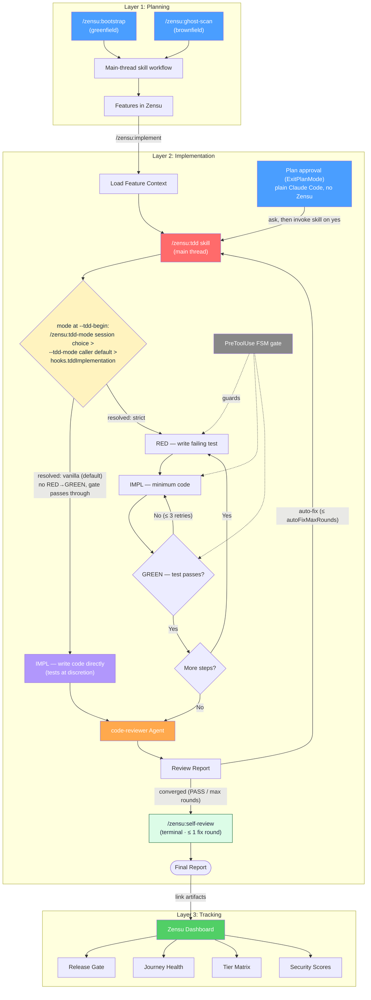

# Architecture

How the three layers fit together, what the review chain does, and the one
rule underneath all of it. Start at the [README](../README.md) if you just
want to install and run it.

## The Three Layers

```
Planning              →  Implementation  →  Tracking
main-thread skills       /zensu:tdd         Zensu Dashboard
/zensu:bootstrap         code-reviewer      (Web UI)
/zensu:ghost-scan        auto-fix loop
/zensu:implement         (main thread)
```

**Layer 1 — Planning (WHAT is being built?):** Bootstrap a greenfield product from a vision document (`/zensu:bootstrap`), or scan an existing codebase to discover and import undocumented features (`/zensu:ghost-scan`) — or, for a brownfield repo that *also* ships a forward plan doc, run the **hybrid**: ghost-scan what is built, then add the plan's not-yet-built items as `planned` features. All end with features tracked in Zensu with security profiles, user journeys, and pricing tiers. Each discovered feature is seated at a **v1 build-out baseline** (a revision); features grow from there through deeper revisions (stages) and subfeatures (parts).

**Layer 2 — Implementation (HOW is it built securely?):** `/zensu:tdd` runs in the main thread in vanilla implementation mode by default. Opt-in strict TDD (Test-Driven Development — write a failing test first, then the minimum implementation to make it pass, then refactor) is available via `hooks.tddImplementation:true` and enforced by the PreToolUse RED→IMPL→GREEN FSM gate (`pre-edit-tdd-reminder.sh`); `/zensu:tdd-mode` switches the same discipline for one session without touching config, and a skill can request it per run (`/zensu:pr-fix-findings` asks for strict). Both modes keep the evidence audits and guaranteed read-only review chain: five parallel specialist aspects → optional judge (default on) → consume-mode code-reviewer → auto-fix loop → self-review.

**Layer 3 — Tracking (HOW is progress tracked?):** Web dashboard for POs and stakeholders — security scores, tier matrix, journey health, coverage trends. No terminal required.

## Agent & Workflow Overview

The Implementation layer shows both modes: **vanilla** skips the RED→GREEN
ceremony and lets the edit gate pass through; **strict** enforces it. The mode is
resolved once at `--tdd-begin` from the ladder in the decision node below —
`hooks.tddImplementation` (default `false`) is rank 3 of it, and both a
`/zensu:tdd-mode` session choice and a calling skill's own `--tdd-mode strict`
default outrank the flag. The review chain and evidence audits run in both.



## Evidence Discipline

One rule runs underneath every other mechanism in this plugin: **an agent may state only what it has actually observed.** A plausible sentence nobody checked is the most expensive defect the plugin can produce, because every later stage — the review chain, the Phase 6 audits, the PR body, the user's decision — treats it as established fact and builds on it.

[`docs/evidence-discipline.md`](evidence-discipline.md) is the single source of truth: no unobserved assertion; cite the observation behind every claim; mark what could not be verified as unverified instead of smoothing it over; settle assumptions with a check before acting and surface the ones you cannot; never invent a path, symbol, identifier, command, flag, API shape, version, or citation; never restate a build/test/coverage result this session did not produce. It lives under `docs/` on purpose — that directory is inside the Session Control runtime digest, so the declared source of truth is tamper-evident within a session exactly like the carriers that quote it.

It reaches every process through three deliberately redundant carriers, because each one alone has a hole:

| Carrier | Reaches | Hole it covers |
|---------|---------|----------------|
| `hooks/session-start-evidence-discipline.sh` | the main thread on every `SessionStart` (including `resume`/`compact`) and every subagent on `SubagentStart` | free-form work that never invokes a skill, and context lost to a compaction |
| `agents/*.md` | every spawned agent | a child whose hook context is advisory or absent |
| `skills/*/SKILL.md` | every invoked workflow | a session that started before the plugin was installed or updated |

The hook reads the block out of the canonical file at run time rather than carrying its own copy, so it cannot drift from the `agents/*.md` and `skills/*/SKILL.md` prompt carriers when the rule is reworded. (The carrier population is pinned as `EXPECTED_AGENTS` + `EXPECTED_SKILLS` in `tests/structure/test-evidence-discipline.sh`; it is deliberately not restated as a literal here, because a numeral goes stale on every new skill and nothing fails closed on it.)

It is the only **advisory** hook without a config flag — `hooks.sessionBanner:false`, or disabling every other hook, does not silence it. Other hooks carry no flag either (`session-start-session-control.sh`, `pre-reviewer-capability-gate.sh`, `session-start-autopilot-resume.sh`, the two `review-evidence-subagent-*` hooks), but those are enforcement or evidence-plumbing hooks that must not be disableable at all; what makes this one unusual is that every other *advisory, context-injecting* hook is flagged. It is also fail-silent: an unknown event, a malformed payload, a missing `node`, or an absent, symlinked, or malformed block exits `0` with no output, so an always-on hook can never block a prompt or a spawn.

**The block names no file, on purpose.** A `reviewer-readonly-v1` subagent resolves tool paths against the *project* root, not the plugin root, so a `docs/evidence-discipline.md` pointer inside the block could only ever resolve into the repository under review — letting a hostile repo plant that path and have its own text ingested as the authoritative rule. The two leased `evidence-worker-v1` agents would additionally burn a bounded turn on a read their lease denies. So the block declares itself complete and forbids any workspace file claiming to be the rule from overriding it; agents act on the block, humans and the hook read the file.

`tests/structure/test-evidence-discipline.sh` keeps the three carriers honest: the condensed block is extracted from between the canonical file's markers and must appear **verbatim** in every agent and every skill, so a newly added surface that omits it fails the suite instead of shipping without the rule. Anti-vacuity is pinned too — extraction hard-aborts rather than degrading to an empty pattern, the carrier predicate is exercised against missing, paraphrased and unterminated fixtures, and the content assertions run against the hook's *emitted* context rather than its source text.

One reviewer is not a plugin file and so cannot be a carrier: a **repo-custom review persona** (`.claude/agents/zensu-review-*.md`) is authored by the repository under review. `/zensu:pr-team-review` and `/zensu:plan-review` are covered by construction — they spawn a custom seat *as* one of the confined plugin workers, which carries the block like any agent. `/zensu:tdd` is the one path that spawns a custom persona under its own `subagent_type`, so its fan-out prepends the canonical block to that spawn prompt, read from the canonical file at run time rather than duplicated. The suite pins all of it, including the premise: if either other skill ever starts spawning custom seats under their own type, that path loses its carrier the same silent way, and the check fails.

The prose is the floor, not the ceiling. Where the discipline can be enforced by machinery it already is — the [witness cross-check](configuration.md#hooks-21) matches every claimed `cmd="…"` against an independent record of what actually ran, REVIEW PACKET v1 makes reviewers reject an evidence-less spawn rather than review from imagination, `/zensu:verify-feature` reports `PARTIAL` instead of inferring an outcome, and `/zensu:wargame` marks an unsettled assumption `RECON NEEDED` with the check that settles it. When extending the plugin, prefer a check that fails closed over a sentence asking the model to be careful.

That cross-check is `hooks/lib/zensu-evidence-crosscheck.js`, and it is code for a reason worth stating precisely. It used to be a prose recipe — "for each `cmd="X"` claim, run `grep -F -q 'cmd="X"'` against the witness log", plus a hand-executed tail scan. The recipe is not known to be wrong on its own: the witness JSON-encodes each recorded command, and that escaping happens to defeat the obvious attack where the `printf` that *wrote* a claim ends up corroborating it. What failed, in a real session on this repository, was the execution — the procedure was carried out by hand, every claim came back `verified`, and that verdict reached a human before anyone noticed nothing had actually been established. A check that must be re-derived and re-run by hand has no failure mode anyone can test and no exit code any gate can consume.

Moving it into a library fixes that and adds what the prose never had: a witness entry that is itself a log write cannot corroborate anything, matching is equality rather than containment, the format is decoded rather than pattern-scraped, a missing witness log fails closed, and the verdict is a deterministic exit code. `/zensu:tdd` Phase 6 and the terminal `/zensu:self-review` report both call it instead of describing it, and `tests/structure/test-evidence-crosscheck.sh` pins each of those properties — including the log-write exclusion — against fixtures. The lesson generalizes past this one check: a correct procedure that a model re-executes from prose each run is not yet enforcement.

## Typical Workflows

### New Product (Planning → Implementation → Release)

```
1. /zensu:bootstrap          → Create product, features, journeys, tiers
2. /zensu:implement ZEN-1    → Load context, plan implementation
3. /zensu:tdd                → Guided main-thread implementation (vanilla; opt-in strict RED→GREEN)
4. review chain              → 5 parallel review-aspect agents → optional review-judge → consume-mode code-reviewer (Phase 6, Stop-hook guaranteed)
5. auto-fix loop             → Critical/Important findings fixed in-thread, then re-reviewed, capped at autoFixMaxRounds
6. /zensu:security-review    → OWASP, threat model, release gate check
```

### Existing Codebase

```
1. /zensu:ghost-scan         → Discover features + journeys + docs (multi-agent fan-out); seat each at a v1 build-out baseline
2. /zensu:security-review    → Assess security posture per feature
3. /zensu:tdd                → Add tests via TDD for untested features
```

### Hybrid (Existing Codebase + Forward Plan)

For a brownfield repo whose plan/vision doc also describes not-yet-built features:

```
1. /zensu:ghost-scan         → Import what is built (each feature seated at a v1 baseline)
2. (agent) create_feature    → Plan doc's not-yet-built items → planned features
3. /zensu:implement KEY-N    → Build the planned items; v1 revision at implement-time
```

No separate skill — the agent runs ghost-scan, then creates the remainder as planned features.

### Quick Feature (No Full TDD)

```
1. /zensu:implement ZEN-42   → Context-aware implementation with artifact linking
2. @code-reviewer            → Quality review
```

## Graceful Degradation

The TDD workflow and code reviewer work **without a Zensu account**. No `zensu` CLI needed for:
- `/zensu:tdd` orchestration (vanilla by default; strict RED→GREEN when configured or switched per session)
- Code review (5 parallel specialist aspects → optional judge → consume-mode reviewer)
- Progress logging (`.zensu/logs/`)

When the `zensu` CLI is installed and authenticated, additional capabilities activate:
- Automatic `zensu link test` and `zensu link source` after TDD completion
- Feature status updates (`zensu features status`)
- Revision creation with implementation summary (`zensu features revision`)
- Security findings fed into `zensu security review`
- Release gate validation (`zensu security validate`)
