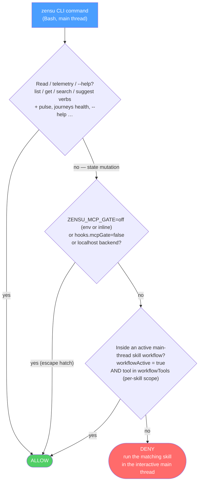

# Gates

Six PreToolUse gates keep an agent inside the workflow conventions, plus TWO
completion-time `--tdd-complete` refusals of the same class: the edit-landing
receipt (discipline patch 10 in [tdd-manager-workflow.md](tdd-manager-workflow.md))
and §Requirements-Table Gate below, which has its own section here. Six of the
eight are convention-nudges with a documented escape hatch, not security
boundaries — see [Session Control](session-control.md) for the part that is. The
two exceptions, §Plugin-Data Guard and §Browser Consent Gate, deliberately have no
escape hatch, and neither is a security boundary on its own: the first closes one
channel to one directory and names the ones it leaves open; the second puts a human
prompt in front of a browser origin and states in its own section what a session can
still do around it.

**Two commands stay reachable when the Session Control bind fails**, in every
bind failure including a record that exists and disagrees, and they are
recognized by `hooks/lib/zensu-doctor-invocation.js` rather than by any
individual gate: `/zensu:doctor`, which writes nothing, and
`/zensu:adopt-session`, whose writes are confined to the calling session's own
record, one workflow history entry, a move of that session's stale
review-evidence leases — on an `already-served` refusal with `--confirm`
only — that session's own missing workflow document plus its `.zensu` ancestors
under the recorded project root, and — under `--restore-root --confirm` only —
the recorded project root itself when that directory is what is gone; it carries
its own justification, and the authoritative five-class enumeration, in the header of
`hooks/lib/zensu-session-adopt.sh`. Both are matched as exact whitelisted shapes
— a closed set of assignments, one `bash <script in the executing installation>`,
and for the adoption at most the literals `--restore-root` and `--confirm`, each
at most once. Neither literal takes a VALUE, which is what keeps a destination out
of every invocation this gate admits. Every hook on the `Bash`
matcher plus the all-tool capability gate must allow, because a deny from any one
of them wins. The full account is in
[Session Control](session-control.md#unbindable-sessions).

## CLI Write-Gate

The `zensu` CLI is **read-free, write-gated**. Any state-mutating command (creating or
updating features, security classifications, tiers, journeys, revisions, …) run directly
on the main thread is **denied by default** — it must run inside a skill that declared its
work, so "freelance" writes cannot bypass the dedup, user-journey, baseline-revision and
security-review conventions the skills enforce. Reads and telemetry are always allowed.

The gate is a PreToolUse(Bash) hook (`pre-bash-zensu-gate.sh`): it parses `zensu <noun> <verb>`
out of the Bash command, resolves each to its canonical tool
name via `hooks/lib/zensu-cli-map.sh`, and classifies it with the same `hooks/lib/zensu-mcp-tools.sh`
source of truth. It is a **convention-nudge, not a hard boundary** — once the CLI's OAuth token
is cached on disk an agent could `curl` the backend directly; the gate enforces the workflow
conventions, not a security control (the same role, and the same `ZENSU_MCP_GATE=off` escape, as
the MCP write-gate it replaced).



A skill opens a **scoped** window with
`zensu-log.sh --workflow-begin --tools "<exact tool set>"`: the bypass then allows **only**
that skill's declared tools — so `/zensu:implement` cannot forge a `set_security_classification`
it never declared — and `--workflow-end` closes it again. The `--tools` list stays tool-name-keyed;
the gate maps each CLI command back to its canonical tool name to check membership. `ZENSU_MCP_GATE=off`
disables the gate for a deliberate one-off — honored both as a session env and as an **inline prefix**
(`ZENSU_MCP_GATE=off zensu …`). The gate is scoped to its threat model (a low-context agent writing to the
*real tracked product*), so it also never fires on reads or `--help`/`-h`, or on a write whose target backend
(`--api-url` flag / `ZENSU_API_URL` env) is **localhost** — a throwaway dev/test DB where the conventions are
meaningless. A structure test (`tests/structure/test-skill-workflow-markers.sh`)
fails the build if any skill runs a mutation command without the `--workflow-begin` /
`--workflow-end` markers, so a new skill cannot silently regress the contract.

## Source-Write Gate

A second PreToolUse(Bash) hook (`pre-bash-source-write-gate.sh`) protects **source files** from
raw shell writes that bypass the Edit/Write tools. The Edit/Write gate (`pre-edit-tdd-reminder.sh`)
only ever sees `Edit|Write|MultiEdit`; an agent can route around it with `printf >> file.rs`,
`cat > file.rs <<EOF`, `sed -i`, `tee`, or `dd of=` — and, worse, `cd` into a sibling/main checkout
and clobber **another session's working tree**.

The gate denies a write through one of those channels to a source-extension file when either:

- **(A) Clobber** — the target already **exists and is git-tracked** inside the project (a raw
  shell overwrite of real tracked source), or
- **(B) Escape** — the resolved path lands **outside the session root** (`CLAUDE_PROJECT_DIR`, else
  the command's cwd) — a sibling or main checkout. Relative targets resolve against a cwd that
  **tracks `cd` across the command**, so `cd ../main && printf … >> src/x.rs` is caught. (B) fires
  even for a new file, since writing fresh source into another checkout is the breach.

git reaches that same breach without naming a write target at all — `git add -A` in a shell whose
cwd drifted back to the main checkout stages *that* repo's files — so a third rule covers it:

- **(C) Git repo escape** — a **working-tree-mutating** git subcommand whose **target repository**
  lands outside the session root. The repository is read from `git -C <path>` (relative and
  cumulative, as git resolves them), `--work-tree`/`--git-dir`, an inline, `env`-wrapper or
  `export`/`declare -x` `GIT_DIR=`/`GIT_WORK_TREE=` assignment, or the same `cd`-tracking cwd as (B). The gated verbs are the `GIT_MUTATIONS` set in
  `hooks/lib/bash-source-write-parse.js`; **reads and unknown subcommands pass**, as does every
  mutation inside your own worktree, and the read-only spellings listed in `GIT_READONLY_FORMS` are exempt.
  `git worktree` is gated for `remove`/`move` only — and judged on the tree it destroys, not on
  the repository it is addressed to, so removing a scratch worktree under `/tmp` stays ungated.
  Rule (A) is never applied to the git subcommand itself.

Never denied under (A)/(B): creating a **new** file inside the project, gitignored/untracked files,
non-source extensions. **Rule (C) applies neither filter** — it judges which repository is addressed,
so `git -C ../sibling add notes.md` is denied even though `.md` is not a source extension. Never
denied under any rule: temp roots (`$TMPDIR`, `/tmp`, `/private/tmp`, `/var/folders`; override the
set with `ZENSU_BSWGATE_TEMP_DIRS`). The standalone `mv`/`cp` commands are out of scope — `git mv`
is covered by (C) when it escapes the session root. Like the CLI gate this is a
**convention-nudge, not a hard boundary** — bypass a deliberate one-off with an inline
`ZENSU_BASH_WRITE_GATE=off` (or `ZENSU_MCP_GATE=off`) prefix, or disable it via `hooks.bashWriteGate:false`.
`tests/structure/test-bash-source-write-gate.sh` pins the behavior.

**The expected *legitimate* hit of rule (C) is a cross-worktree takeover.** A session that continues
work started in a worktree its own anchor does **not contain** (see `/zensu:session-trail`) can edit
files and run tests there — on the main thread no Edit-matcher hook compares a path against the
project root, and the all-tool capability gate that does compare exempts the main principal — but its
first `git add`/`git commit` denies, because the session root is minted at SessionStart and nothing
re-anchors it. Containment is the test, so this does **not** cover a nested worktree: with
`git worktree add .claude/worktrees/<name>` every worktree sits inside the main checkout and a session
anchored there commits in all of them. The blocked shapes are a sibling worktree, another repository,
and the main checkout addressed from inside a worktree. The route is a session whose own anchor
contains that worktree — `cd -- <cwd> && claude --resume <id>` as `show` prints it, or the handoff
brief opened by an instance already running there — not the escape prefix above: the host's
permission layer commonly refuses an inline `ZENSU_BASH_WRITE_GATE=off` as well.

**A third route needs no other session, and it works BECAUSE containment is the test.** Since a
worktree nested inside the anchor is writable, the taking session can create its continuation there
instead of writing into the escaping one: `show --anchor <your project root>` (and `takeover --json`)
renders the whole block under a `CONTINUE` head — `git -C <anchor> worktree add -b claude/<slug>-cont
-- <anchor>/.claude/worktrees/<slug>-cont refs/heads/<source branch>`, plus the transfer of the
uncommitted work the branch alone leaves behind. It serves the two SAME-REPOSITORY shapes above; a
source in **another repository** is refused as `status: blocked` with `reasonCode: cross-repository` (the rendered head is prose, not the code), because the base
ref is measured there and would resolve against your history instead. The plan is rendered and never
executed so a human sees and approves it before anything runs — not because these rules cover it. Be
precise about that, since the block invites the reader to substitute their own target: of its four
writing commands only `git apply` and the patch redirect are judged here. `git worktree add` is
**not** — `worktree` is gated for `remove`/`move` only, as the table above says — and the `tar`
extraction carries none of the channels rule (A)/(B) recognize. The renderer's own guards (same
repository, existing anchor, resolved branch) are what stand in for that. A worktree the script
created inside its own node process would not be seen either, which is why it renders instead.
`/zensu:session-trail` flow 3 owns the routing rule and the nine `CONTINUE` states; this section
names only the one refusal that bounds the offer above.

A plain `--resume` **re-anchors nothing**, and that is why the route works rather than a caveat
against it: `FRESH_SESSION_SOURCES` in `hooks/lib/claude-session-control-v1.js` is
`{startup, clear, fork}`, so a `resume` reuses the immutable record the target session was minted
with and inherits **that session's** anchor whatever directory you `cd` to first. The `cd` operand
decides the anchor only for a **fresh** source — `--fork-session`, or a session whose record was
pruned — and there it matters: compare the `WORKTREE` and `CWD` rows and start in `WORKTREE` if they
differ, or the forked session anchors *inside* the worktree and still cannot commit at its root.
Flow 3 of `skills/session-trail/SKILL.md` carries the routing rule and is the authority.

## Secret Scan

A third PreToolUse gate (`pre-write-secret-scan.sh`) inspects **what** is about to be written,
complementing the source-write gate's **which files**: Write `content`, Edit `new_string`,
MultiEdit `edits[].new_string`, NotebookEdit `new_source`, and — whenever the shared parser
(`detectChannels`) reports a write channel (redirect, `tee`, `sed -i`, `dd of=`, heredoc) —
the Bash command text. Payloads are matched against the curated rule set in
`hooks/lib/secret-patterns.js` (AWS, GitHub `gh[pousr]_`/`github_pat_`, Slack, Stripe
`sk_live_`/`rk_live_`, private-key PEM headers incl. PKCS#8, plus a Shannon-entropy assignment
heuristic — deliberately no naive key/password catch-all); decision logic lives in
`hooks/lib/secret-scan-decide.js`. Never denied: **file-tool** targets under a `test(s)/`, `__tests__/`,
`spec(s)/`, `testdata/`, `evals/` or `fixtures/` segment and `*.example.*` files (the path exemption does not apply to
the Bash channel — its targets are not resolved; use the marker or escape hatch there), lines
carrying the `zensu-secret-allow` marker, obvious placeholders (`EXAMPLE`, `YOUR_...`,
`{{...}}`, `${...}`), and Bash commands with an inline `ZENSU_SECRET_SCAN=off` prefix. Parser
errors **fail open** with a stderr note. Bypass with `ZENSU_SECRET_SCAN=off` (env, or inline
for Bash); disable via `hooks.secretScan:false`.
`tests/structure/test-secret-scan-gate.sh` pins the behavior.

## Reviewer-Spawn Grant

The one entry in this file that **opens** rather than closes. `pre-agent-reviewer-allow.sh` is a
PreToolUse hook on the `Agent|Task` matcher that returns `permissionDecision: "allow"` for Zensu's
own capability-confined reviewer subagents, which short-circuits the host permission pipeline
**before** the auto-mode classifier is consulted.

It exists because a classifier refusal is invisible to every other mechanism here. The spawn never
executes, so no PreToolUse or PostToolUse hook observes it, and the Stop chain-enforcer repeats an
instruction that cannot succeed until its cap releases the guard.
`hooks/lib/reviewer-spawn-denial-v1.js` diagnoses that state after the fact; this hook prevents it.

- **It can only grant or stay silent.** It never emits deny or ask, and every failure path is a
  silent `exit 0` — the opposite of the fail-closed direction the gates above take. A non-zero exit
  from a PreToolUse hook blocks the tool call, so a fail-closed grant hook would break every Agent
  spawn in the session, including the reviewer it exists to admit.
- **Four conditions, all required.** The main principal; a bound Session Control record;
  `hooks.reviewerSpawnAutoAllow` not set to exactly `false`; and membership in the confined set.
- **The set is derived, never spelled.** It is `claude-principal-v1.js`'s `REVIEWER_TYPES` plus
  `EVIDENCE_WORKER_TYPES` — the same classifier `SubagentStart` uses to inject
  `reviewer-readonly-v1` — restricted to the plugin-scoped `zensu:` names, and then filtered
  again at decision time: `confinedByFrontmatter` reads each candidate's `agents/<stem>.md`
  and keeps only those whose `tools:` line is exactly `Read`/`Grep`/`Glob`, so a member added
  to those sets for principal reasons cannot acquire a classifier-free spawn by name alone.
  Bare names (`code-reviewer`, …) are **excluded** because a project may define a same-named
  agent with `tools: Bash`.
- **What bounds the CHILD is in this tree, not an assumption about the host.**
  `hooks/pre-reviewer-capability-gate.sh` runs on the `.*` PreToolUse matcher and denies any
  tool outside the read trio for a `REVIEWER` principal, and confines its reads to the project
  root. It is fail-closed and carries no config off-switch, so it holds whether or not the host
  re-checks the child's own calls — a claim about the host would be unverified, and this one is
  checkable. Weakening `readOnlyViolation`, or giving that gate an off-switch, removes the only
  backstop this grant has.
- **The grant covers the CALL, not only the identity.** Only `tool_name` and
  `tool_input.subagent_type` are examined; every other input field travels unexamined,
  including `prompt` and `isolation: "worktree"` — and that last one is a host-performed
  filesystem action caused by the spawn itself, so it sits outside the `Read`/`Grep`/`Glob`
  confinement the frontmatter provides. Read that confinement as bounding what the CHILD may
  do, never as bounding the call.
- **Three host limits bound it**, and none is a defect to be fixed by widening the grant: a
  `permissions.deny` or `permissions.ask` rule still overrides it; another hook on the same matcher
  returning deny or ask outranks it (the host ranks deny > ask > allow); and an SDK session
  supplying `canUseTool` forces the full pipeline.
- **It is disclosed in both states.** The SessionStart banner names the grant while it is on, and a
  `/zensu:doctor` row reports it either way — that row is not silenceable by the flag. A capability
  the plugin hands itself is exactly the thing that must not be quiet.

## Plugin-Data Guard

A further PreToolUse gate (`pre-write-plugin-data-guard.sh`, on `Edit|Write|MultiEdit` and
`NotebookEdit`) — the ordinals in this file stop here; the count lives in the intro — denies a file-mutating tool call whose resolved target lies inside
`CLAUDE_PLUGIN_DATA`. That store holds this session's immutable Session Control record
(`<plugin data>/session-control/v1/`) and the review-evidence leases, so without this a gate can
end up reading its own boundary from a file the gated party rewrote. It does **not** cover
`<project>/.zensu/state/`, so do not read it as protecting "the anchors every gate binds to" —
see the residuals below.

**It closes a measured hole, not a hypothetical one — on the main thread.** Measured 2026-08-28
and recorded in [multi-repo-chains-spec.md](multi-repo-chains-spec.md) §6.1.2: all three
PreToolUse hooks that match a `Write` — `pre-reviewer-capability-gate.sh` on the `.*` matcher,
plus `pre-edit-tdd-reminder.sh` and `pre-write-secret-scan.sh` — answered *allow* for a target
inside the store, in every chain state (no chain armed, a vanilla chain armed, and a strict chain
at `RED_WRITE`). None of them performs a containment check. The main-thread qualifier is
load-bearing: `hooks/lib/reviewer-capability-v1.js` already denies every NON-main principal a
write into this store and returns early for `main-v1`, so the net delta of this gate is exactly
main-thread `Edit`/`Write`/`MultiEdit`/`NotebookEdit` — which is the channel the measurement found
open. It is a hook of its own rather than a
branch inside the phase gate because that hook returns early while no chain is armed, which is
exactly the state in which the store is read.

**Scope is deliberately narrow, and the asymmetry is accepted.** Only the store is protected. A
write anywhere else outside the project root stays allowed here, so this gate is narrower than
the source-write gate's rule (B), which denies every redirect escaping the project root (temp
roots excepted). The wider rule would need a temp carve-out of its own and would refuse ordinary
work on files outside the project; closing the measured hole does not. It applies to **every
principal** — a subagent must not be able to write the store either.

**Eleven residuals, named because "the store is protected" is false without them.** First, the
**Bash channel is not covered at all**: `bash-source-write-parse.js` filters candidate targets
through its `SRC` extension set, which carries no `json`, and `mv`/`cp` are documented as out of
scope — so a shell redirect, copy, move or link into the store passes every Bash gate. Anything
holding `Bash` still reaches the store, and closing that means an extension-independent rule in
the Bash parser, which this change does not add. Second, **`<project>/.zensu/state/` is not in
the store and is not covered**: the workflow document, the frozen `vanilla` flag and the bypass
ledger live there, and `pre-edit-tdd-reminder.sh` returns early while no chain is armed. Third, a
**hard link** outside the store to a file inside it is judged by its own path and allowed;
creating one needs `ln`, so it sits behind the first residual. Residuals two and three are
main-thread-only — `reviewer-capability-v1.js` covers both for a non-main principal. Fourth, only
the four tool names in the module's `WRITE_TOOLS` are judged: `apply_patch` is in that sibling's
`MUTATING_FILE_TOOLS` and is **not** here, and no MCP write tool is matched, so an unknown tool
allows. Fifth, the store's **location** comes from the ambient `CLAUDE_PLUGIN_DATA` rather than
from the bound Session Control record's authoritative `plugin_data`; a wrong or absent value
disarms the gate, disclosed on stderr. Binding the record here would add a deny path to a control
whose entire fault direction is *allow*, so the ambient read is deliberate — and stated, because
"no escape exists" would otherwise read as stronger than it is. Sixth, the plugin **root** is not
covered — only the data store is; `reviewer-capability-v1.js` protects both trees for a non-main
principal — a superset of the protected ROOT SET, though resolved by a weaker walk, so on a
`<symlink>/../x` spelling this gate denies where that one allows. Seventh, the decision is taken at
PreToolUse while the tool opens the file afterwards, so a component swapped in between is
followed — a property of the hook shape, not of the walk, and the reason this gate is described
as a control rather than a guarantee. Eighth, composing the first and the sixth, the decision module lives inside that unprotected plugin root, so one ungated main-thread `Edit` — or anything holding `Bash`, by the first — removes or replaces it and the wrapper then declines for the rest of the session, disclosed on stderr rather than silently; and ninth, the mirror of the third: a symlink **inside** the store whose target is outside is judged by its resolved location and allowed, so one `ln -s` in the store converts into ongoing Edit-channel control over what a reader gets back from that record path. Tenth, nothing bounds where the project root may point, so one naming a directory *inside* the store carves that subtree out of the over-arm valve; the total disarm this replaced allowed the whole store in the same configuration, so it is a residual of the valve rather than a regression. **At `store === projectRoot` the carve-out is the whole store and the gate denies nothing at all** — the two are the same directory, so every in-store target is also in-project. The scoped form is never *more permissive* than the total disarm it replaced, but it is not strictly stricter either: at equality the two are identical. Eleventh, the valve's project root is the ambient `CLAUDE_PROJECT_DIR`, which this repository records as **not** the authoritative project anchor — every writer resolves the bound record's `project_root` instead. Where the two diverge, which is the ordinary case for a session whose cwd is a worktree, the valve carves out the harness root while the session writes somewhere else: a worktree inside the store but outside that root is denied, and `overArmUnchecked` stays false because the root *did* resolve. Binding the record here would put a session lookup on every `Edit`, so the divergence is stated rather than closed.

**Resolution imitates the kernel, component by component.** Two bypasses of the same class were
measured here before the walk existed, and both came from resolving the spelling before resolving
the links: a **dangling** leaf symlink into the store (`realpath` cannot resolve a destination that
does not exist yet, while the tool's own `open(O_CREAT)` follows the link in), and
`<symlink-into-store>/../x` (`path.resolve` collapses `..` **lexically**, so the link was never
read). `resolveTargetPath` therefore follows a symlink at every component and applies `..` to the
already-resolved prefix, bounded on both the component count and the link hops.

**There is no escape**, by design: no `ZENSU_*=off` variable and no config flag. A switch would
hand back exactly the capability the guard removes, so nothing here lands a bypass-ledger entry
either — there is no gate escape to record. `session-start-evidence-discipline.sh` is the
precedent for a control with no switch.

**Every fault allows, with two exceptions.** The shared plugin-root identity guard refuses with
exit 2, and a resolution that hits an internal bound refuses with its own reason
(`target-resolution-truncated`): the walk gave up before it finished, so "outside" is a claim it
did not earn, and answering it once allowed a spelling that lands in the store. No legitimate input
reaches a bound, so that refusal costs an adversarial spelling and nothing else. A missing `node`, an
absent, empty or unresolvable `CLAUDE_PLUGIN_DATA`, an unparseable payload, or a module that will
not load returns *allow*. The first of those two exceptions is the plugin-root check every sibling gate
carries: a mismatched inherited `CLAUDE_PLUGIN_ROOT` still refuses with exit 2, and on this matcher that
refusal blocks the call. **Four** of the allowing faults carry a stderr note: the
containment module failing to load, a payload the module cannot read (a **payload** fault, not a
load fault), an unusable `CLAUDE_PLUGIN_DATA` — the one that turns the control off completely
and would otherwise render byte-identical to a clean allow — and a payload with **no path field**,
which is what a renamed or restructured host field looks like from here. A fifth note is not a
fault at all: when the caller supplies no project root the over-arm valve cannot be evaluated, and
an armed decision says so rather than skipping the check in silence. Three further faults are outside the
module's reach, because the shell wrapper returns before `node` runs: a missing `node`, a
`hooks/lib` its `cd -P` cannot enter, and a `plugin-data-guard-v1.js` that is absent or is a
symlink. They are **not silent** — the wrapper writes its own stderr note at each of the three,
naming the cause and the consequence, and at both of its exit-2 plugin-root branches
(self-resolution failure and inherited-root mismatch) as well. What cannot reach them is the module's *typed* reason, which
is a limit on the channel and never on whether the operator is told. Denying there would block ordinary in-project
writes, which is strictly worse than the hole this closes. Containment is not re-implemented:
`within` and `msysToDrive` come from `hooks/lib/bash-source-write-parse.js`, and the decision
lives in `hooks/lib/plugin-data-guard-v1.js`.

**The over-arm valve, because a misconfigured store has no in-session escape.** A
`CLAUDE_PLUGIN_DATA` that *contains or equals* the project root would otherwise arm the gate over
the whole workspace and deny every write — and this gate ships with no config flag and no env
bypass, so the session could not edit the file that would fix it. The valve carves out **in-project
targets only**: a write inside the project goes through with its own reason
(`target-in-project-under-containing-store`, deliberately NOT the no-store reason,
so a working gate never announces that it did not run), while every other target inside the store
still denies — except at equality, where there is no "other target": see residual 10. The project root comes from `CLAUDE_PROJECT_DIR`, read in the hook's host half and
passed in; when it cannot be resolved — unset, relative, or a directory that is gone, which is what
a removed worktree looks like — the valve cannot be evaluated and an armed decision says so on
stderr instead of skipping the check in silence. Nothing bounds where the project root may point,
so one naming a directory *inside* the store carves that subtree out; that is residual 10, and it
is not a regression, because the total disarm this replaced allowed the whole store in the same
configuration.
`tests/structure/test-plugin-data-guard.sh` pins the behavior, both directions, in all three
chain states.

## Browser Consent Gate

A PreToolUse gate (`pre-browser-navigation-consent.sh`) and its PostToolUse companion
(`post-browser-navigation-consent.sh`), both registered on the Playwright broker's navigating
tools — `browser_navigate` and `browser_tabs` in either spelling of the broker's server key
`zensu-browser` (`mcp__plugin_zensu_zensu-browser__…` / `mcp__zensu-browser__…`). The pair exists so that
`/zensu:verify-feature` can run without `ZENSU_VERIFY_NAVIGATION_POLICY_V1` in the
environment that launched Claude Code: that variable was the only channel a model cannot
write, and it cost every user a shell prefix, a port fixed before launch, and a restart per
change — and the desktop app has no shell prefix at all.

**What it does.** When no parent policy is present, the broker starts in *consent mode*
(`scripts/playwright-mcp-proxy.js` checks its own `hooks/hooks.json` for this registration at
start, and stays in the old deny-everything mode without it). The PreToolUse hook then returns
`permissionDecision: "ask"` — the host's own prompt, which the model cannot answer — for the
first navigation to each new loopback origin. Consent is per ORIGIN: once an origin is
approved, every route on it passes silently for the rest of the session, which is exactly what
the broker enforces and what the prompt says. The runtime recipe's declared routes are prompt
CONTEXT — they tell the human what the run intends to visit — and steer no decision. The
PostToolUse hook records an executed navigation as `(origin, route, decidedBy, at)` in
`<project>/.zensu/state/verify-consent-<session-key>.json`, written by `O_EXCL` temp plus
rename, contained to that directory, and never through a symlink. The decision, the prompt
text and the memory rules live in `hooks/lib/verify-consent-v1.js`; the address and URL
predicates both the hook and the broker apply live in `hooks/lib/verify-navigation-floor-v1.js`,
so there is one floor, not two.

**The floor holds regardless of consent.** Both layers refuse, independently: a `localhost`
or any other hostname, a non-loopback `http` origin, a private, link-local, loopback-mapped
or documentation address, credentials in the URL, and a query or fragment in a navigation.
Consent mode admits **literal loopback origins only**. A remote target is refused by the hook
and by the broker with the same reason, because Chromium's DNS pins are passed at browser
launch and an origin approved mid-session could not be pinned; remote verification keeps the
parent policy. Sub-requests, WebSockets and redirects reach only origins the session already
opened. In consent mode neither layer enforces routes — the human consented to the whole origin — so a
same-origin redirect to an undeclared route is stopped by neither.

**With a parent policy present the gate stays silent** and the broker enforces the policy
exactly as before; the PostToolUse hook then records `decidedBy: policy-mode`.

**The recorded `decidedBy` names an OBSERVATION, never a human decision.** PostToolUse carries
no evidence of how the permission was resolved, so the vocabulary is `asked` (a prompt was
raised for this origin), `remembered` (the memory already held the origin) and `policy-mode`.
`asked` does not assert that a person said yes — it asserts that the pre hook would have asked
and the navigation then executed.

**Fault direction.** The PreToolUse hook is a gate and fails closed: a missing `node`, an
absent or symlinked module, or a module failure denies the navigation with a stderr note. A
session that cannot bind its Session Control record still gets the floor and a prompt for
every navigation, but the prompt is all it gets: with no session key there is no name to bind an
execution marker to, so the broker refuses the navigation the human was just asked about. The
hook says exactly that on stderr — that this session cannot complete a consent-mode navigation,
and to run `/zensu:doctor` — rather than the older and weaker "nothing is remembered". The PostToolUse hook
never blocks: every fault is a stderr note and exit `0` — with the one exception every sibling
hook shares, the plugin-root identity guard, which refuses with exit 2 before the hook body runs
(self-resolution failure and inherited-root mismatch are two distinct messages). A navigation the
broker rejected (`isError`) is not recorded.

**No escape and no config flag**, deliberately — the same rule as §Plugin-Data Guard. A
switch the session could flip would relax the hook while the broker, which reads the
registration once at start, kept trusting the chain. The parent policy is the supported
alternative, so nothing here lands a bypass-ledger entry.

**Why the server key is `zensu-browser`.** The gate is registered on the tool NAME,
`mcp__(plugin_zensu_)?zensu-browser__browser_(navigate|tabs)`. The key used to be `playwright`,
the default key of upstream `@playwright/mcp`, so the optional group also matched a user's own
browser server keyed `playwright` and denied its remote navigations in every session, with no
skill running. A key upstream does not use ends that without narrowing the matcher. The key is a
naming convention, not a server identity: a different server that someone keys `zensu-browser`
would still match the gate and would still be taken for the broker by `/zensu:doctor` and
`/zensu:verify-feature`, so a collision is unlikely rather than impossible. Both spellings stay
gated because both come from this plugin's own declaration: the same `.mcp.json` yields
`mcp__plugin_zensu_zensu-browser__…` when it is loaded as a plugin and `mcp__zensu-browser__…`
when the repository itself is opened as a project. That project load normally fails to start (see
the residuals below), so the bare arm is defense in depth: a broker runs under the bare name only
where the declaration starts outside the plugin loader with a resolvable command, for example
with `CLAUDE_PLUGIN_ROOT` present where Claude Code expands `.mcp.json`, or with the declaration
copied into another MCP scope. Narrowing to the plugin-scoped spelling would leave exactly that
broker in consent mode with no gate, because the broker checks the registration by matcher string
and never sees its own server name.

**Re-spell permission rules after updating.** The broker's tool names moved from
`mcp__plugin_zensu_playwright__…` / `mcp__playwright__…` to `mcp__plugin_zensu_zensu-browser__…`
/ `mcp__zensu-browser__…`. Every `permissions` rule written for the old names stops matching the
broker, whichever list it sits in: an `allow` rule no longer pre-approves it, so its calls prompt
again, and an `ask` or `deny` rule no longer applies, so the new names fall back to whatever the
rest of your rules and your permission mode decide. The first shows itself; the other two do not,
so move each rule to the new name. Weigh the second case by what the gate covers: it registers on
`browser_navigate` and `browser_tabs` only, so a lost `deny` or `ask` on any other broker tool —
`browser_take_screenshot` and `browser_network_requests` among them — is replaced by nothing in this
plugin on the main thread. A rule for `mcp__playwright__…` still matches a server of your
own keyed `playwright`, which this plugin no longer gates.

**Residuals, named rather than implied.** Opening this repository as a project still loads root
`.mcp.json` as a project-scope server, where `${CLAUDE_PLUGIN_ROOT}` is unexpanded and the server
fails to start; it no longer hides a server keyed `playwright`. The consent memory is a file in a directory the
session can write through a Bash redirect, so a forged record skips the prompt for that origin;
the floor bounds the damage to other loopback services. The broker no longer trusts that the
host ran the hook: consent mode refuses to self-approve an origin without a live per-session
marker the gate writes for every decided loopback navigation, one per (session, origin), and it
reads that marker each time it is asked to approve an origin it has not already approved in this
process, rather than caching a mode resolved once at start — so hooks switched off host-side, a
broker launched from a different tree than the one whose registry the host loaded, and a plugin
swap inside a long-lived MCP process all leave the broker refusing rather than self-approving.
The launcher carries `ZENSU_VERIFY_PROJECT_ROOT` through its `env -i` allowlist, so the broker
anchors on that root when something upstream supplies it. **Nothing in the plugin does**, and
saying otherwise was a false guarantee this document briefly carried: a derivation in the
launcher was tried and removed, because that process has no hook payload for the session binder
and no guaranteed session identity for the payload-free one. In practice the broker therefore
anchors on its own cwd, and for a session whose cwd is a worktree while the record names another
tree the two anchors disagree. State the consequence in BOTH directions rather than as a refusal:
the broker refuses when the cwd-anchored tree holds no live marker for that origin, and the
`/zensu:doctor` execution row, which reads under the RECORD's root, can then report a gate that
ran while that broker still refuses — but a loopback origin is the same string in every project,
and the broker's read carries no session key, so a live marker for that origin written by a
different session in the cwd-anchored project satisfies the check instead. Refusal is the common
case, not the guaranteed one. `/zensu:doctor` reports
both facts on separate rows: `verify-feature:` reports REGISTRATION, and `verify-feature gate:`
reports EXECUTION, session-scoped, with a contract fault reported as `could not be judged` rather
than as the benign row. SEVEN bounds travel with that and are stated rather than implied. The
marker lives in a directory the session can write through a Bash redirect, so it authenticates
nothing against a session forging its own; what it removes is the SILENT case, where a gate that
never ran was indistinguishable from one that did. An origin already approved inside the
broker's process stays approved — the marker gates the WRITE into the approved set, never each
later navigation against it, because a consent the human gave is not revoked by a later plugin
change. The BROKER's read is project-scoped rather than session-scoped, because it has no
session key: a sibling session's marker for the same origin satisfies it, and only the doctor
row binds the session — and that binding is the marker's own FILENAME, not anything the body
proves. `.zensu/state/` is writable from any session in the project, so a co-tenant can write
`verify-consent-exec-<another session's key>-<any tag>.json` and make THAT session's doctor
print an execution row for a gate run it never had. The row is therefore evidence about a file,
not an attestation; closing it needs the session key inside the signed-for body, which the
marker has no way to authenticate today either. And a prompt the human DECLINED still leaves a marker live for its
window, because the gate writes before the answer exists; the marker records `asked` rather than
`allowed`, which names the state but does not close it — closing it needs a signal the gate
cannot emit before the human has answered. The fifth bound is that WINDOW itself
(`MAX_EVIDENCE_AGE_MS`, five minutes): a marker is honoured only while it is inside it, so a
session whose gate ran an hour ago and has navigated nowhere since is refused by the broker and
reported by the doctor as registered-with-no-live-marker. Neither surface is saying the gate
never ran, and both say so in as many words — the `verify-feature gate:` row names expiry beside
"no navigation yet" as an ordinary cause, and the broker's refusal names the window and points at
that row. The sixth is that the reap which keeps the walk's budget from filling is NOT
session-scoped: a write in one session removes markers a sibling session wrote. It is clocked on
`MAX_EVIDENCE_REAP_AGE_MS`, which is twice the read window above, and that GRACE is load-bearing
rather than slack: the broker's expiry probe deliberately reads with no window at all, and a
marker it would still honour is the only input that can produce the `expired` diagnosis instead
of a bare `absent`. So the sweep is NOT bounded to entries no reader anywhere could honour — past
the ten-minute horizon it removes exactly the ones that probe wants, and a sweep clocked on the
five-minute window would have removed them from the first write anywhere in the project. What it
does not remove is anything a NAVIGATION could still have used. The cost of the grace is the
other way round: a dead marker holds a walk slot for twice as long against the budget whose
exhaustion is the `truncated` state. Either way a session's markers can disappear under it, which
is why the doctor row is worded as a report about a LIVE marker rather than about the gate's
history. The seventh is that the sweep runs INSIDE the gating hook and reads and parses
every candidate it examines, up to the same budget — so a decided navigation carries up to that
many `lstat`-then-read windows. That is a count, not a comparison: the broker's own read is
bounded by the same budget rather than by one window, because `liveEvidenceOrigins` stops early
only when it MATCHES the origin it was given, and a miss is exactly the case that produces a
refusal. On a miss the broker walks the directory TWICE — once for the present probe and once for
the widened expiry probe — so both sides are bounded by that budget and neither is bounded by
one. An already-present
non-regular file is refused before either read, so the exposure is the swap race rather than a
plantable block; the count is what is new, and it is named here rather than left to be discovered
from a hook that has become slow. MCP elicitation would remove
the prompt residual in the CLI; it is not the shipped channel because the desktop app lacks it, and
the decision module is shaped so elicitation can replace the prompt without changing the
memory or the wording.

`tests/structure/test-verify-consent.sh` drives the pair against a real Session Control
session and pins the matcher, the memory, the floor, the loopback bound and the skill wording;
`tests/structure/playwright-mcp-proxy.test.js` pins the broker's three start modes.

## Missing Workflow Baseline

The `.*` capability gate (`hooks/pre-reviewer-capability-gate.sh`) revalidates the session's
workflow document before any capability decision, and denies when it is gone. That is
deliberate and unchanged: a deleted document must never be read as *no chain was ever
active*, or deleting one file would release an armed review chain. Because the hook matches
every tool, the deny costs the session everything — Edit, Write, Bash, subagents.

What changed is that the state is **named and repairable** instead of a permanent wedge. The
cause is ordinary: a git worktree deleted and re-created loses the document, because
`.zensu/state/` is gitignored, and a compaction continues the SAME session rather than
minting a new one.

- **The deny names the cause and the command** — `/zensu:adopt-session` for the diagnosis and
  `/zensu:adopt-session --confirm` to rebuild — instead of the generic `immutable context
  revalidation failed`, which is accurate and names no way out. Both commands stay reachable,
  because the Bash recognizer admits them in every bind failure.
- **Only a clean `ENOENT` is named that way.** A document that is present but unsafe or
  unreadable keeps the generic wording: something is at that path, and offering a rebuild
  there would tell the user to build over the evidence.
- **The Stop hook still BLOCKS** and names the same command. It does not release: nothing
  proves completion, and the release would be a claim the plugin cannot make.
- **`/zensu:doctor` reports it.** Before this, `stateBlock` only judged the documents that
  exist and never asked whether the bound session's own was among them, so a report came back
  fully green over a session in which every tool was being denied.
- **`SessionStart` heals it on its own** at the next resume or compaction, on `ENOENT` only,
  writing the same `BASELINE_REBUILT` provenance entry the confirmed repair writes — and it
  SAYS so, on the `additionalContext` it already emits, so the first reply after an automatic
  heal can tell the user what was lost instead of waiting to be asked. That notice is
  model-facing, so it supplements the doctor row below and never replaces it.
- **`/zensu:doctor` renders that provenance entry afterwards.** Once the document is present
  again, nothing else in the report distinguishes a rebuilt one from a healthy one, so the
  own-document verdict carries a `⚠️ state: this session's workflow document was REBUILT` row
  naming the entry count, its timestamp and the state that was repaired. Before that row the
  entry was reserved and read by guards, but no runtime surface ever showed it to a user.

Rebuilding is a **loss, not a restore**: a review chain that was live when the document
vanished is gone, and the rebuilt baseline reads *never active*. That is why the report lists
the session-state files that survived, and why it records **no** bypass-ledger entry — it
escaped no gate, because the document a gate would have read was already gone. See
[Session Control](session-control.md#unbindable-sessions) for the full account.

**Neither writer path is user-consented, and this document said otherwise for one release.**
The adopt path requires the literal `--confirm` in argv, which is a token the model supplies
to itself — prose-backed, not consent-backed, exactly as `--autopilot-release`'s flag is; the
"wait for the user to say yes" rule lives in `skills/adopt-session/SKILL.md`. The
`SessionStart` self-heal above requires no token at all. Do not restate the writer as
gated on `--confirm`: that sentence contradicted the `SessionStart` bullet four lines above it.

## Vanished Recorded Project Root

The ordinary shape after `git worktree remove`: the Session Control record is readable, this
installation may serve it, and the directory it records as `project_root` is gone.
`readOrphanedProjectRootContext` waives exactly that one existence check, so reads and the
read-only diagnostics keep working — while `Edit`, `Write`, `MultiEdit` and every writing Bash
command deny, because the workflow document lived under that root and no write can be
attributed to a project that is not there. It IS a relaxable bind failure, and the table in
[Session Control](session-control.md#unbindable-sessions) carries the per-gate roster.

Re-creating the directory by hand does not repair it, and that is the trap this remedy exists
for. `adoptionWorkflowStatePath` joins `.zensu/state/tdd-phase-<session key>.json` onto the
recorded root, so an empty re-created directory moves the session into a SECOND wedge:
`revalidateWorkflowState` then throws on the `.*` matcher and every tool denies with
`activated workflow CAS state is missing` (§Missing Workflow Baseline).

```bash
# read-only report
CLAUDE_PLUGIN_DATA="${CLAUDE_PLUGIN_DATA}" bash "${CLAUDE_PLUGIN_ROOT}/hooks/lib/zensu-session-adopt.sh" --restore-root
# re-creates the root AND rebuilds the baseline
CLAUDE_PLUGIN_DATA="${CLAUDE_PLUGIN_DATA}" bash "${CLAUDE_PLUGIN_ROOT}/hooks/lib/zensu-session-adopt.sh" --restore-root --confirm
```

Rendered in full because the recognizer admits only `bash <script in the executing
installation>`: a bare script name is refused, so the short form would be a spelling
nobody can run. `/zensu:adopt-session --restore-root` is the slash equivalent.

`/zensu:adopt-session --restore-root` reports the verdict and writes nothing; adding
`--confirm` performs both halves in one run. **The path comes only from the record.**
No argument names a directory anywhere in this mode, and neither literal it accepts takes a
value, so the anchor never moves and the source-write gate compares against exactly the root
it compared against before. Creating a directory at a path the record already names restores the
authority the session already had and adds none.

**Carried from the record is not the same as bounded, and only the first is true.** This is the
one write class whose destination is an arbitrary absolute path: it is **not bounded by location**
— not to `$HOME`, not to a git repository, not away from a child of the filesystem root — and
the private records directory bounds *which record is read*, never where the directory lands.
What is bounded is the DEPTH: at most `RESTORE_MAX_MISSING_COMPONENTS` components below a
nearest-existing ancestor the ladder proved to be a real, canonical, link-free directory, with
each created component re-verified by realpath. The bound is named by its constant rather than
spelled as a number, because a numeral in prose beside the symbol that owns it is a second copy
nothing recomputes. A location allowlist was weighed and refused: it would admit
the ordinary case and reject legitimate roots under `/opt`, `/srv` or `/Volumes`, and it would
be a policy invented at the boundary instead of derived from the record. The barrier is the one
every other write class rests on — write access to the private records directory. What authoring
a record already confers is the CHOICE of destination: the path comes from the record and from
nowhere else, so this write adds no target a record author could not already name. What it adds
is the ACT of creating a directory outside the store, which write access to the store does not
itself perform — narrowed by the depth bound and the ancestor-permission rule, never removed.

Seven refusals, each naming which condition failed: `record-unreadable`,
`plugin-data-mismatch`, `not-served-by-executing-runtime`, `root-present`,
`unsafe-ancestor`, `unsafe-ancestor-ownership`, `too-many-missing-components`. The nearest
existing ancestor must be a real directory that is its own realpath and not a symlink, it
must not be writable by users other than its owner unless it is sticky, and at most
`RESTORE_MAX_MISSING_COMPONENTS` components may be missing below it — a record pointing
into a tree that is mostly gone is not a recycled worktree. The permission rule is its own
refusal because its remedy is its own: the tree is intact, so a `chmod` fixes it when you own it,
and a move when you do not — where `unsafe-ancestor` means the tree changed under the record. The
refusal carries one reason for two causes, so every carrier of it names both arms: the directory
is owned by another user, or you own it and it is group- or other-writable without the sticky bit.

**It restores the ANCHOR, not the work.** The directory comes back empty, it is not a git
worktree, and the chain that lived there is gone rather than restored; the rebuilt baseline
reads "never active", because that is all a fresh baseline can say. Both reports state this
before and after `--confirm`.
That is what this command PLANTS,
and it is a forecast rather than a report: when another run wins the race and creates the directory first, this run never saw the contents and says so instead. `/zensu:doctor` probes the recorded root afterwards and states what is there now. If the directory was moved rather than deleted, moving it back
is the better repair. Provenance is a `PROJECT_ROOT_RESTORED` workflow history entry, which
`zensu-log.sh --phase` and both phase writers reserve; it records no bypass-ledger entry,
because no gate was escaped.

**Order matters when the lineage is also broken.** `restoreRootVerdict` requires this
installation to SERVE the record, so a session that is ALSO an incompatible runtime must run
`/zensu:adopt-session --confirm` first and only then `--restore-root --confirm`.
`tests/structure/test-restore-project-root.sh` pins every refusal, the read-only contract and
the end-to-end repair.

## Vanished Working Directory

A session can outlive the directory it was working in; a git worktree removed after its pull
request merged is the ordinary way. The Session Control record still binds, its recorded
project root still exists, and the host keeps reporting the deleted directory as the
PreToolUse `cwd`. The `.*` capability gate (`hooks/pre-reviewer-capability-gate.sh`) used to
canonicalize that `cwd` while revalidating the binding, so it denied every tool call except the
two recognized commands above (which Windows does not admit either) with `immutable context revalidation failed: PreToolUse cwd does
not exist` — a message that names no cause and no remedy, over a value the main thread never
uses.

It is **not a bind failure** and not a third relaxable state (see
[Session Control](session-control.md#unbindable-sessions)). The `cwd` is a per-call input, and
only a path rule consumes it — to resolve a relative tool input, or as the traversal root of a
`Grep`/`Glob` that names no path:

- **The main thread** returns before any path rule runs, so a vanished `cwd` does not deny it.
- **An evidence worker** resolves its leased paths against the recorded project root, so its
  verdict is decided by its lease and is the same with or without the directory.
- **A reviewer, a PLM subagent and a neutral child** resolve paths against it, so they are still
  denied — with a reason that names their profile and the unusable working directory, and tells
  them to report to the main thread rather than retry.

Nothing else is relaxed. The binding, the recorded project root, the runtime digest and the
workflow document are revalidated for every principal BEFORE the `cwd` is looked at, so a
vanished `cwd` never masks one of those denies — a deleted workflow document still gets the
named deny of §Missing Workflow Baseline. Re-creating the directory, or changing to one that
exists, is needed only before a subagent is spawned again.
`tests/structure/test-vanished-session-cwd.sh` pins these verdicts and, for every `PreToolUse`
registration in `hooks/hooks.json`, that a vanished `cwd` never makes a verdict stricter than
the same call with an existing one.

## TDD Phase Gate

Unlike prompt-based TDD ("please write tests first"), the `/zensu:tdd` workflow **structurally prevents** violations via a PreToolUse FSM gate on Edit/Write/MultiEdit:

- **Phase declaration.** Before any edit, the main agent declares the current TDD phase through the top-level Skill command template `CLAUDE_PLUGIN_DATA="${CLAUDE_PLUGIN_DATA}" bash "${CLAUDE_PLUGIN_ROOT}/hooks/lib/zensu-log.sh" --phase <PHASE> --step <step_id>`. Claude renders both native plugin placeholders in top-level Skill/Agent content. The helper then uses the host-exposed `CLAUDE_CODE_SESSION_ID` only inside that Bash process to validate the exact immutable record and derive its internal selectors; it never trusts an ambient plugin-private selector. Valid phases: `RED_WRITE`, `RED_RUN`, `RED_FAIL`, `IMPL`, `GREEN_RUN`, `GREEN_PASS`, `REFACTOR`.
- **Gate enforcement.** The PreToolUse hook (`pre-edit-tdd-reminder.sh`) blocks edits whose declared phase violates FSM transitions. In particular, `IMPL` requires a prior `RED_FAIL` marker for the **same step** — there is no path to production code without a failing test on record.
- **State.** Phase markers persist at `.zensu/state/tdd-phase-<scv1-session-key>.json`. Every atomic mutation increments the record revision, and each step's history remains auditable from the file.
- **Activation.** Phase 0 of the skill calls `zensu-log.sh --tdd-begin`, which sets a per-session chain-state `active` flag. Given a valid SessionStart baseline, the TDD gate (and Bash witness) enforce **only** while that flag is set; a valid inactive baseline passes through. A missing, malformed, or unreadable mandatory baseline is an integrity failure and fails closed in Session Control plus the edit/Stop guards. (Pre-0.4.0 this keyed on `CLAUDE_AGENT_TYPE=zensu:tdd-manager`.) Bypass via `ZENSU_TDD_GATE=off` for legitimate non-TDD edits explicitly authorized by the user. The strict gate described above is **opt-in**: `hooks.tddImplementation` defaults to `false`, so out of the box the workflow runs in **vanilla mode** — the gate passes through and the RED→GREEN ceremony is dropped while the evidence audits and review chain stay enforced. Set `hooks.tddImplementation:true` to enforce the strict RED→GREEN gate (see the Hook Opt-Out table). Two ranks sit above that flag at `--tdd-begin`: the session choice recorded by `/zensu:tdd-mode` and, below it, the calling skill's own `--tdd-mode` default (`/zensu:pr-fix-findings` asks for `strict`) — full precedence in [Configuration](configuration.md#hook-opt-out). The second of those is **escalation-only** — `strict` is the only value it accepts, so lowering the discipline stays the session choice. Choosing vanilla through that session choice is a MODE choice, not a gate escape, so it records no bypass-ledger entry; `ZENSU_TDD_GATE=off` remains the only escape and still does.

Additional features: dependency graph for independent-step sequencing, 3-retry IMPL escalation on GREEN-fail with progressive context, completeness audit (mtime discipline + edit landing + build verification), real-time progress log at `.zensu/logs/`.

## Requirements-Table Gate

`--tdd-complete` carries two preconditions, and both are refusals rather than reminders. The
first is the Phase 6 step 5b edit-landing receipt. The second is this one: the session's TDD
plan must carry a usable `## Requirements` table.

- **Why it is a gate.** [`/zensu:converge`](../skills/converge/SKILL.md) anchors its flow-back
  audit on that table; without one it takes its documented legacy stop and reports nothing. In
  [`/zensu:autopilot`](../skills/autopilot/SKILL.md) the CONVERGE stage is the only edge into
  `OPEN_PR`, so a missing table turns a mandatory gate into a clean-looking no-op. Prose asked
  for the table and the only check was the warning-level Phase 6 step 6c, which skips silently
  when it is absent.
- **The rule**, implemented once in `hooks/lib/zensu-plan-requirements.sh`: a `## Requirements`
  heading, plus at least one `AC-###`/`FR-###` row whose Requirement cell survives removing
  every `{...}` placeholder group. A row that merely quotes braces counts; a row that is still
  the template's `{curly}` placeholder does not. Deprecated rows count — the never-recycle rule
  keeps them. The Requirement column is located from the table's header row, so a repo override
  that re-orders the columns is judged correctly. This is **stricter than converge**, not
  identical to it: converge's own check is its Phase 0 step 2 legacy stop, which keys on the
  table being *absent*, and its coverage audit EXCLUDES deprecated rows that count here. A plan
  this gate passes is not automatically one converge can audit in full.
- **Which plan.** `--plan <path>` when the skill passes it (it does), else derived from the
  edit-landing receipt's record of the run log it audited: `.zensu/logs/<stem>.log` names
  `.zensu/plans/<stem>.md`. Both channels are bounded to this session: the derived `log` must
  resolve inside the project's own `.zensu/logs/`, and an explicit `--plan` must resolve inside
  `.zensu/plans/` and carry the same stem the derivation would — so neither can be pointed at a file outside
  the project. The stale-plan half is weaker and worth stating exactly: the derived channel binds
  THIS session's receipt, and that receipt is an ordinary file the session can rewrite through a
  Bash redirect, which no gate covers — so the anchoring is only as strong as the receipt. It
  buys nothing an attacker wants anyway: a model that wanted to defeat this gate would simply
  fill the table. With no derivable stem the flag is refused rather than
  accepted on the directory bound alone — except when `ZENSU_EDIT_LANDING_GATE=off` is what
  removed the receipt, where the bound is dropped and disclosed instead (see the scope-gap
  bullet below). A `.zensu/plans` or `.zensu/logs` that is itself a symlink is refused
  rather than resolved through, and every root in the verb comes from
  `zensu_resolve_project_dir` — which is also what `CLAUDE_PROJECT_DIR` is normalized to for
  every `--*` verb before any verb body runs, so the two cannot diverge. An explicit `--plan` that
  names nothing refuses; a derived path that is not there does not, because nothing was asserted
  — but the gate then prints `REQUIREMENTS GATE UNRESOLVED` rather than passing silently, so
  "the table passed" and "no table was checked" never read the same.
- **Refusal wording is typed.** A missing or placeholder-only table refuses as a verdict about
  the plan; an unreadable path, a usage error, or a missing library refuses with "could not
  judge the plan" instead — a load fault must never be reported as a judged table.
- **Scope.** Same as the receipt gate: a resolvable git HEAD plus a non-empty change set. A
  chain that changed nothing has no plan claim to check. **Known gap, stated rather than
  implied:** a bound Autopilot chain that produced zero file changes therefore passes this gate
  untested, still travels its return stage into CONVERGE — the only edge into `OPEN_PR` — and
  converge then mtime-resolves the plan Phase 2 wrote anyway and takes its legacy stop. "The
  CONVERGE stage is the only edge into OPEN_PR" must not be read as "that edge is now covered".
- **Two further scope gaps, named rather than implied.** The change set is the WORKTREE against
  `HEAD` — there is no baseline range — so a chain that COMMITTED its work mid-run measures zero
  changes and both gates skip, silently and without even the `REQUIREMENTS GATE UNRESOLVED`
  line. The sibling edit-landing library does carry a `--baseline` range for exactly that case;
  this verb does not. And `ZENSU_EDIT_LANDING_GATE=off` leaves no receipt, so no run-log stem can
  be derived: the explicit `--plan` then keeps only its plans-directory bound and says so on
  stderr (`REQUIREMENTS GATE STEM UNCHECKED`) rather than refusing, because refusing would make
  that documented exemption unusable for the shipped invocation, which always passes `--plan`.
- **Bypass** with `ZENSU_REQUIREMENTS_GATE=off`, which is deliberately a separate switch from
  `ZENSU_EDIT_LANDING_GATE=off` — exempting a session from one must not disarm the other, and
  the two gates share one change-set computation precisely so neither inherits the other's
  switch. Both escapes are recorded in the per-session bypass ledger.

**Full workflow reference:** [docs/tdd-manager-workflow.md](tdd-manager-workflow.md) — Mermaid flow chart, per-step FSM state diagram, hook gate behavior table, environment variables contract, discipline patches 1-13, four-channel logging.
