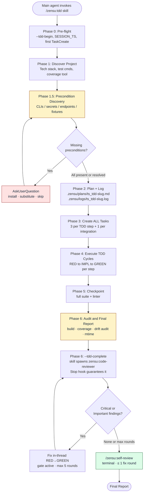
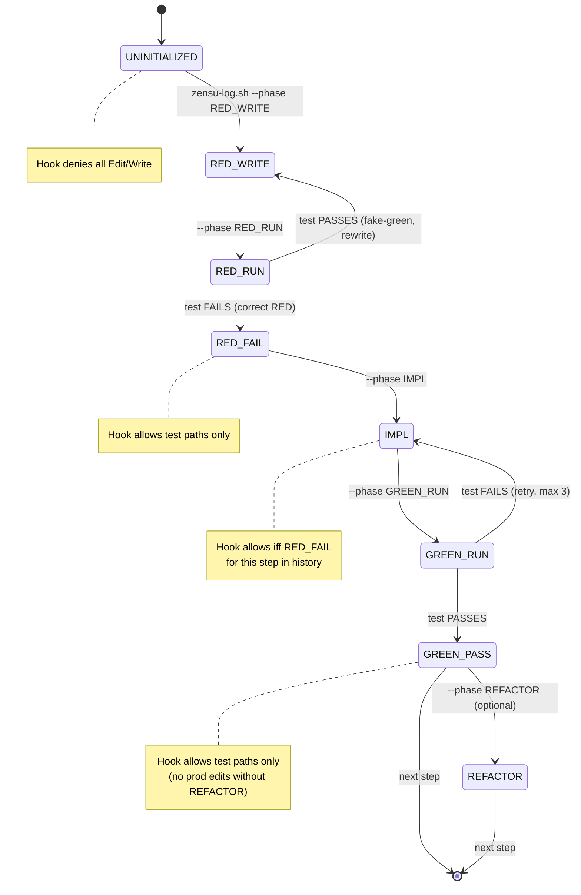
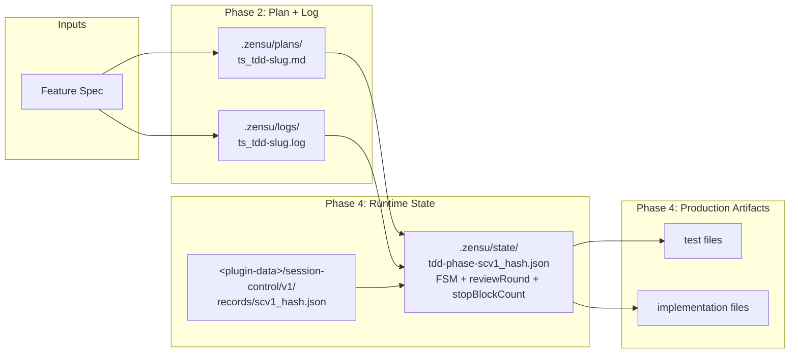
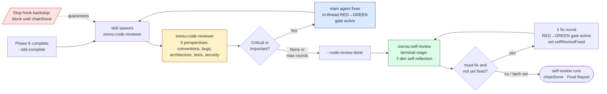

# TDD Workflow (`/zensu:tdd`)

End-to-end reference for the Zensu main-thread implementation workflow: vanilla by default, with strict Red/Green TDD and its PreToolUse phase gate available when configured.

> **0.4.0+ architecture.** Implementation moved from the `zensu:tdd-manager` *subagent* into the **main agent** (the subagent lost too much implementation context). The workflow now lives in `skills/tdd/SKILL.md`; its review stage uses five parallel `zensu:review-aspect` subagents, an optional `zensu:review-judge`, and one consume-mode `zensu:code-reviewer`. Sections 7–8 describe the shipped installed-plugin eval harness.

---

## 1. Overview

**What it is.** A main-thread skill (`/zensu:tdd`) that takes a feature specification and produces working, tested code. It runs in **vanilla implementation mode by default**: no RED→GREEN ceremony, while the plan, evidence audits, and review chain stay enforced. With `hooks.tddImplementation:true`, it additionally declares RED → IMPL → GREEN → REFACTOR transitions and a PreToolUse FSM gate blocks edits that violate the strict cycle (see §5).

**When to invoke.**

```
Use the Skill tool with skill='zensu:tdd' and the feature spec as input
```

The skill is also auto-invoked by the `ExitPlanMode` PostToolUse hook when the user approves a plan that adds executable code, and by `/zensu:implement` Step 3.

**Inputs.**

- A feature specification (free-form text, or a path to `evals/.../prompts/*.md` in eval context).
- Project context — the agent discovers tech stack, test commands, coverage tooling automatically.

**Outputs.**

| Artifact | Path | Purpose |
|----------|------|---------|
| Plan | `.zensu/plans/{ts}_tdd-{slug}.md` | Design decisions, Requirements table (stable AC-###/FR-### IDs), step table with per-step `Covers` traceability, preconditions, audit checklist |
| Log | `${CLAUDE_PROJECT_DIR:-.}/.zensu/logs/{ts}_tdd-{slug}.log` | Append-only execution trace, phase markers, attempts, audit results |
| State | `.zensu/state/tdd-phase-<scv1-session-key>.json` | Runtime FSM/review state (per session, ephemeral) |
| Source | test + implementation files | The actual code |
| Audit | included in log + final report | Build, coverage, mtime discipline, precondition drift |

The plan and log are local per-run working artifacts. They are gitignored and
never auto-staged or committed; the tracked source/tests and final user-facing
report are the durable repository outputs (see [CLAUDE.md](../CLAUDE.md)).

---

## 2. Two-Level Mental Model

Two distinct phase concepts share the word "phase". Keep them separate.

**Workflow Phases (0-6)** — the agent's overall journey for a single task. Linear, one-shot per invocation.

**TDD-FSM phases** — per-step state that the PreToolUse hook reads from the state file. Cyclical, repeated for each step inside Phase 4.

Each step inside Workflow Phase 4 cycles the TDD-FSM through `RED_WRITE → RED_RUN → RED_FAIL → IMPL → GREEN_RUN → GREEN_PASS` (and optionally `REFACTOR`). When all steps complete, the agent advances to Workflow Phase 5.

---

## 3. High-Level Workflow



**Phases at a glance:**

| Phase | Goal | Key outputs |
|-------|------|-------------|
| 0. Pre-flight | Capture `SESSION_TS` + `SESSION_EPOCH`, create first task | session timestamps |
| 1. Discover Project | Read CLAUDE.md hierarchy, detect tech stack, test runners, coverage tool + threshold | tech-stack context |
| 1.5. Precondition Discovery | Enumerate every external CLI/secret/endpoint/fixture named by the spec, verify presence, escalate misses | Preconditions table in plan |
| 2. Plan + Log | Write plan markdown (incl. Requirements table with stable AC-###/FR-### IDs + per-step `Covers` mapping) + initialize log file | plan + log on disk |
| 3. Create ALL Tasks | 3 tasks per TDD step (test/impl/verify) + 1 per integration step | TaskList populated |
| 4. Execute TDD Cycles | Per step: RED → IMPL → GREEN (+ REFACTOR if applicable) | source code + tests |
| 5. Checkpoint | Run full test suite + linter, batch-update plan statuses | checkpoint log entry |
| 6. Audit & Final Report | Build verification, coverage, mtime discipline, precondition drift audit, requirements coverage cross-check (warning level), summary | audit log + final report |

See [skills/tdd/SKILL.md](../skills/tdd/SKILL.md) for the canonical main-thread phase definitions.

---

## 4. Per-Step TDD-FSM

Inside Phase 4, each step cycles through a small state machine. The PreToolUse hook ([hooks/pre-edit-tdd-reminder.sh](../hooks/pre-edit-tdd-reminder.sh)) reads the current phase from the state file and allows or denies Edit/Write/MultiEdit tool calls based on it.



Phase transitions are recorded by invoking the log helper:

```bash
CLAUDE_PLUGIN_DATA="<resolved-plugin-data>" \
  bash "<absolute-plugin-root>/hooks/lib/zensu-log.sh" \
  --phase {PHASE} --step {step_id} [--reason "..."]
```

The top-level `/zensu:tdd` Skill receives Claude's native plugin root/data
substitution and replaces both angle-bracket values before the command runs.
This supporting document is loaded through `Read`, so it deliberately does not
assume a second native-substitution pass. Each stateful invocation passes only
the concrete plugin-data directory to the helper process. The helper reads the
host-exposed `CLAUDE_CODE_SESSION_ID`, validates it against the private immutable
record, and derives its internal selectors in that process only. Do not source
the internal binder, cache its selectors, or use a shared home-directory pointer.

The phase helper mutates workflow state through the Session Control v1 CAS API;
narrative log lines are appended separately by the skill. Its token- and inode-bound lock generations
serialize concurrent processes, recover only dead stale owners, and reject
malformed state instead of resetting its revision. `SessionStart` creates a
mandatory baseline before tools run. A subsequently missing baseline or an
existing malformed, non-object, or unreadable state file is therefore a
fail-closed integrity failure: the all-tool context gate denies further tools,
and the edit/Stop guards deny rather than treating the session as inactive.
A fresh session is required to create trustworthy state.

---

## 5. Hook Gate Behavior

The PreToolUse hook fires on `Edit | Write | MultiEdit` tool calls. It allows or denies based on `(phase, file path type)`.

| Phase | Production file edit | Test file edit |
|-------|---------------------|----------------|
| `UNINITIALIZED` | DENY | DENY |
| `RED_WRITE` | ALLOW | ALLOW |
| `RED_RUN` | (transient, no edits expected) | (transient) |
| `RED_FAIL` | DENY | ALLOW |
| `IMPL` | ALLOW iff this step has `RED_FAIL` in history | ALLOW |
| `GREEN_RUN` | (transient) | (transient) |
| `GREEN_PASS` | DENY | ALLOW |
| `REFACTOR` | ALLOW | ALLOW |

**Test-path detection** ([hooks/lib/zensu-tdd-phase.sh::tdd_is_test_path](../hooks/lib/zensu-tdd-phase.sh)):

1. Path prefix match: `**/test/**`, `**/tests/**`, `**/__tests__/**`, `**/spec/**`, `**/specs/**`, plus top-level variants (case-insensitive)
2. Basename match: `_test.*`, `*_test.*`, `.test.*`, `.tests.*`, `.spec.*`, `.specs.*`, `_spec.*`, `_specs.*`
3. Hard-link rejection: files with link count > 1 fail closed (prevents `ln target.test.ts innocent.ts` bypass)
4. Symlink rejection: `[ -L "$path" ]` → not a test
5. Inline-header sniff (last resort): read first 20 lines, strip BOM, match `^(func Test|describe\(|it\(|test\(|@Test|def test_|#\[test\]|#\[cfg\(test\)\])`. Comment-prefix lines like `// describe(` are NOT matched (anchored at line start, no leading comment chars).

**Hook scope.** With a valid SessionStart baseline, the phase gate is active **only** while the per-session chain-state `active` flag is set — written by `zensu-log.sh --tdd-begin` in Phase 0 of the `/zensu:tdd` skill. A valid inactive baseline exits silently before `--tdd-begin`; it must not be confused with a deleted, malformed, or unreadable mandatory baseline, which fails closed in the all-tool Session Control gate and the edit/Stop guards. This replaces the pre-0.4.0 `CLAUDE_AGENT_TYPE=zensu:tdd-manager` scoping that only worked while TDD ran in a subagent. It remains a deliberate trust-boundary for Claude host-tool workflow decisions, not an OS sandbox against malicious same-UID processes.

**Vanilla implementation mode (`hooks.tddImplementation:false`).** At `--tdd-begin` the config is read ONCE and frozen into the state file's `vanilla` flag; the command echoes the effective mode (`mode: strict` / `mode: vanilla`) so the skill knows which deltas to apply. While `vanilla` is `true` the gate exits 0 right after the `active` check — the whole phase matrix above is bypassed, no phase markers are required, and tests are at the agent's discretion. The gate reads ONLY the state flag, never live config: flipping the config mid-session can neither un-gate a strict session nor re-arm a vanilla one (whose phase stays `UNINITIALIZED` and would otherwise deny everything). Still enforced in vanilla mode: the Bash witness, the Phase 5/6 evidence audits (build, coverage, witness cross-check), the review fan-out → judge second pass (`review-judge`, gated by `hooks.reviewJudge`, default on — fresh-read deltas + `Panel-FP:` neutralization between the aspect merge and the consume-mode reviewer) → `code-reviewer` → auto-fix loop → `/zensu:self-review`, and the Stop-hook chain guarantee. `--tdd-reset` clears the flag; a later `--tdd-begin` re-freezes it from the then-current config. The Stop block reason appends a state legend built from the same frozen flag — `mode=vanilla` / `mode=strict` plus the live `implComplete` / `chainDone` values — because a vanilla session's `phase` and `history` carry no signal and have been misread as a corrupt or never-started chain. Wording only: the routing decision is identical in both modes.

---

## 6. Host Environment and Native Placeholders

| Variable | Where set | Effect |
|----------|-----------|--------|
| `CLAUDE_AGENT_TYPE` | Legacy environment hint. | Never trusted for Session Control or reviewer authorization. Those decisions use the top-level host hook payload. |
| `CLAUDE_PLUGIN_ROOT` | Claude native substitution in top-level Skill/Agent content; hook environment. | Supplies the exact installed helper path. The helper independently verifies that path against its own executable. |
| `CLAUDE_PLUGIN_DATA` | Claude native substitution in top-level Skill/Agent content; hook environment. | Passed to each stateful helper invocation and validated as the private record store. It is not exported by SessionStart. |
| `CLAUDE_CODE_SESSION_ID` | Claude Bash/hook environment. | Host session id used to locate the private record. It is not secret and grants no authority without all record checks. |
| `CLAUDE_ENV_FILE` | Claude shell environment propagation mechanism. | Deliberately ignored: SessionStart neither reads nor writes it, and no plugin-private selector is exported through it. |
| `ZENSU_TDD_GATE` | User sets in shell | Set to `off` to bypass the phase-gate entirely for legitimate non-TDD edits (docs, config, one-offs). |
| `ZENSU_CHAIN` | User sets in shell | Set to `off` to disable the `Stop`-hook review-chain backstop ([hooks/stop-chain-enforcer.sh](../hooks/stop-chain-enforcer.sh)) so the main agent may end its turn without completing the review chain. It is also honored in the three session-binding blocks that precede routing, where an outer Autopilot run cannot be read or advanced either — the only way out of a session whose recorded project root is gone. |
| `ZENSU_HOOK_LOG` | Eval wrapper sets per isolated test dir | Opt-in mirror of denial reasons. Hook writes 4 lines (`TDD-Phase-Gate`, `Current phase:`, `Expected:`, `permissionDecision=deny`) on denial. Empty file in production. |
| `CLAUDE_PROJECT_DIR` | Claude host environment/native substitution. | Stable input for fresh registration. Each stateful helper resolves and uses the immutable record's project root even after `CwdChanged`. |

Session Control stores its baseline and all TDD workflow transitions only in
the immutable record-bound project's `.zensu/state`. There is no
caller-controlled state-directory override.

---

## 7. Files Produced Per Task



The plan + log files form a local, per-run audit pair for the active session;
they are gitignored and not repository provenance. Mutable state files are
also ephemeral per session and live project-locally under `.zensu/state/`; the
immutable session record lives separately under
`CLAUDE_PLUGIN_DATA/session-control/v1/records/`. State filenames use the
domain-separated `scv1_…` key, contain the matching session hash, and increment
a monotonic revision on every atomic mutation. The raw host session id is not
persisted, but Claude exposes it as `CLAUDE_CODE_SESSION_ID` in Bash and hook
subprocesses; it is not a secret or capability on its own. The review-loop
budget (`reviewRound`) and Stop anti-deadlock budget
(`stopBlockCount`) are validated bounded integers in this same CAS document. They
have no independently writable `rounds-*.json` or `*.stopblocks` sidecars.

`SessionStart` is the only context writer. It binds the canonical project and
executed plugin roots, plugin-data directory, plugin version, source revision,
and a digest over all runtime-relevant files. A fresh `startup`/`clear` may
create the record; an existing fresh event must still name the bound project.
`resume`/`compact` require the existing record and preserve its exact project
and workflow-state bytes even when `CwdChanged` reports a descendant or an
external detached worktree. Missing or unknown lifecycle sources fail closed.
Only a host payload with neither `agent_id` nor `agent_type` receives `main-v1`.
Claude also reports `agent_type` on `SessionStart` for top-level `claude --agent`
sessions; those events use the same exact reviewer/neutral classifier as
PreToolUse and can never inherit main authority. Claude reports plugin-shipped
agents to hooks through their scoped `agent_type`. `SubagentStart` reads that same parent record and
injects `reviewer-readonly-v1` for the five exact reviewer identities
`zensu:code-reviewer`, `zensu:review-aspect`, and
`zensu:review-judge`, plus the dedicated `zensu:plan-review-worker` and
`zensu:pr-review-worker`. Every other child receives neutral `host-profile-v1`,
including the plugin-scoped PLM identity `zensu:zensu-plm`; that exact PLM
identity is nevertheless subject to the strict read-only capability profile
described below. Claude Code cannot block a child from `SubagentStart`, so the
first all-tool `PreToolUse` hook revalidates session id, plugin root, plugin
data, project, record path, and live runtime digest before every tool call. The
session id plus its private
plugin-data record bind the session; the record's `project_root` remains the
immutable anchor for workflow state. By contrast, the host-reported payload
`cwd` is canonical location metadata, not a session authenticator. It may point
inside the original project or at an external detached review worktree after a
`CwdChanged` event, and relative tool paths resolve against that canonical
current directory without rebinding `project_root`. Missing identity/context,
any record mismatch, runtime drift, or an attempted control-context rebind is
denied there. Legacy transcript, PPID, newest-file, and fallback-id discovery is
deliberately ignored; concurrent fresh sessions therefore remain isolated even
inside the same worktree.

The read-only Autopilot SessionStart sibling follows the same location split.
For `resume`/`compact` it resolves the immutable private record before examining
project state and stays silent when that record is unavailable. Because equal
SessionStart matchers run concurrently, `startup`/`clear` prefer an already
valid record and otherwise use Claude's stable `CLAUDE_PROJECT_DIR`; mutable
payload `cwd` is never an Autopilot-state selector.

The plugin-scoped reviewers and `zensu:zensu-plm` expose only the host's `Read`,
`Grep`, and `Glob` tools. The `PreToolUse` gate repeats that exact allowlist after
context revalidation: no shell, Git, control, MCP, or other tool outside that
trio is available to those identities. Other `host-profile-v1` children retain
ordinary non-command tools granted by their agent frontmatter and the Claude
host, including file, Agent/Task, coordination, and report-writing operations
where the host provides them. They cannot invoke `Bash`, `shell`, `exec`,
`exec_command`, `terminal`, or `command`: arbitrary command execution cannot be
confined by scanning its source text for protected tokens. The plugin gate adds
no separate Agent/Task or nesting policy; Claude's host and agent definition
decide those capabilities, and Claude currently prevents a subagent from
spawning another subagent.

The plan/PR worker pair has a second, workflow-specific boundary. Before spawn,
the interactive main thread creates one private lease generation containing
exact evidence files, exact candidates, and narrow safe subtrees; the lease id
and plugin-data path never enter the worker prompt. Creation canonicalizes path
chains, rejects symlink aliases and unsafe roots, and snapshots identity/content
metadata. Every leased `Read`/`Grep`/`Glob` call revalidates that snapshot, so a
replacement, symlink swap, or other TOCTOU drift fails closed. The workers have
no file mutation, task, messaging, nested-agent, Skill, MCP, Web, or command
capability. They return one raw JSON final message with exact `kind` and `role`;
`SubagentStop` captures it privately, and collection binds the host worker id,
kind, role, size, and schema before the main thread may materialize it. The lease
closes after collection and on every failure path. Repository instructions,
diffs, source text, overlays, and refinement context remain untrusted data and
cannot alter this contract.

For every reviewer, PLM, and neutral principal, `Grep`/`Glob` must name a
concrete safe source/docs/test subtree. A protected root, an ancestor that could
recursively expose protected descendants, or an omitted path whose effective
`cwd` is such an ancestor is denied. Grep content regexes may still mention
terms such as `session-control` or `main-v1`; only traversal roots and path
filters carry this restriction.

For a neutral child, the gate derives the principal only from the trusted hook
payload. It denies command execution independently of command text, blocks
actual canonical access to protected Session Control and workflow-root paths,
blocks every file mutation below the installed-plugin/private plugin-data roots
(including symlink, case, and hard-link aliases), and blocks mutating Zensu
operations. It does not mistake ordinary report text that mentions those terms
for a control attempt, and tool-input prose cannot claim `main-v1`. Mutating
Zensu workflows therefore remain in the interactive main thread and are entered
through the matching skill.

This enforcement boundary is intentionally narrower than an OS sandbox. It
protects Claude host-tool/subagent workflow decisions and serializes
project-local CAS mutations, but it cannot make project-local files a
cryptographic authority against user-authorized build/test programs, external
processes, or a same-UID process racing after a path check. Untrusted repository
code requires an OS sandbox/container, separate identity, and restricted mounts.
Likewise, a third-party MCP tool that exposes arbitrary local execution is
outside this host-tool boundary and must not be granted to an untrusted agent.

---

## 8. Discipline Patches — User-Visible Behaviors

These are the guardrails that protect users from common TDD failure modes. Each is pinned by structure tests in [tests/structure/](../tests/structure/).

| Patch | What it does | User benefit |
|-------|--------------|--------------|
| **1. Rationalization Counters** | Three patterns recognized as agent self-deception: "I'll just write a quick replacement", "I'll commit a placeholder fixture", "user said no questions so I'll guess". Each is labeled a LIE in the agent prompt. | Agent doesn't talk itself into corner-cutting. |
| **2. Hard Ban on substitution** | Forbids substituting a missing required dependency with a hand-rolled equivalent without explicit user approval. | No silent `KNOWN-ISSUES.md` workarounds. No fake adapters. |
| **3. Phase 1.5 Precondition Discovery** | Enumerates every external CLI/secret/endpoint/fixture named in the spec, verifies presence, and on missing → AskUserQuestion (install / substitute / skip). Overrides any prior "no questions" instruction. | Agent stops and asks BEFORE damaging your workspace with placeholder values. |
| **4. Preconditions table in plan** | Plan template includes `## Preconditions` section listing every dependency + verification + user decision. | Auditable record of what was assumed present. |
| **5. Per-step precondition gate** | If a step's IMPL plan references a precondition marked `skip`, the step gets `[!]` status and is bypassed. No partial test, no placeholder. | Skipped dependencies don't leak into half-broken implementations. |
| **6. Phase 6 Precondition Drift Audit** | Greps the log for the contracted tool name versus the user-named substitute. Flags `PRECONDITION DRIFT — {tool}: decision={d}, actual={observed}` when reality diverges from the plan. | Catches silent substitution after the fact. |
| **7. Installed-plugin Claude CLI provider** | Wrapper [scripts/session-control-claude-wrapper.sh](../scripts/session-control-claude-wrapper.sh) invokes pinned Claude Code from a fresh isolated user-scope registry, never with `--plugin-dir`, and emits one wrapper-owned `[control-attestation]`. | Contract runs stay deterministic; live runs prove the real installed cache root, content revision, exact source Git SHA, session hash, runtime digest, state revision, normal/reviewer subagent context, hook sequence, reviewer capabilities, and changed-file hashes. See the [release-gate contract](session-control-release-gate.md). |
| **8. Hook event mirror** | Opt-in via `ZENSU_HOOK_LOG`. Hook writes denial reason lines into the log when the gate fires. | Eval assertions can verify gate behavior without reading hook stderr. |
| **9. Trusted control attestation** | The wrapper reads trusted runtime artifacts before cleanup, neutralizes reserved prefixes in model output, and produces exactly one schema-versioned attestation line. | Assertions never grade model prose or accept a spoofed success claim. |

---

## 9. Auto-Review Chain

At Phase 6 the `/zensu:tdd` skill marks `--tdd-complete` and spawns `zensu:code-reviewer` itself. The `Stop` hook ([hooks/stop-chain-enforcer.sh](../hooks/stop-chain-enforcer.sh), registered on the `Stop` matcher in [hooks/hooks.json](../hooks/hooks.json)) guarantees the chain even if that spawn is skipped: it blocks the main agent from ending its turn while `implComplete && !chainDone`. Reviewer findings are routed back into the main thread by [hooks/post-review-tdd-delegate.sh](../hooks/post-review-tdd-delegate.sh) to be fixed in-thread under the still-active phase-gate, then the reviewer is re-spawned — looping until PASS or max rounds, after which the terminal `/zensu:self-review` stage runs (see below).



Reviewer returns findings in three tiers:

- **Critical**: blocks ship. Auto-fix attempted.
- **Important**: should land before merge. Auto-fix attempted.
- **Suggestions**: nice-to-have. NOT auto-fixed.

Auto-fix loop runs up to 5 rounds (configurable via `autoFixMaxRounds` in plugin settings). On the 5th round, the harness emits "max rounds reached, manual fix required" and hands off to the terminal self-review stage (below) instead of stopping — preventing infinite loops on intractable findings.

**Terminal self-review stage (0.5.0+).** When `hooks.selfReview` is enabled (default), the code-reviewer chain does NOT close at convergence. On PASS, suggestions-only, or max-rounds, [hooks/post-review-tdd-delegate.sh](../hooks/post-review-tdd-delegate.sh) marks `--code-review-done` and hands off to the `/zensu:self-review` skill ([skills/self-review/SKILL.md](../skills/self-review/SKILL.md)) — a main-thread terminal stage ported from `/reflect`. It re-reads the session's own changes across seven dimensions (architecture, consistency, edge-cases, test coverage, security, simplification, conventions), takes at most ONE fix round under the still-active phase-gate if a must-fix surfaces (latched by `selfReviewFixed`; it never re-spawns the code-reviewer), then owns the chain terminus: it runs `--chain-done` and renders the final report including a `## Self-Review Summary`. The `Stop` hook ([hooks/stop-chain-enforcer.sh](../hooks/stop-chain-enforcer.sh)) routes to self-review while `codeReviewDone && !chainDone`. Set `hooks.selfReview=false` to restore the pre-0.5.0 behavior where code-reviewer convergence closes the chain directly.

**Terminus forms and the zero-change gate.** A standalone chain closes either ticket-bound (`--chain-done --claimed-review-ticket <ticket>`, the normal reviewed path) or unqualified (`--chain-done` alone). The unqualified form can only ever bind a chain in which no review ticket was consumed, so its one sanctioned use is the ZERO-file-change exception the Stop block names — and `zensu-log.sh` verifies that claim instead of trusting it: while `git diff --name-only HEAD` or an untracked non-ignored file still reports a changed file, the terminus is refused with a non-zero exit and the chain stays open. A project root that is not a git worktree, or a repository without a HEAD commit, cannot be evaluated and keeps the legacy behavior. Autopilot-bound chains are unaffected — they carry `--outcome no-changes` into the durable run's audited receipt. If the state says `codeReviewDone=true` but its consumed review ticket is unbindable, the Stop block routes to a repair branch: `/zensu:reset-review-limit` cannot help there (it rebinds a *retained* consumed ticket), so the block names a fresh `/zensu:tdd` entry, whose `--tdd-begin` resets the review ticket, round counter, and chain flags in one transition.

**Reading and repairing a chain that will not advance.** `zensu-log.sh --chain-status` is the read-only diagnosis for this FSM: it classifies the workflow document into one shape (the roster lives in `NEXT_COMMAND` in [hooks/lib/chain-recovery-v1.js](../hooks/lib/chain-recovery-v1.js) and is mirrored by the shape table in [skills/recover-chain/SKILL.md](../skills/recover-chain/SKILL.md)) and names the supported next command, so "the chain is stuck" can be distinguished from "a supported command has not been run yet". Exactly one shape is a true wedge: a pending `reviewRearm` receipt whose `runId`/`attempt`/`chainId` disagree with the document itself. The core validates that receipt's shape only, while `_tdd_issue_review_ticket_critical` additionally requires it to match the current generation, so such a receipt is a legal document that makes `--review-ticket` refuse permanently — and no in-plugin transition can produce it (every writer of the receipt matches the link, and every writer or deleter of the link fields drops the receipt in the same mutation), so it indicates an externally corrupted or restored document. `zensu-log.sh --chain-recover` (surfaced as `/zensu:recover-chain`) repairs exactly that shape under the same lease every ticket writer takes: it drops the receipt and records one `history` entry, in one revision, and writes nothing else. It never writes a terminal flag, never resets `reviewRound`/`stopBlockCount`, never discards an outstanding ticket, never unbinds an Autopilot generation, and refuses while a `deferredReviewClaim` is outstanding — so it restores reachability without granting budget. It also refuses (rather than normalizes) an inconsistent ticket slot: writing `reviewTicketConsumed=true` would complete the precondition of the unqualified no-ticket terminus, which would make the repair a shorter path to a closed chain than the review itself. Shape classification and the receipt predicate live in [hooks/lib/chain-recovery-v1.js](../hooks/lib/chain-recovery-v1.js), shared by the status verb, the recovery transaction, the ticket issuer and `/zensu:doctor`.

**When the session binding itself cannot be resolved.** Before any routing, the Stop hook must bind the event to the immutable Session Control record of its session. Three states make that impossible, and each now blocks with its own reason: the Session Control library is missing from the installation, the event cannot be bound to its record at all, or the record no longer resolves against a project root that still exists. The most common real cause is a **deleted or moved worktree**: the recorded `project_root` is immutable, so the binder rejects it with `session-control-v1: context project root does not exist` and no Stop can ever prove completion from that record again. Re-create exactly that directory to resume the recorded session, or start a new session. Because these blocks sit *above* the routing logic, `ZENSU_CHAIN` and `hooks.chainEnforcer` are now evaluated in them too — otherwise a session whose worktree was deleted could never end a turn again. Both switches are named on stderr for the user and deliberately kept out of the model-facing reason; a release logs that no completion was proven, only that the guard was waived.

**Chain-end combined summary.** At every chain-end branch — PASS / zero findings, suggestions-only stop, and max-rounds convergence — `hooks/post-review-tdd-delegate.sh` appends a `CHAIN-END SUMMARY` directive to its `additionalContext` output. The main agent then renders a narrative summary block in this order: `## Problem` (the feature/bug/need this session addressed), `## What I built` (numbered deliverables with status + PR links, carrying the audit facts — feature title, files modified, tests created, build status, mtime audit verdict, coverage status, plan + log paths, and — when the plan carries a `## Requirements` table — per-requirement status keyed by its stable AC-###/FR-### IDs), `## How I built it` (the TDD discipline followed, the final reviewer verdict with findings count by severity and files reviewed, and the per-round auto-fix trace of EVERY review round 1..N — each round's in-thread fixes plus the clean verification round(s) marked `PASS — 0 findings, nothing to fix`, so the reader sees the chain converged with all findings addressed; skipped only when no review round ran), `## Open` (deferred suggestions / max-rounds findings requiring manual fix / next step), and `## TL;DR` (exactly one sentence, last). This replaces the prior terse-stop behavior so the user retains visibility into the full chain. When `hooks.selfReview` is enabled (default), the terminal `/zensu:self-review` stage renders this summary and inserts a `## Self-Review Summary` section before `## Open`. Controlled by `hooks.combinedSummary` in `~/.zensu/config.json` (default `true`; set `false` to restore terse stop). Contrast `autoFixIncludeSuggestions` which defaults to disabled — `combinedSummary` defaults the other way.

---

## 10. Four-Channel Logging Contract

Every `/zensu:tdd` run uses four channels:

| Channel | What | Lifetime | Format |
|---------|------|----------|--------|
| **Plan** | Design decisions, step table, Preconditions, audit checklist | Local per session — **gitignored, never committed** | Markdown |
| **Log** | Execution trace: phase markers (`RED_WRITE`, `RED_FAIL`, `IMPL`, `GREEN_PASS`, `REFACTOR`), attempt counts, audit results | Local per session — **gitignored, never committed** | Append-only timestamped text |
| **State** | Current FSM phase per session, history array | Ephemeral per session | JSON |
| **Witness** | Independent record of every Bash tool invocation (cmd, exit code, stdout tail, interrupted flag) | Ephemeral per session — **local only, gitignored, never committed** (consumed solely by the in-session Phase 6 cross-check); under promptfoo it lives in the per-test isolated dir | Append-only timestamped text, JSON-escaped fields |

The agent appends to the log via:

```bash
printf '%s%s\n' "$(CLAUDE_PLUGIN_DATA="<resolved-plugin-data>" bash "<absolute-plugin-root>/hooks/lib/zensu-log.sh" timestamp "$SESSION_EPOCH")" "<message>" >> "${CLAUDE_PROJECT_DIR:-.}/.zensu/logs/{ts}_tdd-{slug}.log"
```

The helper resolves the user's configured `logging.timestampStyle` (`wall`, `relative`, or `none`) so the log format is consistent across runs. Do not inline `$(date +%H:%M:%S)` — that bypasses the user's preference.

Workflow-state phase transitions are atomic:

```bash
CLAUDE_PLUGIN_DATA="<resolved-plugin-data>" \
  bash "<absolute-plugin-root>/hooks/lib/zensu-log.sh" \
  --phase {PHASE} --step {step_id} [--reason "{reason}"]
```

This command updates only the state document through one Session Control v1 CAS
transaction. The CAS serialization prevents lost state revisions between
parallel processes. Narrative log appends use the separate command above and
are intentionally not part of the state transaction.

### Witness channel — anti-hallucination evidence

The witness log at `${CLAUDE_PROJECT_DIR:-.}/.zensu/logs/witness-<scv1-session-key>.log` is written automatically by the `hooks/post-bash-witness.sh` PostToolUse hook on every Bash tool call. The hook records lines only while that exact Session Control key's chain-state `active` flag is set; it never scans for or adopts another session's state. Disable it with `ZENSU_TEST_WITNESS=off`. The witness log, narrative `.log`, and plan are all **gitignored and never committed** — they are local, single-session working evidence summarized in the final report.

Each line has the form:

```
[HH:MM:SS] BASH cmd="<JSON-escaped command>" exit=<rc|?> tail="<JSON-escaped last 200 chars of stdout>" interrupted=<true|false>
```

In practice `exit=` is almost always `?`: Claude Code's Bash `tool_response` carries no `exit_code` field (only `stdout`/`stderr`/`interrupted`/`isImage`), so the witness corroborates a run by `cmd=` + the stdout `tail=`, never by exit code. `interrupted=true` flags a killed or timed-out run. The tail is **stdout only** — a runner that prints its failure summary to stderr yields an empty `tail=`, so result-corroboration cannot fire there and the `cmd=` match remains the gate.

The witness log is the source of truth for Phase 5/6 cross-checks. The agent prompt mandates that every test/lint/build run logged in Phase 5 (`CHECKPOINT — cmd="X" exit=N result="..."`) and Phase 6 (`AUDIT — cmd="X" exit=N result="..."`) use the literal command string sent to the Bash tool. Phase 6 step 1 then runs `grep -F -q 'cmd="X"' witness.log` for each claim; an unmatched claim becomes `EVIDENCE GAP — cmd="X" claimed but not in witness log` and marks Phase 6 NOT complete.

Non-Bash test invocations (rare; e.g. an MCP test runner) use the `via=tool_name claim="..."` escape clause instead of `cmd="..."`. Audit treats `via=` as a known-limit (no cross-check possible) and surfaces it prominently in the final report.

---

## See Also

- [skills/tdd/SKILL.md](../skills/tdd/SKILL.md) — canonical main-thread workflow skill
- [hooks/pre-edit-tdd-reminder.sh](../hooks/pre-edit-tdd-reminder.sh) — gate enforcement
- [hooks/lib/zensu-tdd-phase.sh](../hooks/lib/zensu-tdd-phase.sh) — state file I/O
- [hooks/lib/zensu-log.sh](../hooks/lib/zensu-log.sh) — log + phase helper CLI
- [hooks/hooks.json](../hooks/hooks.json) — hook registrations
- [scripts/claude-promptfoo-wrapper.sh](../scripts/claude-promptfoo-wrapper.sh) — eval provider
- [evals/tdd-manager-pretool/](../evals/tdd-manager-pretool/) — 13 promptfoo scenarios verifying the discipline
- [tests/structure/](../tests/structure/) — 127 structure tests pinning the contract
- [CLAUDE.md](../CLAUDE.md) — repo conventions (English-only, version bumps, PR workflow)
- [CHANGELOG.md](../CHANGELOG.md) — release history
